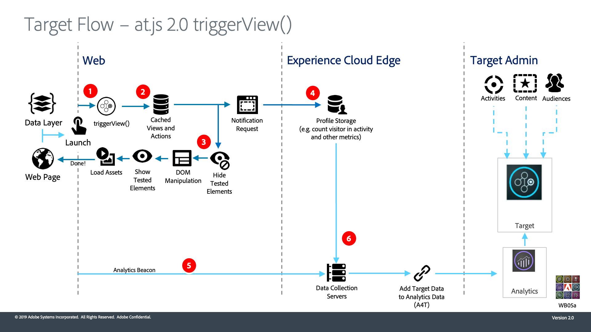

# Come  funziona Adobe Target a.js 2.0

`at.js` 2.0 migliora  supporto Adobe Target per le applicazioni a pagina singola (SPA) e si integra con altre soluzioni  Experience Cloud. Questo video e i diagrammi che lo accompagnano spiegano come tutto si combina.

>[!VIDEO](https://video.tv.adobe.com/v/26250?quality=12)

## Diagrammi di architettura

1. La chiamata restituisce  ID Experience Cloud (ECID). Se l’utente è autenticato, un’altra chiamata sincronizza l’ID cliente.

1. `at.js` la libreria viene caricata in modo sincrono e nasconde il corpo del documento (`at.js` può anche essere caricato in modo asincrono con un frammento di preimpostazione opzionale implementato sulla pagina).

1. La richiesta di caricamento della pagina viene effettuata includendo tutti i parametri configurati, ECID, SDID e ID cliente.

1. Gli script di profilo vengono eseguiti e inviati al [!UICONTROL Profile Store]. Lo Store richiede audience qualificate dalla [!UICONTROL Libreria Pubblico] (ad es. audience condivise da [!DNL Analytics],  Audience Manager, ecc.). [!UICONTROL Gli ] attributi del cliente vengono inviati a  [!UICONTROL Profile ] Store in un processo batch.
1. In base all&#39;URL, ai parametri di richiesta e ai dati del profilo, [!DNL Target] decide quali attività ed esperienze restituire al visitatore per la pagina corrente e le visualizzazioni future

1. Contenuto di destinazione inviato di nuovo alla pagina, eventualmente con valori di profilo per un’ulteriore personalizzazione.

   Il contenuto mirato sulla pagina corrente viene mostrato il più rapidamente possibile senza che venga visualizzato momentaneamente il contenuto predefinito.

   Il contenuto di destinazione per le visualizzazioni future di un&#39;applicazione a pagina singola viene memorizzato nella cache del browser, in modo che possa essere applicato istantaneamente senza una chiamata server aggiuntiva quando le viste vengono attivate. (Vedere il diagramma seguente per il comportamento `triggerView()`).

1. [!DNL Analytics] i dati inviati dalla pagina ai  [!UICONTROL Data ] CollectionServers
1. [!DNL Target]I dati di vengono confrontati con i dati di tramite SDID e vengono elaborati nell’archivio dei rapporti di Analytics. [!DNL Analytics] [!DNL Analytics] i dati possono quindi essere visualizzati sia nei rapporti A4T  [!DNL Analytics] che  [!DNL Target] tramite.

1. `adobe.target.triggerView()` viene chiamato nell’applicazione a pagina singola
1. Il contenuto mirato per la visualizzazione viene letto dalla cache

1. Il contenuto mirato viene mostrato il più rapidamente possibile senza che venga visualizzato momentaneamente il contenuto predefinito

1. Si invia la richiesta di notifica all&#39;archivio profili di [!DNL Target] per conteggiare il visitatore nell&#39;attività e nelle metriche incrementali
1. [!DNL Analytics] i dati vengono inviati dal SPA ai  [!UICONTROL Data ] CollectionServers

1. [!DNL Target] i dati vengono inviati dal  [!DNL Target] backend ai  [!UICONTROL Data ] CollectionServers. I dati di [!DNL Target] vengono confrontati con i dati di [!DNL Analytics] tramite SDID e vengono elaborati nell’archivio dei rapporti di [!DNL Analytics]. [!DNL Analytics] i dati possono quindi essere visualizzati sia nei rapporti A4T  [!DNL Analytics] che  [!DNL Target] tramite.

## Risorse aggiuntive

* [Implementazione di at.js 2.0 in un&#39;applicazione a pagina singola](implement-atjs-20-in-a-single-page-application.md)
* [Usare  Adobe Target Visual Experience Composer (Compositore esperienza visivo per applicazioni a pagina singola) (SPA VEC)](../experiences/use-the-visual-experience-composer-for-single-page-applications.md)
* [Come funziona at.js](https://docs.adobe.com/content/help/en/target/using/implement-target/client-side/at-js/how-atjs-works.html)