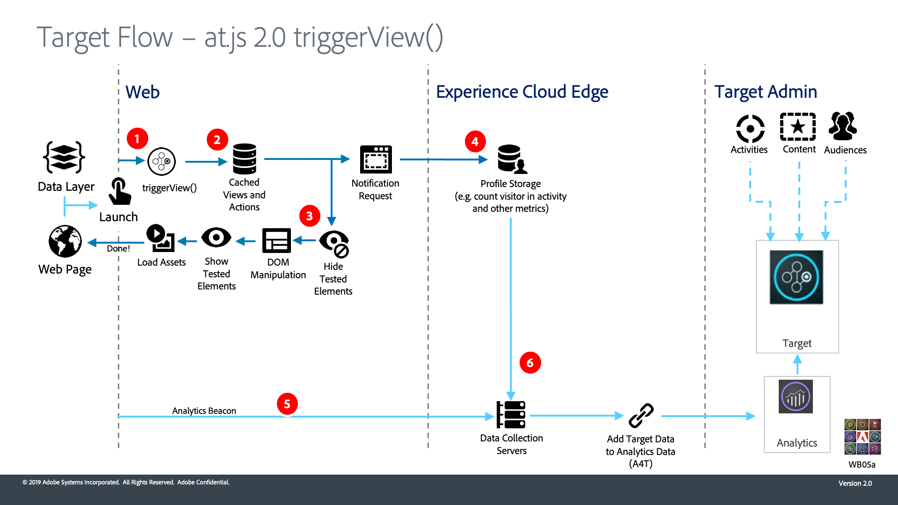

# Come funziona at.js 2.0 di Adobe Target

`at.js` 2.0 migliora il supporto di Adobe Target per le applicazioni a pagina singola (SPA) e si integra con altre soluzioni Experience Cloud. Questo video e i relativi diagrammi spiegano come tutto si combina.

>[!VIDEO](https://video.tv.adobe.com/v/26250?quality=12)

## Diagrammi architettura

Comportamento di 

1. La chiamata restituisce Experience Cloud ID (ECID). Se l&#39;utente è autenticato, un&#39;altra chiamata sincronizza l&#39;ID cliente.

1. La libreria `at.js` viene caricata in modo sincrono e nasconde il corpo del documento (`at.js` può anche essere caricato in modo asincrono con un frammento pre-hiding opzionale implementato nella pagina).

1. Viene effettuata una richiesta di caricamento della pagina, con tutti i parametri configurati, ECID, SDID e ID cliente.

1. Gli script di profilo vengono eseguiti e inseriti in [!UICONTROL Profile Store]. L&#39;archivio richiede tipi di pubblico idonei da [!UICONTROL Audience Library] (ad esempio pubblici condivisi da [!DNL Analytics], Audience Manager, ecc.). [!UICONTROL Customer Attributes] sono inviati a [!UICONTROL Profile Store] in un processo batch.
1. In base all&#39;URL, ai parametri di richiesta e ai dati di profilo, [!DNL Target] decide quali attività ed esperienze restituire al visitatore per la pagina corrente e le viste future

1. Contenuto di destinazione rinviato alla pagina, includendo facoltativamente i valori di profilo per ulteriore personalizzazione.

   Il contenuto mirato sulla pagina corrente viene mostrato il più rapidamente possibile senza che venga visualizzato momentaneamente il contenuto predefinito.

   Il contenuto mirato per le viste future di un’applicazione a pagina singola viene memorizzato nella cache del browser, in modo da applicarlo immediatamente senza una chiamata al server aggiuntiva quando si attivano le viste. (vedere il diagramma successivo per il comportamento `triggerView()`).

1. [!DNL Analytics] dati inviati dalla pagina ai server [!UICONTROL Data Collection]
1. I dati di [!DNL Target] vengono confrontati con i dati di Analytics tramite SDID ed elaborati nell&#39;archivio dei report di [!DNL Analytics]. I dati di [!DNL Analytics] possono quindi essere visualizzati sia in [!DNL Analytics] che in [!DNL Target] tramite i rapporti A4T.

Comportamento di 

1. Chiamata di `adobe.target.triggerView()` nell&#39;applicazione a pagina singola
1. Il contenuto di destinazione per la visualizzazione viene letto dalla cache

1. Il contenuto di destinazione viene mostrato il più rapidamente possibile senza che venga visualizzato momentaneamente il contenuto predefinito

1. Richiesta di notifica inviata a [!DNL Target] [!UICONTROL Profile Store] per conteggiare il visitatore nell&#39;attività e nelle metriche incrementali
1. [!DNL Analytics] dati inviati dall&#39;applicazione a pagina singola ai server [!UICONTROL Data Collection]

1. I dati di [!DNL Target] vengono inviati dal backend [!DNL Target] ai server [!UICONTROL Data Collection]. I dati di [!DNL Target] corrispondono ai dati di [!DNL Analytics] tramite SDID ed vengono elaborati nell&#39;archivio dei report di [!DNL Analytics]. I dati di [!DNL Analytics] possono quindi essere visualizzati sia in [!DNL Analytics] che in [!DNL Target] tramite i rapporti A4T.

## Risorse aggiuntive

* [Implementare at.js 2.0 in un’applicazione a pagina singola](implement-atjs-20-in-a-single-page-application.md)
* [Utilizzare il Compositore esperienza visivo di Adobe Target per applicazioni a pagina singola](../experiences/use-the-visual-experience-composer-for-single-page-applications.md)
