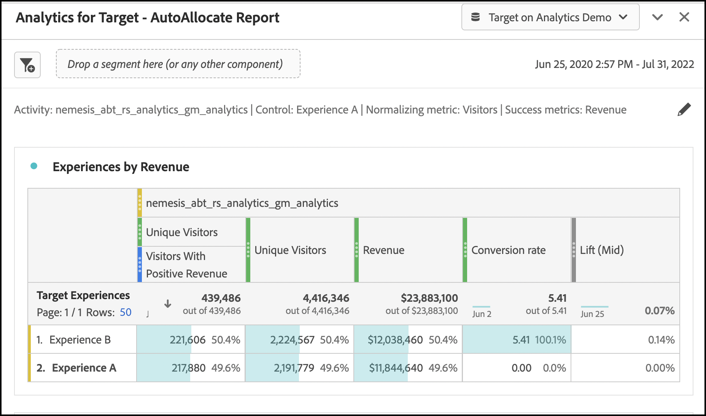

# Configurazione dei rapporti A4T in Analysis Workspace per [!DNL Auto-Allocate] attività

Un [!DNL Auto-Allocate] l’attività identifica un vincitore tra due o più esperienze e, di conseguenza, ridistribuisce automaticamente più traffico per il vincitore, mentre il test continua a essere eseguito e ad apprendere. Integrazione di Analytics for Target (A4T) per [!DNL Auto-Allocate] consente di visualizzare i dati di reporting in Adobe Analytics e di ottimizzarli anche per gli eventi personalizzati o le metriche definiti in Adobe Analytics.

Sebbene in Adobe Analytics Analysis Workspace siano disponibili funzionalità di analisi avanzate, alcune modifiche apportate al valore predefinito **[!UICONTROL Analytics for Target]** Il pannello è necessario per interpretare correttamente [!DNL Auto-Allocate] attività, a causa delle sfumature [criteri di ottimizzazione](https://experienceleague.adobe.com/docs/target/using/integrate/a4t/a4t-at-aa.html?lang=en#supported).

Questa esercitazione illustra le modifiche consigliate per l&#39;analisi [!DNL Auto-Allocate] attività in Workspace. I concetti chiave sono:

* I visitatori devono sempre essere utilizzati come metrica di normalizzazione in [!DNL Auto-Allocate] attività.
* Quando la metrica è una metrica Adobe Analytics, il numeratore appropriato per il tasso di conversione dipende dal tipo di criteri di ottimizzazione scelti durante l’impostazione dell’attività.
   * Il criterio di ottimizzazione &quot;massimizza il tasso di conversione del visitatore univoco&quot; ha un tasso di conversione il cui numeratore è un conteggio dei visitatori unici con un valore positivo della metrica.
   * Il &quot;valore della metrica di massimizzazione per visitatore* ha un tasso di conversione il cui numeratore è il valore della metrica regolare in Adobe Analytics. Questa è fornita per impostazione predefinita nella **[!UICONTROL Analytics for Target]** in Workspace.
* Quando la metrica di ottimizzazione è una metrica di conversione definita da Target, l’impostazione predefinita **[!UICONTROL Analytics for Target]** In Workspace il pannello è utile per configurare il pannello.
* I numeri di affidabilità visualizzati in Workspace non riflettono il [statistiche più conservative utilizzate dall&#39;allocazione automatica](https://experienceleague.adobe.com/docs/target/using/activities/auto-allocate/automated-traffic-allocation.html?lang=en#section_98388996F0584E15BF3A99C57EEB7629)e deve essere rimosso.

## Creare A4T per [!DNL Auto-Allocate] pannello in Workspace

Per creare un A4T per [!DNL Auto-Allocate] inizia con **[!UICONTROL Analytics for Target]** in Workspace, come illustrato di seguito. Effettua quindi le seguenti selezioni:

1. **[!UICONTROL Control Experience]**: Puoi scegliere qualsiasi esperienza
2. **[!UICONTROL Normalizzazione della metrica]**: Seleziona visitatori : l’allocazione automatica normalizza sempre i tassi di conversione per visitatori univoci.
3. **[!UICONTROL Metriche di successo]**: Seleziona la stessa metrica utilizzata durante la creazione dell’attività - se si tratta di una metrica di conversione definita da Target, seleziona **Conversione attività**. In caso contrario, seleziona la metrica Adobe Analytics utilizzata.

*Figura 1: Configurazione del pannello Analytics for Target per [!DNL Auto-Allocate] attività.*

>[!NOTE]
>
> Puoi anche arrivare ad un pre-costruito **[!UICONTROL Analytics for Target]** se fai clic sul collegamento dalla schermata del rapporto in Adobe Target.

## Metriche di conversione di Target o metriche di Analytics con criteri di ottimizzazione &quot;Massimizza valore metrica per visitatore&quot;

Maniglie predefinite del pannello A4T [!DNL Auto-Allocate] attività in cui la metrica di obiettivo è una conversione Target o una metrica Analytics con il criterio di ottimizzazione &quot;Massimizza valore metrica per visitatore&quot;.

Un esempio di questo pannello è mostrato per la metrica Ricavo, in cui &quot;Massimizza valore metrica per visitatore&quot; è stato selezionato come criterio di ottimizzazione al momento della creazione dell’attività. Come accennato in precedenza, [!DNL Auto-Allocate] utilizza calcoli di affidabilità più conservativi rispetto a quelli utilizzati dal **[!UICONTROL Analytics for Target]** pannello. Si consiglia pertanto di rimuovere la metrica di affidabilità, nonché le relative metriche di incremento inferiore e superiore.

*Figura 2: Rapporto consigliato per [!DNL Auto-Allocate] attività con una metrica Analytics Massimizza valore metrica per criterio di ottimizzazione visitatore. Per questi tipi di metriche e per le metriche di conversione definite da Target, l&#39;impostazione predefinita **[!UICONTROL Analytics for Target]**è possibile utilizzare il pannello in workspace.*

## Metriche di Analytics con i criteri di ottimizzazione &quot;Massimizza tasso di conversione del visitatore univoco&quot;

Quando una metrica Adobe Analytics viene utilizzata con un criterio di ottimizzazione di *Massimizza tasso di conversione del visitatore univoco*, il valore predefinito **[!UICONTROL Analytics for Target]** in workspace deve essere modificato.

La metrica di successo è ora un conteggio di visitatori unici per i quali la metrica di conversione era positiva. Questo può essere ottenuto creando un segmento che filtra gli hit con un valore positivo della metrica. Crea questo segmento come segue:

1. Seleziona la **Componenti** > **Crea segmento** nella barra degli strumenti di Workspace.
1. Trascina la metrica utilizzata al momento della creazione dell’attività dal pannello a sinistra al **Definizione** della casella del segmento.
1. Seleziona i valori della metrica che sono **maggiore di** un valore numerico pari a 0.
1. Da **Includi** a discesa, seleziona **Visitatori**
1. Assegna al segmento un nome appropriato

Un esempio della creazione del segmento è mostrato nella figura seguente, dove selezioniamo i visitatori per i quali il Ricavo è positivo.

*Figura 3: Creazione di segmenti per le metriche Adobe Analytics con criteri di ottimizzazione uguali a Massimizza tasso di conversione del visitatore univoco. In questo esempio, la metrica è Ricavo e l’obiettivo di ottimizzazione è quello di massimizzare il numero di visitatori con ricavi positivi.*

Una volta creato il segmento appropriato, il valore predefinito  **[!UICONTROL Analytics for Target]** è possibile modificare il pannello in workspace.

1. Aggiungi un secondo **Visitatori unici** insieme alla colonna metrica visitatori esistenti
2. Trascina il segmento appena creato sotto la prima colonna, per produrre un pannello simile alla Figura 4. Osserva la differenza: il numero di visitatori unici con ricavi positivi è una frazione del numero totale di visitatori univoci assegnati a ogni esperienza.
   
   *Figura 4: Filtraggio di visitatori univoci per il segmento appena creato*
3. Un tasso di conversione può essere [calcolo rapido](https://experienceleague.adobe.com/docs/analytics-learn/tutorials/components/calculated-metrics/quick-calculated-metrics-in-analysis-workspace.html?lang=en) evidenziando sia la prima che la seconda colonna, facendo clic con il pulsante destro del mouse e selezionando **Crea metrica da selezione** > **Dividi**. Il tasso di conversione predefinito deve essere rimosso e sostituito con questa nuova metrica calcolata, come illustrato di seguito. Potrebbe essere necessario modificare la metrica calcolata appena creata per visualizzarla come **Formato** > **Percentuale** fino a due posizioni decimali, come mostrato.
   

   *Figura 4: Il pannello di allocazione automatica finale che mostra i tassi di conversione per una metrica di conversione dei ricavi binarizzata*

## Conclusione

I passaggi precedenti hanno dimostrato come configurare correttamente [!DNL Workspace] per visualizzare i dati dei rapporti di allocazione automatica. Per riepilogare:

* Quando la metrica è una metrica di conversione definita da Target o una metrica Adobe Analytics con criterio di ottimizzazione *Massimizza valore della metrica per visitatore*, utilizza il pannello workspace predefinito configurato con i visitatori come metrica di normalizzazione.
* Quando la metrica è una metrica Adobe Analytics con criterio di ottimizzazione &quot;Massimizza tasso di conversione del visitatore univoco&quot;, devi utilizzare un tasso di conversione definito come la frazione di visitatori per i quali la metrica è positiva. Questo viene fatto creando un segmento corrispondente, che filtra la metrica del visitatore univoco.
