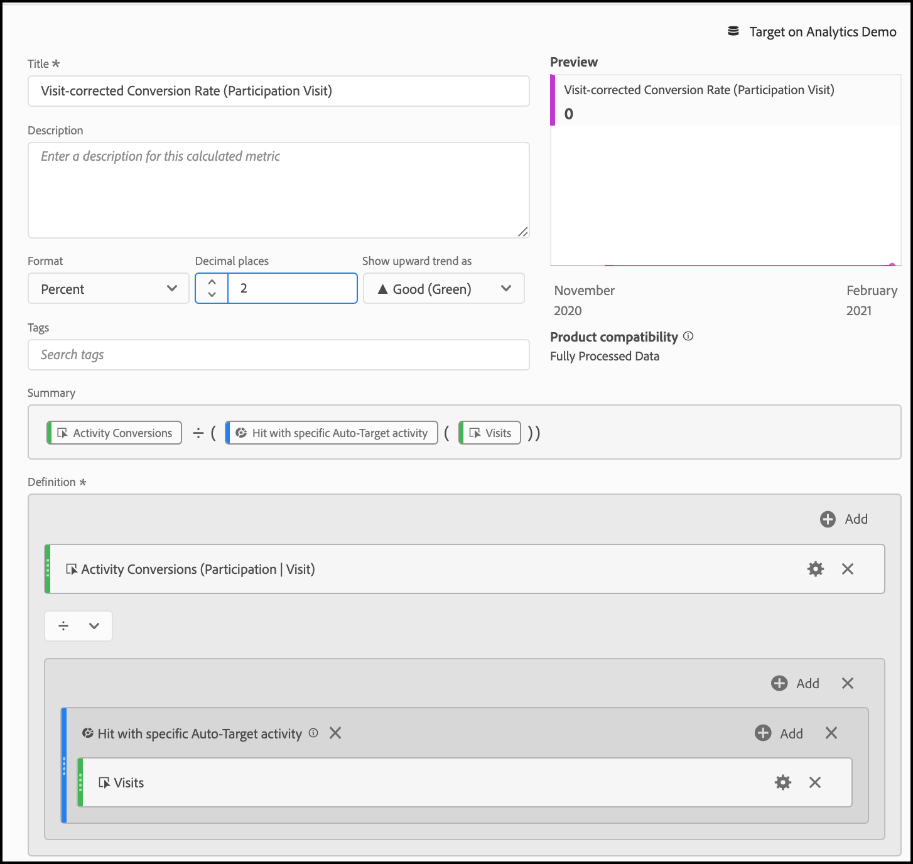

# Configurare rapporti A4T in [!DNL Analysis Workspace] per [!DNL Auto-Target] attività

>[!IMPORTANT]
>
>Per le attività [!UICONTROL Auto-Target], è necessario controllare il reporting in [!DNL Analytics Workspace] e creare manualmente un pannello A4T.

L&#39;integrazione di [!UICONTROL Analytics for Target] (A4T) per le attività di [!DNL Auto-Target] utilizza gli algoritmi di machine learning (ML) [!DNL Adobe Target] per scegliere l&#39;esperienza migliore per ogni visitatore in base al profilo, al comportamento e al contesto, mentre si utilizza una metrica di obiettivo [!DNL Adobe Analytics].

Sebbene le funzionalità avanzate di analisi siano disponibili in [!DNL Adobe Analytics] [!DNL Analysis Workspace], sono necessarie alcune modifiche al pannello predefinito **[!UICONTROL Analytics for Target]** per interpretare correttamente le attività [!DNL Auto-Target], a causa delle differenze tra le attività di sperimentazione (manuale [!UICONTROL A/B Test] e [!UICONTROL Auto-Allocate]) e le attività di personalizzazione ([!UICONTROL [!UICONTROL Auto-Target]]).

Questo tutorial illustra le modifiche consigliate per l&#39;analisi delle attività [!UICONTROL Auto-Target] in [!DNL Analysis Workspace], basate sui seguenti concetti chiave:

* La dimensione **[!UICONTROL Control vs Targeted]** può essere utilizzata per distinguere tra [!UICONTROL Control] esperienze e quelle fornite dall&#39;algoritmo ML di gruppo [!UICONTROL Auto-Target].
* Le visite devono essere utilizzate come metrica di normalizzazione quando si visualizzano raggruppamenti delle prestazioni a livello di esperienza. Inoltre, la metodologia di conteggio predefinita di [Adobe Analytics potrebbe includere visite in cui l&#39;utente non vede effettivamente il contenuto dell&#39;attività](https://experienceleague.adobe.com/docs/target/using/integrate/a4t/a4t-faq/a4t-faq-viewing-reports.html#metrics){target=_blank}, ma questo comportamento predefinito può essere modificato utilizzando un segmento con ambito appropriato (dettagli di seguito).
* L’attribuzione con ambito di lookback su visita, nota anche come &quot;intervallo di lookback su visita&quot; nel modello di attribuzione prescritto, viene utilizzata dai modelli da [!DNL Adobe Target] ML durante le fasi di apprendimento. È necessario utilizzare lo stesso modello di attribuzione (non predefinito) durante la suddivisione della metrica obiettivo.

## Crea il pannello A4T per [!UICONTROL Auto-Target] in [!DNL Analysis Workspace]

Per creare un report A4T per [!UICONTROL Auto-Target], iniziare con il pannello **[!UICONTROL Analytics for Target]** in [!DNL Analysis Workspace], come mostrato di seguito, oppure iniziare con una tabella a forma libera. Effettua quindi le seguenti selezioni:

1. **[!UICONTROL Control Experience]**: è possibile scegliere qualsiasi esperienza; tuttavia, questa scelta verrà ignorata in seguito. Per le attività [!UICONTROL Auto-Target], l&#39;esperienza di controllo è in realtà una strategia di controllo, che può essere a) distribuita in modo casuale tra tutte le esperienze, oppure b) distribuita una singola esperienza (questa scelta viene effettuata al momento della creazione dell&#39;attività in [!DNL Adobe Target]). Anche se si è scelto (b), l&#39;attività [!UICONTROL Auto-Target] ha designato come controllo un&#39;esperienza specifica. È comunque necessario seguire l&#39;approccio descritto in questa esercitazione per l&#39;analisi di A4T per le attività [!UICONTROL Auto-Target].
2. **[!UICONTROL Normalizing Metric]**: Selezionare [!UICONTROL Visits].
3. **[!UICONTROL Success Metrics]**: anche se è possibile selezionare qualsiasi metrica su cui generare il rapporto, in genere è necessario visualizzare i rapporti sulla stessa metrica scelta per l&#39;ottimizzazione durante la creazione dell&#39;attività in [!DNL Target].

   Configurazione del pannello ![[!UICONTROL Analytics for Target] per [!UICONTROL Auto-Target] attività.](assets/Figure1.png)

   *Figura 1: [!UICONTROL Analytics for Target] installazione del pannello per [!UICONTROL Auto-Target] attività.*

>[!TIP]
>
>Per impostare il pannello [!UICONTROL Analytics for Target] per le attività [!UICONTROL Auto-Target], scegliere un&#39;esperienza di controllo, scegliere [!UICONTROL Visits] come metrica di normalizzazione e scegliere la stessa metrica obiettivo scelta per l&#39;ottimizzazione durante la creazione dell&#39;attività [!DNL Target].

## Usa la dimensione [!UICONTROL Control vs.Targeted] per confrontare il modello ML del gruppo [!DNL Target] con il tuo controllo

Il pannello A4T predefinito è progettato per le attività classiche (manuali) [!UICONTROL A/B Test] o [!UICONTROL Auto-Allocate] in cui l&#39;obiettivo è confrontare le prestazioni delle singole esperienze con l&#39;esperienza di controllo. Nelle attività [!UICONTROL Auto-Target], tuttavia, il confronto del primo ordine deve essere tra il controllo *strategia* e la *strategia* di destinazione. In altre parole, determinare l&#39;incremento delle prestazioni complessive del modello ML del gruppo [!UICONTROL Auto-Target] sulla strategia di controllo.

Per eseguire il confronto, utilizzare la dimensione **[!UICONTROL Control vs Targeted (Analytics for Target)]**. Trascinare e rilasciare per sostituire la dimensione **[!UICONTROL Target Experiences]** nel report A4T predefinito.

Nota: questa sostituzione invalida i calcoli predefiniti di [!UICONTROL Lift and Confidence] sul pannello A4T. Per evitare confusione, puoi rimuovere queste metriche dal pannello predefinito, lasciando il seguente rapporto:

Pannello ![[!UICONTROL Experiences by Activity Conversions] in [!DNL Analysis Workspace]](assets/Figure2.png)

*Figura 2: rapporto linea di base consigliato per le attività [!DNL Auto-Target]. Questo report è stato configurato per confrontare il traffico di destinazione (gestito dal modello ML del gruppo) con il traffico di controllo.*

>[!NOTE]
>
>Attualmente, [!UICONTROL Lift and Confidence] numeri non sono disponibili per [!UICONTROL Control vs Targeted] dimensioni per i rapporti A4T per [!UICONTROL Auto-Target]. Fino all&#39;aggiunta del supporto, è possibile calcolare [!UICONTROL Lift and Confidence] manualmente scaricando il [calcolatore di affidabilità](https://experienceleague.adobe.com/docs/target/assets/complete_confidence_calculator.xlsx).

## Aggiungere suddivisioni delle metriche a livello di esperienza

Per ottenere ulteriori informazioni sulle prestazioni del modello ML del gruppo, insight può esaminare le suddivisioni a livello di esperienza della dimensione **[!UICONTROL Control vs Targeted]**. In [!DNL Analysis Workspace], trascina la dimensione **[!UICONTROL Target Experiences]** nel report, quindi suddividi separatamente ciascuna dimensione di controllo e di destinazione.

Pannello ![[!UICONTROL Experiences by Activity Conversions] in [!DNL Analysis Workspace]](assets/Figure3.png)

*Figura 3: suddivisione della dimensione di destinazione per esperienze Target*

Qui viene mostrato un esempio del rapporto risultante.

Pannello ![[!UICONTROL Experiences by Activity Conversions] in [!DNL Analysis Workspace]](assets/Figure4.png)

*Figura 4: un report [!UICONTROL Auto-Target] standard con raggruppamenti a livello di esperienza. Tieni presente che la metrica dell&#39;obiettivo potrebbe essere diversa e che la strategia di controllo potrebbe avere una singola esperienza.*

>[!TIP]
>
>In [!DNL Analysis Workspace], fai clic sull&#39;icona a forma di ingranaggio per nascondere le percentuali nella colonna [!UICONTROL Conversion Rate] per mantenere l&#39;attenzione sui tassi di conversione dell&#39;esperienza. I tassi di conversione verranno quindi formattati come decimali, ma interpretati di conseguenza come percentuali.

## Perché &quot;[!UICONTROL Visits]&quot; è la metrica di normalizzazione corretta per le attività [!UICONTROL Auto-Target]

Durante l&#39;analisi di un&#39;attività [!UICONTROL Auto-Target], scegliere sempre [!UICONTROL Visits] come metrica di normalizzazione predefinita. La personalizzazione [!UICONTROL Auto-Target] seleziona un&#39;esperienza per un visitatore una volta per visita (formalmente, una volta per [!DNL Target] sessione), il che significa che l&#39;esperienza mostrata a un visitatore può cambiare su ogni singola visita. Pertanto, se utilizzi [!UICONTROL Unique Visitors] come metrica di normalizzazione, il fatto che un singolo utente possa vedere più esperienze (su visite diverse) condurrebbe a confondere i tassi di conversione.

Un semplice esempio dimostra questo punto: considera uno scenario in cui due visitatori entrano in una campagna che ha solo due esperienze. Il primo visitatore visita due volte. Vengono assegnati all’Esperienza A alla prima visita, ma all’Esperienza B alla seconda visita (a causa del loro stato di profilo che cambia durante la seconda visita). Dopo la seconda visita, il visitatore converte effettuando un ordine. La conversione è attribuita all’esperienza mostrata più di recente (Esperienza B). Anche il secondo visitatore visita due volte e viene mostrata l’Esperienza B entrambe le volte, ma non si converte mai.

Confrontiamo i rapporti a livello di visitatore e di visita:

| Esperienza | Visitatori univoci | Visite | Conversioni | Tasso di conversione normalizzato per il visitatore | Tasso di conversione normalizzato per visita |
| --- | --- | --- | --- | --- | --- |
| Una  | 1 | 1 | - | 0% | 0% |
| B | 2 | 3 | 1 | 50% | 33,3% |
| Totali | 2 | 4 | 1 | 50% | 25% |

*Tabella 1: esempio di confronto dei rapporti normalizzati per visitatore e per visita per uno scenario in cui le decisioni sono permanenti per una visita (e non per visitatore, come con i normali test A/B). In questo scenario le metriche normalizzate dal visitatore sono confuse.*

Come mostrato nella tabella, esiste una chiara incongruenza dei numeri a livello di visitatore. Nonostante il fatto che ci siano due visitatori univoci totali, questa non è una somma dei singoli visitatori univoci per ogni esperienza. Anche se il tasso di conversione a livello di visitatore non è necessariamente sbagliato, quando si confrontano le singole esperienze, i tassi di conversione a livello di visita hanno probabilmente molto più senso. Formalmente, l’unità di analisi (&quot;visite&quot;) è la stessa dell’unità di fedeltà decisionale, il che significa che è possibile aggiungere e confrontare le suddivisioni delle metriche a livello di esperienza.

## Filtra per le visite effettive all’attività

La metodologia di conteggio predefinita [!DNL Adobe Analytics] per le visite a un&#39;attività [!DNL Target] potrebbe includere visite in cui l&#39;utente non ha interagito con l&#39;attività [!DNL Target]. Ciò è dovuto al modo in cui [!DNL Target] assegnazioni di attività vengono mantenute nel contesto visitatore [!DNL Analytics]. Di conseguenza, il numero di visite all&#39;attività [!DNL Target] può talvolta essere aumentato, determinando una depressione dei tassi di conversione.

Se si preferisce creare un rapporto sulle visite in cui l&#39;utente ha effettivamente interagito con l&#39;attività [!UICONTROL Auto-Target] (tramite l&#39;ingresso nell&#39;attività, un evento di visualizzazione o visita o una conversione), è possibile:

1. Creare un segmento specifico che includa gli hit dell&#39;attività [!DNL Target] in questione, quindi
1. Filtra la metrica [!UICONTROL Visits] utilizzando questo segmento.

**Per creare il segmento:**

1. Selezionare l&#39;opzione **[!UICONTROL Components > Create Segment]** nella barra degli strumenti di [!DNL Analysis Workspace].
2. Specifica **[!UICONTROL Title]** per il segmento. Nell&#39;esempio seguente, il segmento è denominato [!DNL "Hit with specific Auto-Target activity"].
3. Trascina la dimensione **[!UICONTROL Target Activities]** nella sezione **[!UICONTROL Definition]** del segmento.
4. Utilizza l&#39;operatore **[!UICONTROL equals]**.
5. Cerca l&#39;attività [!DNL Target] specifica.
6. Fare clic sull&#39;icona a forma di ingranaggio, quindi selezionare **[!UICONTROL Attribution model > Instance]** come illustrato nella figura seguente.
7. Fare clic su **[!UICONTROL Save]**.

![Segmento in [!DNL Analysis Workspace]](assets/Figure5.png)

*Figura 5: utilizza un segmento come quello mostrato qui per filtrare la metrica [!UICONTROL Visits] nella tua A4T per il report [!UICONTROL Auto-Target]*

Una volta creato il segmento, utilizzalo per filtrare la metrica [!UICONTROL Visits], in modo che la metrica [!UICONTROL Visits] includa solo le visite in cui l&#39;utente ha interagito con l&#39;attività [!DNL Target].

**Per filtrare [!UICONTROL Visits] con questo segmento:**

1. Trascina il segmento appena creato dalla barra degli strumenti dei componenti, quindi passa il cursore del mouse sulla base dell&#39;etichetta della metrica **[!UICONTROL Visits]** fino a visualizzare un prompt blu di **[!UICONTROL Filter by]**.
2. Rilascia il segmento. Il filtro viene applicato a tale metrica.

Il pannello finale viene visualizzato come segue:

Pannello ![[!UICONTROL Experiences by Activity Conversions] in [!DNL Analysis Workspace]](assets/Figure6.png)

*Figura 6: pannello di reporting con il segmento &quot;Hit con attività di Targeting automatico specifica&quot; applicato alla metrica [!UICONTROL Visits]. Questo segmento garantisce che nel rapporto vengano incluse solo le visite in cui un utente ha effettivamente interagito con l&#39;attività [!DNL Target] in questione.*

## Assicurati che la metrica di obiettivo e l’attribuzione siano allineate al criterio di ottimizzazione

L&#39;integrazione A4T consente al modello [!UICONTROL Auto-Target] ML di essere *addestrato* utilizzando gli stessi dati dell&#39;evento di conversione utilizzati da [!DNL Adobe Analytics] per *generare rapporti sulle prestazioni*. Tuttavia, esistono alcune ipotesi che devono essere utilizzate per interpretare questi dati durante la formazione dei modelli ML, che differiscono dalle ipotesi predefinite effettuate durante la fase di reporting in [!DNL Adobe Analytics].

In particolare, i modelli da [!DNL Adobe Target] ML utilizzano un modello di attribuzione con ambito visita. In altre parole, i modelli ML presuppongono che una conversione debba avvenire durante la stessa visita come visualizzazione del contenuto per l’attività, affinché la conversione possa essere &quot;attribuita&quot; alla decisione presa dal modello ML. Questo è necessario affinché [!DNL Target] garantisca una formazione tempestiva dei propri modelli; [!DNL Target] non può attendere fino a 30 giorni per una conversione (l&#39;intervallo di attribuzione predefinito per i report in [!DNL Adobe Analytics]) prima di includerlo nei dati di formazione dei propri modelli.

Pertanto, la differenza tra l&#39;attribuzione utilizzata dai modelli [!DNL Target] (durante l&#39;apprendimento) e l&#39;attribuzione predefinita utilizzata nell&#39;esecuzione di query sui dati (durante la generazione del rapporto) potrebbe causare discrepanze. Potrebbe anche sembrare che i modelli ML stiano andando male, quando in realtà il problema sta nell’attribuzione.

>[!TIP]
>
>Se i modelli ML si stanno ottimizzando per una metrica attribuita in modo diverso da quella delle metriche visualizzate in un rapporto, le prestazioni dei modelli potrebbero non corrispondere alle attese. Per evitare questo problema, assicurati che le metriche obiettivo nel rapporto utilizzino la stessa definizione e attribuzione di metrica utilizzata dai modelli [!DNL Target] ML.

La definizione esatta della metrica e le impostazioni di attribuzione dipendono dal [criterio di ottimizzazione](https://experienceleague.adobe.com/docs/target/using/integrate/a4t/a4t-at-aa.html#supported){target=_blank} specificato durante la creazione dell&#39;attività.

### Conversioni definite da Target o [!DNL Analytics] metriche con *Massimizza valore metrica per visita*

Quando la metrica è una conversione [!DNL Target] o una metrica [!DNL Analytics] con **Massimizza valore metrica per visita**, la definizione della metrica di obiettivo consente che si verifichino più eventi di conversione nella stessa visita.

Per visualizzare le metriche obiettivo con la stessa metodologia di attribuzione utilizzata dai modelli [!DNL Target] ML, eseguire la procedura seguente:

1. Passa il puntatore sull’icona a forma di ingranaggio della metrica obiettivo:

   

1. Dal menu risultante, scorrere fino a **[!UICONTROL Data settings]**.
1. Selezionare **[!UICONTROL Use non-default  attribution model]** (se non già selezionato).

   

1. Fare clic su **[!UICONTROL Edit]**.
1. Selezionare **[!UICONTROL Model]**: **[!UICONTROL Participation]** e **[!UICONTROL Lookback window]**: **[!UICONTROL Visit]**.

   

1. Fare clic su **[!UICONTROL Apply]**.

Questi passaggi garantiscono che il rapporto attribuisca la metrica di obiettivo alla visualizzazione dell&#39;esperienza, se l&#39;evento della metrica di obiettivo si è verificato *in qualsiasi momento* (&quot;partecipazione&quot;) nella stessa visita in cui è stata visualizzata un&#39;esperienza.

### [!DNL Analytics] metriche con *Tassi di conversione visita univoci*

**Definisci la visita con un segmento di metrica positivo**

Nello scenario in cui hai selezionato *Massimizzare il tasso di conversione visita univoco* come criterio di ottimizzazione, la definizione corretta del tasso di conversione è la frazione di visite in cui il valore della metrica è positivo. Ciò può essere ottenuto creando un segmento che filtra le visite con un valore positivo della metrica e quindi filtrando la metrica Visite.

1. Come in precedenza, selezionare l&#39;opzione **[!UICONTROL Components > Create Segment]** nella barra degli strumenti [!DNL Analysis Workspace].
2. Specifica **[!UICONTROL Title]** per il segmento.

   Nell&#39;esempio seguente, il segmento è denominato [!DNL "Visits with an order"].

3. Trascina nel segmento la metrica di base utilizzata nell’obiettivo di ottimizzazione.

   Nell&#39;esempio seguente, utilizziamo la metrica **orders**, in modo che il tasso di conversione misuri la frazione di visite in cui viene registrato un ordine.

4. In alto a sinistra nel contenitore di definizione del segmento, seleziona **[!UICONTROL Include]** **Visita**.
5. Utilizzare l&#39;operatore **[!UICONTROL is greater than]** e impostare il valore su 0.

   Se si imposta il valore su 0, questo segmento include le visite in cui la metrica degli ordini è positiva.

6. Fare clic su **[!UICONTROL Save]**.

*Figura 7: filtro della definizione del segmento per le visite con ordine positivo. A seconda della metrica di ottimizzazione dell&#39;attività, è necessario sostituire gli ordini con una metrica appropriata*

**Applicalo alle visite nella metrica filtrata per attività**

Questo segmento può ora essere utilizzato per filtrare le visite con un numero positivo di ordini e in cui si è verificato un hit per l&#39;attività [!DNL Auto-Target]. La procedura di filtraggio di una metrica è simile a prima e dopo aver applicato il nuovo segmento alla metrica di visita già filtrata, il pannello di rapporto dovrebbe essere simile alla Figura 8

*Figura 8: il pannello dei rapporti con la metrica di conversione visita univoca corretta: il numero di visite in cui è stato registrato un hit dall&#39;attività e in cui la metrica di conversione (ordini in questo esempio) è diversa da zero.*

## Passaggio finale: crea un tasso di conversione che acquisisca la magia precedente

Con le modifiche apportate alle metriche [!UICONTROL Visit] e obiettivo nelle sezioni precedenti, la modifica finale da apportare al pannello di reporting A4T predefinito per [!DNL Auto-Target] consiste nel creare tassi di conversione che rappresentino il rapporto corretto, ovvero quello della metrica obiettivo corretta, con una metrica &quot;Visite&quot; filtrata in modo appropriato.

Per eseguire questa operazione, creare un [!UICONTROL Calculated Metric] seguendo la procedura seguente:

1. Selezionare l&#39;opzione **[!UICONTROL Components > Create Metric]** nella barra degli strumenti di [!DNL Analysis Workspace].
1. Specifica **[!UICONTROL Title]** per la metrica. Ad esempio, &quot;Tasso di conversione corretto per visita per l’attività XXX&quot;.
1. Selezionare **[!UICONTROL Format]** = percentuale e **[!UICONTROL Decimal Places]** = 2.
1. Trascina la metrica di obiettivo rilevante per l&#39;attività (ad esempio, [!UICONTROL Activity Conversions]) nella definizione e utilizza l&#39;icona a forma di ingranaggio su questa metrica di obiettivo per regolare il modello di attribuzione su (Partecipazione|Visita), come descritto in precedenza.
1. Seleziona **[!UICONTROL Add > Container]** dall&#39;alto a destra della sezione **[!UICONTROL Definition]**.
1. Seleziona l’operatore di divisione (÷) tra i due contenitori.
1. Trascina il segmento creato in precedenza, denominato &quot;Hit con attività [!UICONTROL Auto-Target] specifica&quot; in questa esercitazione per questa attività [!DNL Auto-Target] specifica.
1. Trascina la metrica **[!UICONTROL Visits]** nel contenitore di segmenti.
1. Fare clic su **[!UICONTROL Save]**.

>[!TIP]
>
> È inoltre possibile creare questa metrica utilizzando la funzionalità metrica calcolata rapida .

La definizione completa della metrica calcolata è mostrata qui.

*Figura 7: definizione delle metriche del tasso di conversione del modello corretto per visita e per attribuzione. (Nota: questa metrica dipende dalla metrica e dall’attività dell’obiettivo. In altre parole, questa definizione di metrica non è riutilizzabile tra le attività.)*

>[!IMPORTANT]
>
>La metrica del tasso di [!UICONTROL Conversion] dal pannello A4T non è collegata all’evento di conversione o alla metrica di normalizzazione nella tabella. Quando si apportano le modifiche suggerite in questa esercitazione, la frequenza [!UICONTROL Conversion] non si adatta automaticamente alle modifiche. Pertanto, se apporti la modifica all&#39;attribuzione dell&#39;evento di conversione o alla metrica di normalizzazione (o a entrambe), devi ricordare come passaggio finale per modificare anche il tasso [!UICONTROL Conversion], come mostrato sopra.

## Riepilogo: esempio finale [!DNL Analysis Workspace] pannello per [!UICONTROL Auto-Target] rapporti

Combinando tutti i passaggi precedenti in un unico pannello, la figura seguente mostra una visualizzazione completa del rapporto consigliato per [!UICONTROL Auto-Target] attività A4T. Questo report è uguale a quello utilizzato dai modelli [!DNL Target] ML per ottimizzare la metrica obiettivo. Il rapporto incorpora tutte le sfumature e i consigli discussi in questa esercitazione. Questo report è anche il più simile alle metodologie di conteggio utilizzate nelle attività [!DNL Target] tradizionali basate sul reporting di [!UICONTROL Auto-Target].

Fare clic per espandere l&#39;immagine.

![Rapporto A4T finale in [!DNL Analysis Workspace]](assets/Figure10.png "Rapporto A4T in Analysis Workspace"){width="600" zoomable="yes"}

*Figura 10: il report finale A4T [!UICONTROL Auto-Target] in [!DNL Adobe Analytics] [!DNL Workspace], che combina tutte le regolazioni alle definizioni delle metriche descritte nelle sezioni precedenti di questa esercitazione.*
