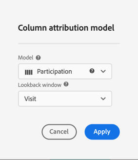

# Configurazione dei rapporti A4T in Analysis Workspace per [!DNL Auto-Target] attività

Integrazione di Analytics for Target (A4T) per [!DNL Auto-Target] le attività utilizzano gli algoritmi di apprendimento automatico del sistema di raccolta (ML) di Adobe Target per scegliere l’esperienza migliore per ogni visitatore in base al suo profilo, comportamento e contesto, il tutto utilizzando una metrica di obiettivo di Adobe Analytics.

Sebbene in Adobe Analytics Analysis Workspace siano disponibili funzionalità di analisi avanzate, alcune modifiche apportate al valore predefinito **[!UICONTROL Analytics for Target]** Il pannello è necessario per interpretare correttamente [!DNL Auto-Target] attività, a causa di differenze tra le attività di sperimentazione (A/B manuale e Allocazione automatica) e le attività di personalizzazione ([!DNL Auto-Target]).

Questa esercitazione illustra le modifiche consigliate per l&#39;analisi [!DNL Auto-Target] attività in Workspace, basate sui seguenti concetti chiave:

* La **[!UICONTROL Controllo e targeting]** può essere utilizzata per distinguere tra le esperienze di controllo e quelle gestite da [!DNL Auto-Target] algoritmo ML di raggruppamento.
* Le visite devono essere utilizzate come metrica di normalizzazione quando visualizzi le suddivisioni delle prestazioni a livello di esperienza. Inoltre, [La metodologia di conteggio predefinita di Adobe Analytics può includere visite in cui l’utente non visualizza effettivamente il contenuto dell’attività](https://experienceleague.adobe.com/docs/target/using/integrate/a4t/a4t-faq/a4t-faq-viewing-reports.html?lang=en#metrics), ma questo comportamento predefinito può essere modificato utilizzando un segmento con ambito appropriato (dettagli qui sotto).
* L’attribuzione con ambito di lookback su visita, nota anche come &quot;intervallo di lookback su visita&quot; sul modello di attribuzione prescritto, viene utilizzata dai modelli ML di Adobe Target durante le fasi di formazione e deve essere utilizzato lo stesso modello di attribuzione (non predefinito) durante la suddivisione della metrica di obiettivo.

## Creare A4T per [!DNL Auto-Target] pannello in Workspace

Per creare un A4T per [!DNL Auto-Target] inizia con **[!UICONTROL Analytics for Target]** in Workspace, come illustrato di seguito, oppure inizia con una tabella a forma libera. Effettua quindi le seguenti selezioni:

1. **[!UICONTROL Control Experience]**: Puoi scegliere qualsiasi esperienza; tuttavia, questa scelta verrà ignorata in un secondo momento. Tieni presente che per [!DNL Auto-Target] attività, l’esperienza di controllo è in realtà una strategia di controllo, che consiste in a) distribuire in modo casuale tra tutte le esperienze, o b) Servire un’unica esperienza (questa scelta viene effettuata al momento della creazione dell’attività in Adobe Target). Anche se hai scelto la scelta (b)—il tuo [!DNL Auto-Target] l’attività ha designato come controllo un’esperienza specifica; dovresti comunque seguire l’approccio descritto in questa esercitazione per analizzare A4T per [!DNL Auto-Target] attività.
2. **[!UICONTROL Normalizzazione della metrica]**: Seleziona Visite.
3. **[!UICONTROL Metriche di successo]**: Anche se puoi selezionare una metrica o più su cui generare rapporti, in genere dovresti visualizzare i rapporti sulla stessa metrica selezionata per l’ottimizzazione durante la creazione di attività in Adobe Target.

*Figura 1: Configurazione del pannello Analytics for Target per [!DNL Auto-Target] attività.*

>[!NOTE]
>
>Per configurare il pannello Analytics for Target per le attività di Targeting automatico, scegli un’esperienza di controllo, scegli Visite come metrica di normalizzazione e scegli la stessa metrica di obiettivo selezionata per l’ottimizzazione durante la creazione di attività Target.

## Utilizza la dimensione Controllo e targeting per confrontare il modello ML dell’insieme di Adobe Target con il tuo controllo

Il pannello A4T predefinito è progettato per test A/B classici (manuali) o attività di allocazione automatica in cui l’obiettivo è quello di confrontare le prestazioni di singole esperienze rispetto all’esperienza di controllo. In [!DNL Auto-Target] le attività, tuttavia, il confronto di primo ordine dovrebbe essere tra il controllo *strategia* e il *strategia* (in altre parole, determinare l&#39;incremento delle prestazioni complessive del [!DNL Auto-Target] mettere insieme il modello ML sulla strategia di controllo).

Per eseguire questo confronto, utilizza la variabile **[!UICONTROL Controllo e targeting (Analytics for Target)]** dimensione. Trascina e rilascia per sostituire **[!UICONTROL Esperienze Target]** nel rapporto A4T predefinito.

Nota che questa sostituzione invalida i calcoli di incremento e affidabilità predefiniti nel pannello A4T. Per evitare confusione, puoi rimuovere queste metriche dal pannello predefinito, lasciando il seguente rapporto:

*Figura 2: Rapporto di base consigliato per [!DNL Auto-Target] attività. Questo rapporto è stato configurato per confrontare il traffico mirato (servito dal modello ML dell’insieme) con il traffico di controllo.*

>[!NOTE]
>
>Al momento, i numeri di incremento e affidabilità non sono disponibili per i rapporti Controllo rispetto alle dimensioni di destinazione per A4T per il targeting automatico. Fino a quando non viene aggiunto il supporto, Incremento e Affidabilità possono essere calcolati manualmente scaricando il [calcolatore di affidabilità](https://experienceleague.adobe.com/docs/target/assets/complete_confidence_calculator.xlsx?lang=en).

## Aggiungere suddivisioni delle metriche a livello di esperienza

Per ottenere ulteriori informazioni sulle prestazioni del modello ML di insieme, puoi esaminare le suddivisioni a livello di esperienza del **[!UICONTROL Controllo e targeting]** dimensione. In Workspace, trascina la **[!UICONTROL Esperienze Target]** Inserisci le dimensioni nel rapporto, quindi suddividi separatamente ciascuna delle dimensioni Controllo e Targeting .

*Figura 3: Suddivisione della dimensione di targeting per esperienze Target*

Un esempio del rapporto risultante è mostrato qui.

*Figura 4: Standard [!DNL Auto-Target] rapporti con suddivisioni a livello di esperienza. La metrica di obiettivo può essere diversa e la strategia di controllo può avere una sola esperienza.*

>[!TIP]
>
>In Workspace, fai clic sull’icona a forma di ingranaggio per nascondere le percentuali nella colonna Tasso di conversione, per mantenere lo stato attivo sui tassi di conversione dell’esperienza. I tassi di conversione verranno quindi formattati come decimali, ma interpretati di conseguenza come percentuali.

## Perché &quot;Visite&quot; è la metrica di normalizzazione corretta per [!DNL Auto-Target] attività

Quando si analizza un [!DNL Auto-Target] attività , scegli sempre Visite come metrica di normalizzazione predefinita. [!DNL Auto-Target] la personalizzazione seleziona un’esperienza per un visitatore una volta per visita (formalmente, una volta per sessione Adobe Target), il che significa che l’esperienza mostrata a un utente può cambiare a ogni singola visita. Pertanto, se utilizzi Visitatori unici come metrica di normalizzazione, il fatto che un singolo utente possa visualizzare più esperienze (in visite diverse) confonderebbe i tassi di conversione.

Un esempio semplice illustra questo punto: considera uno scenario in cui due visitatori accedono a una campagna con solo due esperienze. Il primo visitatore visita due volte. Vengono assegnate all’Esperienza A nella prima visita, ma all’Esperienza B nella seconda visita (a causa della modifica dello stato del profilo in quella seconda visita). Dopo la seconda visita, il visitatore si converte effettuando un ordine. La conversione è attribuita all’esperienza mostrata più di recente (Esperienza B). Anche il secondo visitatore visita due volte e viene mostrato sia l’Esperienza B che la conversione.

Confrontiamo i rapporti a livello di visitatore e di visita:

| Esperienza | Visitatori univoci | Visite | Conversioni | Norma per i visitatori. Conv. Tariffa | Visita la norma. Conv. Tariffa |
| --- | --- | --- | --- | --- | --- |
| A | 1 | 1 | - | 0% | 0% |
| B | 2 | 3 | 1 | 50% | 33,3% |
| Totali | 2 | 4 | 1 | 50% | 25% |

*Tabella 1: Esempio di confronto tra rapporti normalizzati sui visitatori e normalizzati sulle visite per uno scenario in cui le decisioni sono appiccicose a una visita (e non ai visitatori, come con i normali test A/B). Le metriche normalizzate dai visitatori confondono in questo scenario.*

Come mostrato nella tabella, esiste una chiara incongruenza dei numeri a livello di visitatore. Nonostante il fatto che ci siano due visitatori unici totali, questa non è una somma di singoli visitatori unici per ogni esperienza. Anche se il tasso di conversione a livello di visitatore non è necessariamente sbagliato, quando si confrontano le singole esperienze, i tassi di conversione a livello di visita probabilmente hanno molto più senso. Formalmente, l’unità di analisi (&quot;visite&quot;) è la stessa dell’unità di decisione viscerale, il che significa che è possibile aggiungere e confrontare suddivisioni delle metriche a livello di esperienza.

## Filtrare le visite effettive all’attività

La metodologia di conteggio predefinita di Adobe Analytics per le visite a un’attività Target può includere visite in cui l’utente non ha interagito con l’attività Target. Ciò è dovuto al modo in cui le assegnazioni di attività di Target vengono mantenute nel contesto del visitatore di Analytics. Di conseguenza, il numero di visite all’attività Target può talvolta essere gonfiato, con conseguente depressione dei tassi di conversione.

Se preferisci creare rapporti sulle visite in cui l’utente ha effettivamente interagito con l’attività di Targeting automatico (tramite l’accesso all’attività, un evento di visualizzazione/visita o una conversione), puoi:

1. Crea un segmento specifico che include gli hit dall’attività Target in questione, e quindi
1. Filtra la metrica Visite utilizzando questo segmento.

**Per creare il segmento:**

1. Seleziona la **[!UICONTROL Componenti > Crea segmento]** nella barra degli strumenti di Workspace.
2. Inserisci un **[!UICONTROL Titolo]** per il segmento. Nell’esempio seguente, il segmento viene denominato [!DNL "Hit with specific Auto-Target activity"].
3. Trascina **[!UICONTROL Attività di Target]** Dimensione del segmento **[!UICONTROL Definizione]** sezione .
4. Utilizza la **[!UICONTROL è]** operatore.
5. Cerca la tua attività Target specifica.
6. Seleziona l’icona a forma di ingranaggio e seleziona **[!UICONTROL Modello di attribuzione > Istanza]** come illustrato nella figura riportata di seguito.
7. Fai clic su **[!UICONTROL Salva]**.

*Figura 5: Utilizza un segmento come quello mostrato qui per filtrare la metrica Visite in A4T per [!DNL Auto-Target] rapporto*

Una volta creato il segmento, utilizzalo per filtrare la metrica Visite, in modo che la metrica Visite includa solo le visite in cui l’utente ha interagito con l’attività Target.

**Per filtrare le visite utilizzando questo segmento:**

1. Trascina il segmento appena creato dalla barra degli strumenti dei componenti e passa il puntatore del mouse sulla base della **[!UICONTROL Visite]** etichetta metrica fino a un blu **[!UICONTROL Filtra per]** viene visualizzato un prompt.
2. Rilascia il segmento. Il filtro verrà applicato a tale metrica.

Il pannello finale verrà visualizzato come segue.

*Figura 6: Pannello di reporting con il segmento &quot;Hit con specifica attività di Targeting automatico&quot; applicato al [!UICONTROL Visite] metrica. In questo modo, solo le visite in cui un utente ha effettivamente interagito con l’attività Target in questione vengono incluse nel rapporto.*

## Assicurati che la metrica di obiettivo e l’attribuzione siano allineate con il criterio di ottimizzazione

L’integrazione A4T consente [!DNL Auto-Target]modello ML da utilizzare *addestrato* utilizzo degli stessi dati evento di conversione utilizzati da Adobe Analytics in *generare rapporti sulle prestazioni*. Tuttavia, vi sono alcune ipotesi che devono essere utilizzate per interpretare questi dati durante la formazione dei modelli ML, che differiscono dalle ipotesi di default formulate durante la fase di segnalazione in Adobe Analytics.

In particolare, i modelli ML di Adobe Target utilizzano un modello di attribuzione basato sulle visite. In altre parole, presuppongono che una conversione avvenga nella stessa visita di una visualizzazione del contenuto per l&#39;attività, affinché la conversione sia &quot;attribuita&quot; alla decisione presa dal modello ML. Ciò è necessario affinché Target garantisca una formazione tempestiva dei suoi modelli; Target non può attendere fino a 30 giorni per una conversione (la finestra di attribuzione predefinita per i rapporti in Adobe Analytics), prima di includerla nei dati di formazione per i suoi modelli.

Pertanto, la differenza tra l’attribuzione utilizzata dai modelli di Target (durante la formazione) e l’attribuzione predefinita utilizzata per eseguire query sui dati (durante la generazione del rapporto) può causare discrepanze. Potrebbe anche sembrare che i modelli ML abbiano prestazioni scadenti, quando in realtà il problema è legato all&#39;attribuzione.

>[!TIP]
>
>Se i modelli ML vengono ottimizzati per una metrica che viene attribuita in modo diverso rispetto alle metriche visualizzate in un rapporto, le prestazioni dei modelli potrebbero non essere quelle previste. Per evitare questo problema, assicurati che le metriche dell’obiettivo nel rapporto utilizzino la stessa definizione metrica e attribuzione utilizzata dai modelli ML di Target.

La definizione esatta della metrica e le impostazioni di attribuzione dipendono dal [criterio di ottimizzazione](https://experienceleague.adobe.com/docs/target/using/integrate/a4t/a4t-at-aa.html?lang=en#supported) hai specificato durante la creazione dell’attività.

### Conversioni definite da Target o metriche di Analytics con *Massimizza valore della metrica per visita*

Quando la metrica è una conversione Target, o una metrica Analytics con **Massimizza valore della metrica per visita**, la definizione della metrica obiettivo consente di verificare più eventi di conversione nella stessa visita.
Per visualizzare le metriche dell’obiettivo che hanno la stessa metodologia di attribuzione utilizzata dai modelli ML di Adobe Target, procedi come segue:

1. Passa il puntatore sull’icona a forma di ingranaggio della metrica di obiettivo:
   
1. Dal menu risultante, scorri fino a **[!UICONTROL Impostazioni dati]**.
1. Seleziona **[!UICONTROL Usa modello di attribuzione non predefinito]** (se non è già selezionato):
   
1. Fai clic su **[!UICONTROL Modifica]**.
1. Seleziona **[!UICONTROL Modello]**: **[!UICONTROL Partecipazione]** e **[!UICONTROL Intervallo di lookback]**: **[!UICONTROL Visita]**.
   
1. Fai clic su **[!UICONTROL Applica]**.

Questi passaggi garantiscono che il rapporto attribuisca la metrica dell’obiettivo alla visualizzazione dell’esperienza, se si è verificato l’evento della metrica obiettivo *qualsiasi ora* (&quot;partecipazione&quot;) nella stessa visita in cui è stata mostrata un’esperienza.

### Metriche di Analytics con *Tassi di conversione delle visite univoci*

**Definire la visita con un segmento di metrica positiva**

Nello scenario in cui hai selezionato *Massimizza il tasso di conversione della visita univoca* come criterio di ottimizzazione, la definizione corretta del tasso di conversione è la frazione di visite in cui il valore della metrica è positivo. Questo può essere ottenuto creando un segmento che filtra verso il basso le visite con un valore positivo della metrica, e quindi filtrando la metrica visite.

1. Come prima, seleziona la **[!UICONTROL Componenti > Crea segmento]** nella barra degli strumenti di Workspace.
2. Inserisci un **[!UICONTROL Titolo]** per il segmento. Nell’esempio seguente, il segmento viene denominato [!DNL "Visits with an order"].
3. Trascina nel segmento la metrica di base utilizzata nell’obiettivo di ottimizzazione . Nell’esempio riportato di seguito, utilizziamo il **ordini** , in modo che il tasso di conversione misuri la frazione di visite in cui viene registrato un ordine.
4. In alto a sinistra del contenitore di definizione del segmento, seleziona **[!UICONTROL Includi]** **Visita**.
5. Utilizza la **[!UICONTROL è maggiore di]** e imposta il valore su 0 (ovvero, questo segmento include visite in cui la metrica degli ordini è positiva)
6. Fai clic su **[!UICONTROL Salva]**.

*Figura 7: Filtraggio della definizione del segmento alle visite con un ordine positivo. A seconda della metrica di ottimizzazione dell’attività, dovrai sostituire gli ordini con una metrica appropriata*

**Applicalo alle visite nella metrica filtrata dell’attività**

Questo segmento può ora essere utilizzato per filtrare le visite con un numero positivo di ordini e in cui è stato rilevato un hit per il [!DNL Auto-Target]attività. La procedura di filtraggio di una metrica è simile a quella precedente e dopo l’applicazione del nuovo segmento alla metrica di visita già filtrata, il pannello di rapporto dovrebbe essere simile alla Figura 8

*Figura 8: Il pannello del rapporto con la metrica di conversione visita univoca corretta, ovvero il numero di visite in cui è stato registrato un hit dall’attività e in cui la metrica di conversione (ordini in questo esempio) era diversa da zero.*

## Passaggio finale: Crea un tasso di conversione che cattura la magia di cui sopra

Con le modifiche alle metriche Visita e Obiettivo nelle sezioni precedenti, l’ultima modifica da apportare al tuo A4T predefinito per [!DNL Auto-Target] il pannello di reporting è quello di creare tassi di conversione che siano il rapporto corretto, quello della metrica di obiettivo corretta, in una metrica &quot;Visite&quot; filtrata in modo appropriato.

A tale scopo, crea una metrica calcolata utilizzando i seguenti passaggi:

1. Seleziona la **[!UICONTROL Componenti > Crea metrica]** nella barra degli strumenti di Workspace.
1. Inserisci un **[!UICONTROL Titolo]** per la metrica. Ad esempio, &quot;Tasso di conversione corretto per le visite per l’attività XXX&quot;.
1. Seleziona **[!UICONTROL Formato]** = percentuale e **[!UICONTROL Luoghi decimali]** = 2.
1. Trascina la metrica di obiettivo pertinente per l’attività (ad esempio, Conversioni attività) nella definizione e utilizza l’icona a forma di ingranaggio su questa metrica di obiettivo per regolare il modello di attribuzione su (Partecipazione|Visita), come descritto in precedenza.
1. Seleziona **[!UICONTROL Aggiungi > Contenitore]** in alto a destra **[!UICONTROL Definizione]** sezione .
1. Selezionare l&#39;operatore di divisione (÷) tra i due contenitori.
1. Trascina il segmento creato in precedenza, denominato &quot;Hit with specifiche (Hit con specifico) [!DNL Auto-Target] attività&quot; in questa esercitazione—per questo specifico [!DNL Auto-Target] attività.
1. Trascina **[!UICONTROL Visite]** nel contenitore di segmenti.
1. Fai clic su **[!UICONTROL Salva]**.

>[!TIP]
>
> Puoi anche creare questa metrica utilizzando la variabile [funzionalità metriche calcolate rapide](https://experienceleague.adobe.com/docs/analytics-learn/tutorials/components/calculated-metrics/quick-calculated-metrics-in-analysis-workspace.html?lang=en).

La definizione completa della metrica calcolata è mostrata qui.

*Figura 9: Definizione della metrica del tasso di conversione del modello corretta per visita e attribuzione. (Nota che questa metrica dipende dalla metrica e dall’attività dell’obiettivo. In altre parole, questa definizione di metrica non è riutilizzabile tra le attività.)*

>[!IMPORTANT]
>
>La metrica del tasso di conversione dal pannello A4T non è collegata all’evento di conversione o alla metrica di normalizzazione nella tabella. Quando apporti le modifiche suggerite in questa esercitazione, il tasso di conversione non si adatta automaticamente alle modifiche. Pertanto, se apporti la modifica a uno (o entrambi) l’attribuzione dell’evento di conversione e la metrica di normalizzazione, devi ricordare come passaggio finale per modificare anche il tasso di conversione, come mostrato sopra.

## Riepilogo: Pannello Area di lavoro di esempio finale per [!DNL Auto-Target] rapporti

Combinando tutti i passaggi sopra descritti in un unico pannello, la figura seguente mostra una visualizzazione completa del rapporto consigliato per [!DNL Auto-Target] Attività A4T. Questo rapporto è lo stesso utilizzato dai modelli di machine learning di Target per ottimizzare la metrica dell’obiettivo e include tutte le sfumature e i consigli descritti in questa esercitazione. Questo rapporto è anche più vicino alle metodologie di conteggio utilizzate nelle tradizionali attività di reporting basate su Target [!DNL Auto-Target] attività.

*Figura 10: L’A4T finale [!DNL Auto-Target] in Adobe Analytics Workspace, che combina tutte le modifiche alle definizioni metriche descritte nelle sezioni precedenti di questo documento.*
