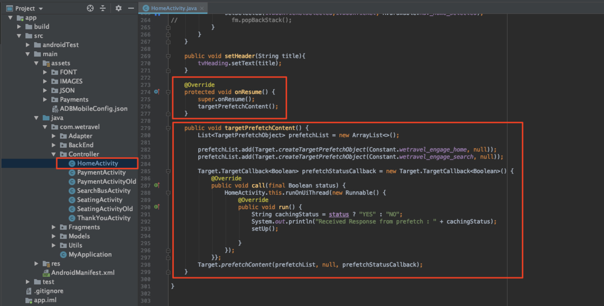

# Aggiungere richieste Adobe Target

L’SDK di Adobe Mobile Services (v4) fornisce metodi e funzionalità di Adobe Target che consentono di personalizzare l’app con esperienze diverse per utenti diversi. In genere, dall’app all’Adobe Target vengono effettuate una o più richieste per recuperare il contenuto personalizzato e misurare l’impatto di tale contenuto.

In questa lezione, preparerai l’app We.Travel per la personalizzazione implementando le richieste [!DNL Target] .

## Prerequisiti

Assicurati di [scaricare e aggiornare l&#39;app di esempio](download-and-update-the-sample-app.md).

## Obiettivi di apprendimento

Al termine di questa lezione, potrai:

* Memorizza in cache più offerte [!DNL Target] (cioè contenuti personalizzati) utilizzando una richiesta di preacquisizione batch
* Carica posizioni preacquisite [!DNL Target]
* Carica una posizione [!DNL Target] in tempo reale (non preacquisita)
* Cancella le posizioni preacquisite dalla cache
* Convalidare richieste preacquisite e in tempo reale

## Terminologia 

Di seguito sono riportate alcune delle principali terminologie di Target che verranno utilizzate nel resto dell’esercitazione.

* **Richiesta:**  una richiesta di rete ai server Adobe Target
* **Offerta:**  snippet di codice o di altro contenuto basato su testo, definito nell’interfaccia  [!DNL Target] utente (o con API) e consegnato nella risposta. Di solito JSON quando [!DNL Target] viene utilizzato nelle app mobile native.
* **Posizione:**  nome definito dall’utente assegnato a una richiesta, utilizzato nell’ [!DNL Target] interfaccia per associare le offerte a richieste specifiche
* **Richiesta batch:**  una singola richiesta che include più posizioni
* **Richiesta di preacquisizione:**  una singola richiesta che recupera le offerte e le memorizza nella cache per un utilizzo futuro nell’app.
* **Richiesta di preacquisizione in batch:**  una singola richiesta che prerileva le offerte per più posizioni
* **Pubblico:**  un gruppo di visitatori definiti nell’ [!DNL Target] interfaccia o condivisi con  [!DNL Target] da altre applicazioni di Adobe (ad esempio &quot;Visitatori iPhone X&quot;, &quot;visitatori in California&quot;, &quot;Prima apertura app&quot;)
* **Attività:**  un  [!DNL Target] costrutto, definito nell’interfaccia  [!DNL Target] utente (o con API) che collega posizioni, offerte e pubblico per creare un’esperienza personalizzata

## Aggiungere una richiesta di recupero preventivo del batch

La prima richiesta che implementeremo in We.Travel è una richiesta di preacquisizione batch con due posizioni [!DNL Target] nella schermata iniziale. In una lezione successiva, configureremo le offerte per queste posizioni in modo da visualizzare i messaggi per aiutare i nuovi utenti a seguire il processo di prenotazione.

Una richiesta di preacquisizione recupera il contenuto [!DNL Target] nel modo più minimale possibile memorizzando nella cache la risposta del server Adobe Target (offerta). Una richiesta di preacquisizione batch recupera e memorizza in cache più offerte, ciascuna associata a una posizione diversa. Tutte le posizioni preacquisite vengono memorizzate nella cache del dispositivo per un utilizzo futuro nella sessione utente. Con il prerecupero di più posizioni nella schermata iniziale, possiamo recuperare le offerte da utilizzare in un secondo momento quando il visitatore naviga nell’app. Per ulteriori informazioni sui metodi di preacquisizione, consulta la [documentazione di preacquisizione](https://docs.adobe.com/content/help/en/mobile-services/android/target-android/c-mob-target-prefetch-android.html) .

### Aggiungere la richiesta di recupero preventivo del batch

Aggiorna il controller HomeActivity (il codice sorgente di Home Screen), che si trova in app > main > java > com.wetravel > Controller. Aggiungeremo i due blocchi di codice mostrati in rosso:

Inizieremo con il controller HomeActivity (codice sorgente dello schermo Home), che si trova in app > main > java > com.wetravel > Controller.

Aggiungeremo i due blocchi di codice mostrati in rosso:



Scorri verso il basso fino alla fine del codice di HomeActivity e aggiungi il codice fornito di seguito dopo la funzione `setHeader()` e *sostituendo* la funzione `onResume()` corrente:

```java
@Override
protected void onResume() {
    super.onResume();
    targetPrefetchContent();
}

public void targetPrefetchContent() {
    List<TargetPrefetchObject> prefetchList = new ArrayList<>();
    prefetchList.add(Target.createTargetPrefetchObject(Constant.wetravel_engage_home, null));
    prefetchList.add(Target.createTargetPrefetchObject(Constant.wetravel_engage_search, null));
    Target.TargetCallback<Boolean> prefetchStatusCallback = new Target.TargetCallback<Boolean>() {
        @Override
        public void call(final Boolean status) {
            HomeActivity.this.runOnUiThread(new Runnable() {
                @Override
                public void run() {
                    String cachingStatus = status ? "YES" : "NO";
                    System.out.println("Received Response from prefetch : " + cachingStatus);
                    setUp();

                }
            });
        }};
    Target.prefetchContent(prefetchList, null, prefetchStatusCallback);
}
```

Probabilmente l’IDE ti avviserà che nel file non sono state importate le classi [!DNL Target] . Assicurati di importare le classi [!DNL Target] nella parte superiore del controller HomeActivity come mostrato in rosso di seguito:

```java
import com.adobe.mobile.Target;
import com.adobe.mobile.TargetPrefetchObject;
```


Probabilmente vedrai anche gli errori per &quot;impossibile trovare la variabile di simbolo wetravel_Eng_home&quot; e &quot;impossibile trovare la variabile di simbolo wetravel_Eng_search&quot;. Aggiungi questi al file `Constant.java` (in app > src > main > java > com > wetravel > Utils):

```java
public static final String wetravel_engage_home = "wetravel_engage_home";
public static final String wetravel_engage_search = "wetravel_engage_search";
```


### Spiegazione del codice della richiesta di recupero preventivo del batch

| Codice | Descrizione |
|--- |--- |
| `targetPrefetchContent()` | Funzione definita dall&#39;utente (non facente parte dell&#39;SDK) che utilizza i metodi [!DNL Target] per recuperare e memorizzare nella cache due posizioni [!DNL Target]. |
| `prefetchContent()` | Il metodo [!DNL Target] SDK che invia la richiesta di preacquisizione |
| `Constant.wetravel_engage_home` | Nome posizione preacquisito [!DNL Target] che mostrerà il contenuto della sua offerta nella schermata iniziale |
| `Constant.wetravel_engage_search` | Nome posizione preacquisito [!DNL Target] che mostrerà il contenuto della sua offerta nella schermata Risultati ricerca. Poiché si tratta di una seconda posizione nella preacquisizione, questa richiesta di preacquisizione è denominata &quot;richiesta batch di preacquisizione&quot;. |
| setUp() | Funzione definita dall’utente che esegue il rendering della schermata iniziale dell’app dopo il prerecupero delle offerte [!DNL Target] |

### Informazioni asincrone e sincrono

Con il codice appena implementato, la richiesta di preacquisizione viene effettuata come una chiamata sincrona e di blocco, poco prima del rendering della schermata iniziale. Quando abbiamo incollato il nuovo codice nel controller HomeActivity, abbiamo spostato l’esecuzione della funzione `setUp()` dalla funzione `onResume()` fino a dopo la richiesta Target. Questo può essere utile negli scenari in cui desideri personalizzare il contenuto quando l’app si apre per la prima volta, in quanto assicura che il contenuto personalizzato dai server di Target sia restituito (o scaduto) prima del rendering della prima schermata. Per consentire il caricamento asincrono delle richieste (in background), chiama invece `setUp()` all’interno della funzione `onCreate()` .

### Convalida la richiesta di recupero preventivo del batch

Rigenera l’app e apri l’emulatore Android. (Le schermate seguenti utilizzano Pixel 2 su Android Q versione 9+, API livello 29). La risposta di preacquisizione dovrebbe riportare &quot;risposta di preacquisizione ricevuta&quot;:

Quando viene eseguito il rendering della schermata iniziale, la richiesta di preacquisizione deve essere caricata. Con Logcat, filtra per [!DNL "Target"] per visualizzare la richiesta e la risposta:


Se non trovi una risposta corretta, verifica le impostazioni nel file `ADBMobileConfig.json` e la sintassi del codice nel file HomeActivity.

Due posizioni sono ora memorizzate nella cache del dispositivo. I nomi delle posizioni verranno a breve caricati lentamente nell&#39;interfaccia [!DNL Target], dove possono essere selezionati in vari menu a discesa quando li utilizzi in un&#39;attività.

### Aggiungi richieste di caricamento per ogni posizione nella cache

Ora che le posizioni sono preacquisite e le relative risposte memorizzate nella cache del dispositivo, aggiungiamo il metodo `Target.loadRequest()` che recupera il contenuto dell’offerta dalla cache in modo da poterlo utilizzare per aggiornare l’applicazione. Verrà aggiunto un nuovo metodo personalizzato denominato `engageMessage()` che verrà eseguito con la richiesta di preacquisizione. `engageMessage()` chiamerà  `Target.loadRequest()`. `engageMessage()` viene eseguito prima  `setUp()` di garantire che la richiesta di caricamento venga chiamata prima che la schermata sia impostata.

Innanzitutto, aggiungi la chiamata e il metodo `engageMessage()` per la posizione wetravel_Eng_home in HomeActivity:


Ecco il codice aggiornato:

```java
    public void targetPrefetchContent() {
        List<TargetPrefetchObject> prefetchList = new ArrayList<>();
        Map<String, Object> params1;
        params1 = new HashMap<String, Object>();
        params1.put("at_property", "your at_property value goes here");
        prefetchList.add(Target.createTargetPrefetchObject(Constant.wetravel_engage_home, params1));
        prefetchList.add(Target.createTargetPrefetchObject(Constant.wetravel_engage_search, params1));
        Target.TargetCallback<Boolean> prefetchStatusCallback = new Target.TargetCallback<Boolean>() {
            @Override
            public void call(final Boolean status) {
                HomeActivity.this.runOnUiThread(new Runnable() {
                    @Override
                    public void run() {
                        String cachingStatus = status ? "YES" : "NO";
                        System.out.println("Received Response from prefetch : " + cachingStatus);
                        engageMessage();
                        setUp();
                    }
                });
            }};
        Target.prefetchContent(prefetchList, null, prefetchStatusCallback);
    }
    public void engageMessage() {
        Target.loadRequest(Constant.wetravel_engage_home, "", null, null, null,
            new Target.TargetCallback<String>(){
                @Override
                public void call(final String s) {
                    runOnUiThread(new Runnable() {
                        @Override
                        public void run() {
                            System.out.println("Engage Message : " + s);
                            if(s != null && !s.isEmpty()) Utility.showToast(getApplicationContext(), s);
                        }
                    });
                }
            });
    }
```

Ora aggiungi la chiamata e il metodo `engageMessage()` per la posizione wetravel_Eng_search in SearchBusActivity. Nota che la chiamata `engageMessage()` è impostata nel metodo `onResume()` prima della chiamata a `setUpSearch()` in modo che venga eseguita prima della configurazione della schermata:


Ecco il codice aggiornato:

```java
    @Override
    public void onResume() {
        super.onResume();
        engageMessage();
        setUpSearch();
    }
    public void engageMessage() {
        Target.loadRequest(Constant.wetravel_engage_search, "", null, null, null,
                new Target.TargetCallback<String>(){
                    @Override
                    public void call(final String s) {
                        runOnUiThread(new Runnable() {
                            @Override
                            public void run() {
                                System.out.println("Engage Message : " + s);
                                if(s != null && !s.isEmpty()) Utility.showToast(getApplicationContext(), s);
                            }
                        });
                    }
                });
    }
```

Poiché hai appena aggiunto i metodi di Target a SearchBusActivity, assicurati di importare le classi [!DNL Target] :

```java
import com.adobe.mobile.Target;
import com.adobe.mobile.TargetPrefetchObject;
```

## Aggiungere una richiesta in tempo reale

La richiesta successiva che aggiungeremo all’app sarà una richiesta in tempo reale nella schermata di ringraziamento. Con &quot;in tempo reale&quot; intendiamo che sia la richiesta che la risposta saranno applicate immediatamente (non memorizzate nella cache per un momento successivo). In una lezione successiva, creeremo un’esperienza utilizzando questa richiesta, personalizzata per la destinazione del viaggio dell’utente.

Aggiungiamo quindi una richiesta in tempo reale nella schermata di ringraziamento. Nel file di ringraziamentoYouActivity verranno apportate le modifiche visualizzate in rosso:


Scorri fino alla fine del file di ringraziamentoYouActivity. Aggiungi un commento alle tre righe della funzione `getRecommandations()` e aggiungi la chiamata della funzione `targetLoadRequest()` :

```java
// AppDialogs.dialogLoaderHide();
// recommandations.addAll(recommandation.recommandations);
// recommandationbAdapter.notifyDataSetChanged();
```

Aggiungi questa riga di codice alla funzione `getRecommandations()` :

```java
targetLoadRequest(recommandation.recommandations);
```

Ora è necessario definire la funzione `targetLoadRequest()` :


Aggiungi questo blocco di codice dopo la funzione `filterRecommendationBasedOnOffer()` :

```java
public void targetLoadRequest(final ArrayList<Recommandation> recommandations) {
    Target.loadRequest(Constant.wetravel_context_dest, "", null, null, null, new Target.TargetCallback<String>() {
        @Override
        public void call(final String response) {
            try {
                runOnUiThread(new Runnable() {
                    @Override
                    public void run() {
                        AppDialogs.dialogLoaderHide();
                        filterRecommendationBasedOnOffer(recommandations, response);
                        recommandationbAdapter.notifyDataSetChanged();
                    }
                });
            } catch (Exception e) {
                e.printStackTrace();
            }
        }
    });
}
```

Poiché hai appena aggiunto i metodi di Target all’attività di ringraziamento, assicurati di importare le classi di Target:

```java
import com.adobe.mobile.Target;
import com.adobe.mobile.TargetPrefetchObject;
```

### spiegazione del codice targetLoadRequest()

| Codice | Descrizione |
|--- |--- |
| `targetLoadRequest()` | Funzione definita dall&#39;utente (non facente parte dell&#39;SDK) che attiva `Target.loadRequest()` per caricare e visualizzare la posizione wetravel_context_dest |
| `Target.loadRequest()` | Il metodo SDK che effettua la richiesta al server Target |
| Constant.wetravel_context_dest | Nome della posizione assegnato alla richiesta che utilizzeremo in seguito quando creeremo l’attività nell’interfaccia [!DNL Target] |
| `filterRecommendationBasedOnOffer()` | Funzione definita dall’utente nell’app che prende l’offerta della posizione dalla risposta di Target e decide in che modo l’app deve cambiare in base al contenuto dell’offerta |
| `recommandations.addAll()` | Funzione definita dall’utente nell’app che veniva eseguita per impostazione predefinita al caricamento della schermata di ringraziamento, ma ora viene eseguita dopo che la risposta di Target è stata ricevuta e analizzata da `filterRecommendationBasedOnOffer()` |

Questo è stato un aggiornamento più sofisticato che abbiamo fatto all&#39;app, poi con la richiesta che abbiamo aggiunto alla schermata iniziale, quindi prendiamo solo un momento per rivedere quello che abbiamo fatto:

1. Abbiamo interrotto il comportamento precedente dell’app di mostrare tre promozioni predefinite, commentando le righe di codice
1. Abbiamo invece detto all&#39;app di eseguire una nuova funzione, che abbiamo chiamato arbitrariamente targetLoadRequest
1. Abbiamo definito la funzione `targetLoadRequest` per effettuare una richiesta a Target utilizzando il metodo Target.loadRequest ed eseguire immediatamente la funzione `filterRecommendationBasedOnOffer()` quando viene ricevuta la risposta di offerta [!DNL Target]
1. La funzione `filterRecommendationBasedOnOffer()` interpreta la risposta e decide quali promozioni applicare allo schermo

Si tratta di un pattern di utilizzo molto comune quando si utilizza [!DNL Target] nelle app per dispositivi mobili.  È molto potente, in quanto puoi personalizzare quasi ogni aspetto della tua app mobile. Richiede anche il coordinamento tra il codice dell’app e le offerte che definiremo successivamente nell’ interfaccia [!DNL Target] . A causa di questo coordinamento, alcuni casi d’uso di personalizzazione potrebbero richiedere l’aggiornamento dell’app nell’app store per avviare l’attività.

### Convalidare la richiesta in tempo reale

Apri l&#39;emulatore Android e passa attraverso tutti i passaggi per prenotare un viaggio: Home > Risultati ricerca bus > Selezione posti, Opzioni di pagamento (qualsiasi opzione di pagamento con dati vuoti funzionerà).

Nella schermata finale di ringraziamento, controlla Logcat per la risposta. La risposta dovrebbe riportare &quot;Il contenuto predefinito è stato restituito per &quot;wetravel_context_dest&quot;:


## Cancellazione delle posizioni preacquisite dalla cache

In alcune situazioni le posizioni preacquisite devono essere eliminate durante una sessione. Ad esempio, quando si verifica una prenotazione, ha senso cancellare le posizioni memorizzate nella cache, dal momento che l’utente è &quot;impegnato&quot; e comprende il processo di prenotazione. Se prenotano un altro viaggio durante la loro sessione, non avranno bisogno delle posizioni originali nella schermata iniziale e della schermata dei risultati di ricerca per guidare la loro prenotazione. Sarebbe più sensato cancellare le posizioni dalla cache e preacquisire nuove offerte per forse una seconda prenotazione scontata o un altro scenario pertinente. È possibile aggiungere la logica alla schermata iniziale e alla schermata dei risultati della ricerca per preacquisire nuove posizioni se è stata effettuata una prenotazione durante la sessione.

Per questo esempio, quando si effettua una prenotazione, verranno cancellate le posizioni preacquisite per la sessione. Questa operazione viene eseguita chiamando la funzione `Target.clearPrefetchCache()` . Imposta la funzione all&#39;interno della funzione `targetLoadRequest()` come mostrato di seguito:

```java
Target.clearPrefetchCache()
```


Congratulazioni! L’app ora dispone del framework per la personalizzazione. Nella prossima lezione, miglioreremo le nostre funzionalità di personalizzazione aggiungendo parametri a queste posizioni.

**[SUCCESSIVO : &quot;Aggiungi parametri&quot; >](add-parameters.md)**
