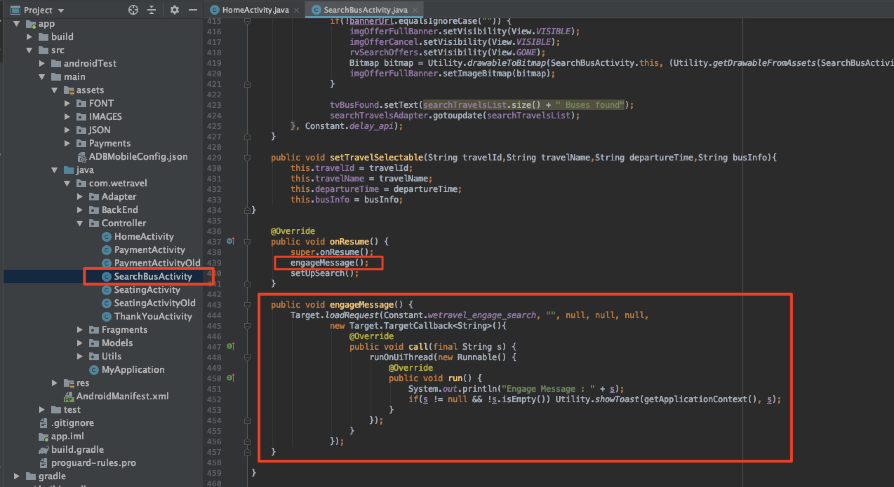

# Aggiungi  richieste Adobe Target

L&#39;SDK di  Adobe Mobile Services (v4) fornisce  metodi e funzionalità Adobe Target che consentono di personalizzare l&#39;app con esperienze diverse per utenti diversi. In genere, una o più richieste vengono effettuate dall&#39;app all&#39;Adobe Target  per recuperare il contenuto personalizzato e misurare l&#39;impatto di tale contenuto.

In questa lezione, preparerai l&#39;app We.Travel per la personalizzazione implementando le [!DNL Target] richieste.

## Prerequisiti

Assicurati di [scaricare e aggiornare l&#39;app di esempio](download-and-update-the-sample-app.md).

## Obiettivi di apprendimento

Al termine di questa lezione, potrete:

* Memorizzare nella cache più offerte [!DNL Target] (ossia contenuti personalizzati) utilizzando una richiesta di recupero preventivo batch
* Carica posizioni prerecuperate [!DNL Target]
* Carica una posizione [!DNL Target] in tempo reale (non preacquisita)
* Cancellare le posizioni prerecuperate dalla cache
* Convalida di richieste prerecuperate e in tempo reale

## Terminologia 

Di seguito sono riportati alcuni termini chiave di Target che verranno utilizzati nel resto dell&#39;esercitazione.

* **Richiesta:**  una richiesta di rete ai server Adobe Target
* **Offerta:**  frammento di codice o altro contenuto basato su testo, definito nell&#39;interfaccia  [!DNL Target] utente (o con API), che viene distribuito nella risposta. Di solito JSON quando [!DNL Target] viene utilizzato nelle app mobili native.
* **Percorso:nome definito dall’utente assegnato a**  una richiesta, utilizzato nell’ [!DNL Target] interfaccia per associare le offerte a richieste specifiche
* **Richiesta batch:**  una singola richiesta che include più posizioni
* **Richiesta di recupero preventivo:**  una singola richiesta che recupera le offerte e le memorizza nella cache per un utilizzo futuro nell&#39;app
* **Richiesta recupero preventivo batch:**  una singola richiesta che prerileva le offerte per più posizioni
* **Pubblico:**  un gruppo di visitatori definiti nell&#39; [!DNL Target] interfaccia o condivisi con altri  [!DNL Target] Adobi di applicazioni (ad es. &quot;Visitatori iPhone X&quot;, &quot;visitatori in California&quot;, &quot;First App Open&quot;)
* **Attività:**  un  [!DNL Target] costrutto, definito nell&#39;interfaccia  [!DNL Target] utente (o con API) che collega posizioni, offerte e audience per creare un&#39;esperienza personalizzata

## Aggiunta di una richiesta di recupero preventivo batch

La prima richiesta che implementeremo in We.Travel è una richiesta di preacquisizione batch con due [!DNL Target] posizioni sulla Home Screen. In una lezione successiva, configureremo le offerte per queste posizioni che visualizzano messaggi per aiutare i nuovi utenti a seguire il processo di prenotazione.

Una richiesta di preacquisizione recupera il contenuto [!DNL Target] il meno possibile, memorizzando nella cache la risposta del server Adobe Target  (offerta). Una richiesta di recupero preventivo del batch recupera e memorizza nella cache più offerte, ciascuna associata a una posizione diversa. Tutte le posizioni prerecuperate vengono memorizzate nella cache del dispositivo per un utilizzo futuro nella sessione utente. Anteponendo in anteprima più posizioni nella schermata iniziale, possiamo recuperare le offerte da utilizzare in un secondo momento quando il visitatore naviga nell’app. Per ulteriori informazioni sui metodi di preacquisizione, consultare la [documentazione relativa al recupero preventivo](https://docs.adobe.com/content/help/en/mobile-services/android/target-android/c-mob-target-prefetch-android.html).

### Aggiunta della richiesta di recupero preventivo del batch

Aggiornate il controller HomeActivity (il codice sorgente della Home Screen), che si trova in app > main > java > com.wetravel > Controller. Verranno aggiunti i due blocchi di codice riportati in rosso:

Inizieremo con il controller HomeActivity (codice sorgente della Home Screen), che si trova in app > main > java > com.wetravel > Controller.

Verranno aggiunti i due blocchi di codice riportati in rosso:


Scorrete verso il basso fino alla fine del codice di HomeActivity e aggiungete il codice fornito di seguito dopo la funzione `setHeader()` e *sostituendo* la funzione corrente `onResume()`:

```java
@Override
protected void onResume() {
    super.onResume();
    targetPrefetchContent();
}

public void targetPrefetchContent() {
    List<TargetPrefetchObject> prefetchList = new ArrayList<>();
    prefetchList.add(Target.createTargetPrefetchObject(Constant.wetravel_engage_home, null));
    prefetchList.add(Target.createTargetPrefetchObject(Constant.wetravel_engage_search, null));
    Target.TargetCallback<Boolean> prefetchStatusCallback = new Target.TargetCallback<Boolean>() {
        @Override
        public void call(final Boolean status) {
            HomeActivity.this.runOnUiThread(new Runnable() {
                @Override
                public void run() {
                    String cachingStatus = status ? "YES" : "NO";
                    System.out.println("Received Response from prefetch : " + cachingStatus);
                    setUp();

                }
            });
        }};
    Target.prefetchContent(prefetchList, null, prefetchStatusCallback);
}
```

L&#39;IDE avviserà probabilmente che nel file non sono state importate le classi [!DNL Target]. Assicuratevi di importare le classi [!DNL Target] nella parte superiore del controller HomeActivity come mostrato in rosso di seguito:

```java
import com.adobe.mobile.Target;
import com.adobe.mobile.TargetPrefetchObject;
```


Probabilmente verranno visualizzati anche errori per &quot;impossibile trovare la variabile di simbolo wetravel_Eng_home&quot; e &quot;impossibile trovare la variabile di simbolo wetravel_Eng_search&quot;. Aggiungeteli al file `Constant.java` (in app > src > main > java > com > wetravel > Utils):

```java
public static final String wetravel_engage_home = "wetravel_engage_home";
public static final String wetravel_engage_search = "wetravel_engage_search";
```


### Spiegazione codice richiesta recupero preventivo batch

| Codice | Descrizione |
|--- |--- |
| `targetPrefetchContent()` | Una funzione definita dall&#39;utente (non facente parte dell&#39;SDK) che utilizza i metodi [!DNL Target] per recuperare e memorizzare nella cache due posizioni [!DNL Target]. |
| `prefetchContent()` | Il metodo SDK [!DNL Target] che invia la richiesta di preacquisizione |
| `Constant.wetravel_engage_home` | Nome della posizione [!DNL Target] preacquisita che mostrerà il contenuto della propria offerta nella schermata iniziale |
| `Constant.wetravel_engage_search` | Nome posizione [!DNL Target] preacquisito che mostrerà il contenuto della propria offerta nella schermata Risultati ricerca. Poiché si tratta di una seconda posizione nella preacquisizione, questa richiesta di preacquisizione è denominata &quot;richiesta batch di preacquisizione&quot;. |
| setUp() | Una funzione definita dall&#39;utente che esegue il rendering della schermata iniziale dell&#39;app dopo che le offerte [!DNL Target] sono state prerecuperate |

### Informazioni asincrone e sincrono

Con il codice appena implementato, la richiesta di preacquisizione viene effettuata come chiamata sincrona di blocco, appena prima del rendering della schermata iniziale. Quando abbiamo incollato il nuovo codice nel controller HomeActivity, abbiamo spostato l&#39;esecuzione della funzione `setUp()` dalla funzione `onResume()` fino a dopo la richiesta Target. Questo può essere utile negli scenari in cui desiderate personalizzare il contenuto quando l&#39;app si apre per la prima volta, perché garantisce che il contenuto personalizzato dai server di Target sia restituito (o scaduto) prima del rendering della prima schermata. Per consentire il caricamento asincrono delle richieste (in background), è sufficiente chiamare `setUp()` all&#39;interno della funzione `onCreate()`.

### Convalida della richiesta di recupero preventivo del batch

Generate di nuovo l&#39;app e aprite l&#39;emulatore Android. (Le schermate seguenti utilizzano Pixel 2 su Android Q versione 9+, API livello 29). La risposta di recupero preventivo deve essere &quot;risposta di recupero preventivo ricevuta&quot;:

Quando viene eseguito il rendering della schermata principale, la richiesta di recupero preventivo deve essere caricata. Con Logcat, filtrate [!DNL "Target"] per visualizzare la richiesta e la risposta:


Se la risposta non viene ricevuta correttamente, verificate le impostazioni nel file `ADBMobileConfig.json` e la sintassi del codice nel file HomeActivity.

Due posizioni vengono ora memorizzate nella cache del dispositivo. I nomi delle posizioni verranno caricati lentamente nell&#39;interfaccia [!DNL Target], dove possono essere selezionati in vari menu a discesa quando vengono utilizzati in un&#39;attività.

### Aggiunta di richieste di caricamento per ogni posizione nella cache

Ora che le posizioni sono prerecuperate e le relative risposte memorizzate nella cache del dispositivo, aggiungiamo il metodo `Target.loadRequest()` che recupera il contenuto dell&#39;offerta dalla cache in modo da poterlo utilizzare per aggiornare l&#39;applicazione. Verrà aggiunto un nuovo metodo personalizzato denominato `engageMessage()` che verrà eseguito con la richiesta di preacquisizione. `engageMessage()` chiamerò  `Target.loadRequest()`. `engageMessage()` viene eseguito prima  `setUp()` di fare in modo che la richiesta di caricamento venga chiamata prima della configurazione dello schermo.

Innanzitutto, aggiungi la `engageMessage()` chiamata &amp; metodo per la posizione wetravel_Eng_home in HomeActivity:


Ecco il codice aggiornato:

```java
    public void targetPrefetchContent() {
        List<TargetPrefetchObject> prefetchList = new ArrayList<>();
        Map<String, Object> params1;
        params1 = new HashMap<String, Object>();
        params1.put("at_property", "your at_property value goes here");
        prefetchList.add(Target.createTargetPrefetchObject(Constant.wetravel_engage_home, params1));
        prefetchList.add(Target.createTargetPrefetchObject(Constant.wetravel_engage_search, params1));
        Target.TargetCallback<Boolean> prefetchStatusCallback = new Target.TargetCallback<Boolean>() {
            @Override
            public void call(final Boolean status) {
                HomeActivity.this.runOnUiThread(new Runnable() {
                    @Override
                    public void run() {
                        String cachingStatus = status ? "YES" : "NO";
                        System.out.println("Received Response from prefetch : " + cachingStatus);
                        engageMessage();
                        setUp();
                    }
                });
            }};
        Target.prefetchContent(prefetchList, null, prefetchStatusCallback);
    }
    public void engageMessage() {
        Target.loadRequest(Constant.wetravel_engage_home, "", null, null, null,
            new Target.TargetCallback<String>(){
                @Override
                public void call(final String s) {
                    runOnUiThread(new Runnable() {
                        @Override
                        public void run() {
                            System.out.println("Engage Message : " + s);
                            if(s != null && !s.isEmpty()) Utility.showToast(getApplicationContext(), s);
                        }
                    });
                }
            });
    }
```

Ora aggiungi il metodo `engageMessage()` call &amp; per il percorso wetravel_Eng_search in SearchBusActivity. Tenere presente che la chiamata `engageMessage()` è impostata nel metodo `onResume()` prima della chiamata a `setUpSearch()`, quindi viene eseguita prima della configurazione della schermata:



Ecco il codice aggiornato:

```java
    @Override
    public void onResume() {
        super.onResume();
        engageMessage();
        setUpSearch();
    }
    public void engageMessage() {
        Target.loadRequest(Constant.wetravel_engage_search, "", null, null, null,
                new Target.TargetCallback<String>(){
                    @Override
                    public void call(final String s) {
                        runOnUiThread(new Runnable() {
                            @Override
                            public void run() {
                                System.out.println("Engage Message : " + s);
                                if(s != null && !s.isEmpty()) Utility.showToast(getApplicationContext(), s);
                            }
                        });
                    }
                });
    }
```

Poiché hai appena aggiunto i metodi Target a SearchBusActivity, assicurati di importare le classi [!DNL Target]:

```java
import com.adobe.mobile.Target;
import com.adobe.mobile.TargetPrefetchObject;
```

## Aggiunta di una richiesta in tempo reale

La richiesta successiva che aggiungeremo all&#39;app sarà una richiesta in tempo reale nella schermata di ringraziamento. Con &quot;tempo reale&quot; si intende che sia la richiesta che la risposta saranno immediatamente applicate (non memorizzate nella cache per un momento successivo). In una lezione successiva, verrà creata un&#39;esperienza utilizzando questa richiesta, personalizzata per la destinazione del viaggio dell&#39;utente.

Aggiungiamo una richiesta in tempo reale nella schermata di ringraziamento. Nel file di attività di ringraziamento verranno apportate le modifiche indicate in rosso:


Scorrete fino alla fine del file di attività di ringraziamento. Aggiungete un commento alle tre righe nella funzione `getRecommandations()` e aggiungete l&#39;invocazione della funzione `targetLoadRequest()`:

```java
// AppDialogs.dialogLoaderHide();
// recommandations.addAll(recommandation.recommandations);
// recommandationbAdapter.notifyDataSetChanged();
```

Aggiungere questa riga di codice alla funzione `getRecommandations()`:

```java
targetLoadRequest(recommandation.recommandations);
```

Ora è necessario definire la funzione `targetLoadRequest()`:


Aggiungi questo blocco di codice dopo la funzione `filterRecommendationBasedOnOffer()`:

```java
public void targetLoadRequest(final ArrayList<Recommandation> recommandations) {
    Target.loadRequest(Constant.wetravel_context_dest, "", null, null, null, new Target.TargetCallback<String>() {
        @Override
        public void call(final String response) {
            try {
                runOnUiThread(new Runnable() {
                    @Override
                    public void run() {
                        AppDialogs.dialogLoaderHide();
                        filterRecommendationBasedOnOffer(recommandations, response);
                        recommandationbAdapter.notifyDataSetChanged();
                    }
                });
            } catch (Exception e) {
                e.printStackTrace();
            }
        }
    });
}
```

Poiché hai appena aggiunto i metodi di Target all&#39;attività di ringraziamento, assicurati di importare le classi di Target:

```java
import com.adobe.mobile.Target;
import com.adobe.mobile.TargetPrefetchObject;
```

### descrizione del codice targetLoadRequest()

| Codice | Descrizione |
|--- |--- |
| `targetLoadRequest()` | Una funzione definita dall&#39;utente (non facente parte dell&#39;SDK) che attiva `Target.loadRequest()` per caricare e visualizzare la posizione wetravel_context_dest |
| `Target.loadRequest()` | Metodo SDK che invia la richiesta al server di Target |
| Constant.wetravel_context_dest | Il nome della posizione assegnato alla richiesta che utilizzeremo in seguito al momento della creazione dell&#39;attività nell&#39;interfaccia [!DNL Target] |
| `filterRecommendationBasedOnOffer()` | Funzione definita dall&#39;utente nell&#39;app che prende l&#39;offerta della posizione dalla risposta di Target e decide in che modo l&#39;app deve cambiare in base al contenuto dell&#39;offerta |
| `recommandations.addAll()` | Una funzione definita dall&#39;utente nell&#39;app che era utilizzata per impostazione predefinita quando veniva caricata la schermata di ringraziamento, ma ora viene eseguita dopo che la risposta di Target è stata ricevuta e analizzata da `filterRecommendationBasedOnOffer()` |

Questo è stato un aggiornamento più sofisticato che abbiamo fatto all&#39;app con la richiesta che abbiamo aggiunto alla schermata iniziale, quindi dedichiamo un momento per vedere cosa abbiamo fatto:

1. Abbiamo interrotto il comportamento precedente dell&#39;app, che mostrava tre promozioni predefinite, commentando le righe di codice
1. Abbiamo detto all&#39;app invece di eseguire una nuova funzione, che abbiamo chiamato arbitrariamente targetLoadRequest
1. Abbiamo definito la funzione `targetLoadRequest` per effettuare una richiesta a Target utilizzando il metodo Target.loadRequest ed eseguire immediatamente la funzione `filterRecommendationBasedOnOffer()` quando viene ricevuta la risposta dell&#39;offerta [!DNL Target]
1. La funzione `filterRecommendationBasedOnOffer()` interpreta la risposta e decide quali promozioni applicare allo schermo

Si tratta di un pattern di utilizzo molto comune quando si utilizza [!DNL Target] nelle app mobili.  È molto potente, in quanto puoi personalizzare quasi tutti gli aspetti della tua app mobile. Richiede inoltre il coordinamento tra il codice dell&#39;app e le offerte che verranno definite successivamente nell&#39;interfaccia [!DNL Target]. Grazie a questo coordinamento, alcuni casi di utilizzo della personalizzazione potrebbero richiedere l&#39;aggiornamento dell&#39;app nell&#39;app store per avviare l&#39;attività.

### Convalida della richiesta in tempo reale

Aprite l&#39;emulatore Android e seguite tutti i passaggi per prenotare un viaggio: Home > Risultati ricerca bus > Selezione posti, Opzioni di pagamento (qualsiasi opzione di pagamento con dati vuoti funzionerà).

Nella schermata finale di ringraziamento, guardate Logcat per la risposta. La risposta deve essere &quot;Contenuto predefinito restituito per &quot;wetravel_context_dest&quot;:


## Cancellazione delle posizioni prerecuperate dalla cache

In alcune situazioni le posizioni prerecuperate devono essere eliminate durante una sessione. Ad esempio, quando si verifica una prenotazione, ha senso cancellare le posizioni memorizzate nella cache, dal momento che l&#39;utente è &quot;impegnato&quot; e comprende il processo di prenotazione. Se prenotano un altro viaggio durante la loro sessione, non avranno bisogno delle posizioni originali sullo schermo di casa e la schermata dei risultati della ricerca per guidarne la prenotazione. Sarebbe più sensato cancellare le posizioni dalla cache e preacquisire nuove offerte per forse una seconda prenotazione scontata o un altro scenario pertinente. È possibile aggiungere la logica alla schermata iniziale e alla schermata dei risultati della ricerca per preacquisire nuove posizioni se durante la sessione è stata effettuata una prenotazione.

In questo esempio, verranno cancellate le posizioni preconfigurate per la sessione al momento della prenotazione. Questa operazione viene eseguita chiamando la funzione `Target.clearPrefetchCache()`. Impostare la funzione all&#39;interno della funzione `targetLoadRequest()` come illustrato di seguito:

```java
Target.clearPrefetchCache()
```


Congratulazioni! La tua app ora dispone del framework per la personalizzazione. Nella prossima lezione, miglioreremo le nostre capacità di personalizzazione aggiungendo parametri a queste posizioni.

**[NEXT: &quot;Aggiungi parametri&quot; >](add-parameters.md)**
