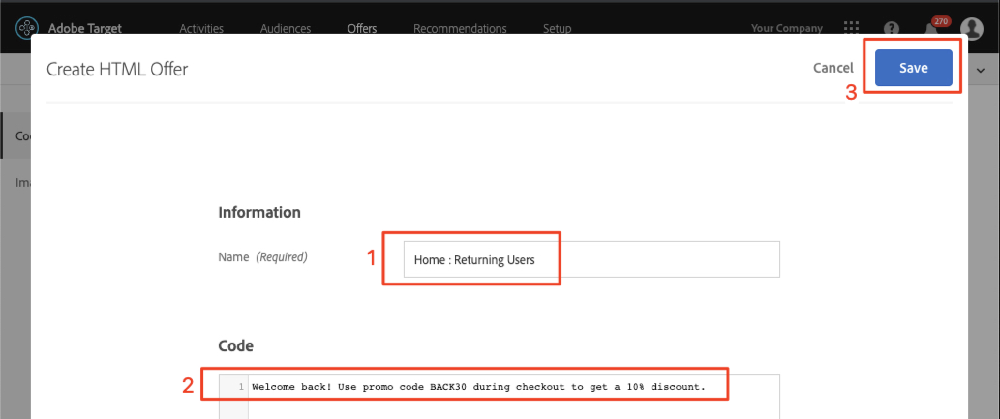

# Creazione di audience e offerte in  Adobe Target

In questa lezione, entreremo nell&#39; [!DNL Target] interfaccia e creeremo audience e offerte per le tre posizioni che abbiamo implementato nelle lezioni precedenti.

## Obiettivi di apprendimento

Al termine di questa lezione, potrete:

* Utilizzo del pubblico in Adobe Target
* Creare offerte in  Adobe Target

Più specificamente, in questa lezione creeremo audience e offerte necessarie per realizzare i casi di utilizzo personalizzati definiti all&#39;inizio dell&#39;esercitazione. Vogliamo utilizzare le schermate Home e Ricerca per aiutare gli utenti delle app a prenotare i loro viaggi, e vogliamo utilizzare la schermata di ringraziamento per mostrare alcune promozioni rilevanti in base alla destinazione dell&#39;utente. Di seguito è riportata una tabella che rappresenta gli elementi che verranno generati in questa lezione per ogni posizione:

| Posizione | Destinatari | Offerta |
| --- | --- | --- |
| wetravel_Eng_home | Nuovi utenti delle app mobili | &quot;Seleziona la tua origine e destinazione per cercare le rotte dei bus disponibili&quot; |
| wetravel_Eng_search | Nuovi utenti delle app mobili | &quot;Utilizza i filtri per limitare i risultati della ricerca&quot; |
| wetravel_Eng_home | Restituzione di utenti di app mobili | &quot;Bentornato! Usa il codice promozionale BACK30 durante il checkout per ottenere uno sconto del 10%.&quot; |
| wetravel_Eng_search | Restituzione di utenti di app mobili | contenuto predefinito |
| wetravel_context_dest | Destinazione: San Diego | &quot;DJ&quot; |
| wetravel_context_dest | Destinazione: Los Angeles | &quot;Universale&quot; |

## Selezionare l&#39;area di lavoro

Se l&#39;azienda utilizza le proprietà e le aree di lavoro per stabilire limiti per la personalizzazione di app e siti Web e hai implementato il parametro at_property nell&#39;ultima lezione, devi prima accertarti di essere nell&#39;area di lavoro corretta prima di continuare con questa lezione. Se non usi Proprietà e Aree di lavoro, ignora questo passaggio. Selezionare l&#39;area di lavoro utilizzata nella lezione precedente per copiare il valore at_property:

## Creazione di audience

Ora creiamo i tipi di pubblico che utilizzeremo per personalizzare l&#39;app.

### Creare un pubblico per i nuovi utenti

 pubblico Adobe Target viene utilizzato per identificare specifici gruppi di visitatori. Le offerte possono quindi essere indirizzate a quei gruppi specifici. Per le prime due posizioni, utilizzeremo un pubblico &quot;New Users&quot;:

1. Fate clic su **[!UICONTROL Audience]** nella navigazione in alto.
1. Fate clic sul pulsante **[!UICONTROL Crea pubblico]** .
   

1. Inserisci **[!UICONTROL Nuovi utenti]** app mobili come nome dell&#39;audience.
1. Selezionate **[!UICONTROL Aggiungi regola]**.
1. Selezionare una regola **[!UICONTROL personalizzata]** .
   

1. Selezionate **[!UICONTROL a.Launches]**.
1. Seleziona **[!UICONTROL è minore]** di.
1. Enter **5**.
1. Salva la nuova audience.
   

### Creare un pubblico per gli utenti che tornano

Seguite gli stessi passaggi elencati sopra per creare un&#39;audience per gli utenti di ritorno.

1. Denominate il pubblico _che restituisce gli utenti_ delle app mobili.
1. Usa **[!UICONTROL a.Launches è maggiore o uguale a 5]** come regola personalizzata.
1. Salva la nuova audience.

   

>[!NOTE]
>
>Tutte le metriche e le dimensioni del ciclo di vita raccolte nell’SDK per [!DNL Target] dispositivi mobili sono precedute da &quot;a&quot; (ad esempio, a.Launches) e sono disponibili nell’opzione &quot;Personalizzato&quot; del menu a discesa e possono essere utilizzate per creare audience.

### Creazione di un pubblico per gli utenti Prenotazione di un viaggio a San Diego

Successivamente verranno creati alcuni tipi di pubblico per alcune delle destinazioni offerte dall&#39;app We.Travel. Nell&#39;ultima lezione abbiamo passato la destinazione come parametro di posizione nella richiesta di posizione wetravel_context_dest. Tale parametro è disponibile nell&#39;opzione &quot;Personalizzato&quot; del menu a discesa.

>[!NOTE]
>
>Se un parametro che si prevede di visualizzare nel menu a discesa Personalizzato non viene visualizzato nell&#39; [!DNL Target] interfaccia, verificate che sia effettivamente passato nella richiesta. Se avete verificato che sia presente nella richiesta, ma che non sia stata caricata nell&#39; [!DNL Target] interfaccia, potete semplicemente digitare il nome del parametro e premere Invio per continuare a definire il pubblico

1. Nome dell&#39;audience _Destinazione: San Diego_.
1. Utilizzate una regola personalizzata con questa definizione: _locationDest contiene San Diego_.
1. Salva la nuova audience.

   

### Creazione di un pubblico per gli utenti Prenotazione di un viaggio a Los Angeles

1. Nome dell&#39;audience _Destinazione: Los Angeles_
1. Utilizzate una regola personalizzata con questa definizione: _locationDest contiene Los Angeles_
1. Salva la nuova audience.

## Creare offerte

Ora, creiamo offerte per visualizzare questi messaggi. Come promemoria, le offerte sono snippet di codice/contenuto, che vengono recapitati nella [!DNL Target] risposta. Vengono spesso creati nell’interfaccia [!DNL Target] utente, ma possono anche essere creati tramite API o mediante l’integrazione dei frammenti esperienza con  Adobe Experience Manager. Nelle app mobili, le offerte JSON sono comuni. In questa esercitazione, utilizzeremo le offerte HTML, che possono essere utilizzate per distribuire qualsiasi contenuto di testo normale (incluso JSON) nell&#39;app.

### Creare l&#39;offerta per i nuovi utenti

Innanzitutto, creiamo offerte per i messaggi ai nuovi utenti:

1. Fate clic su **[!UICONTROL Offerte]** nella navigazione superiore.
1. Fai clic su **[!UICONTROL Crea]**.
1. Selezionate **[!UICONTROL Offerta]** HTML.

   

1. Denominate l&#39;offerta _Home: Coinvolgi nuovi utenti_.
1. Digitate _Seleziona origine e destinazione per cercare i bus_ disponibili come codice.
1. Salvate la nuova offerta.

   

### Creare l&#39;offerta per gli utenti che tornano

Create ora un&#39;unica offerta per gli utenti finali (la seconda sarà il contenuto predefinito, che verrà visualizzato come nulla):

1. Denominate l&#39;offerta _Home: Restituzione di utenti_.
1. Immettete _Bentornato! Utilizza il codice promozionale BACK30 durante il checkout per ottenere uno sconto del 10%._ come codice HTML.
1. Salvate la nuova offerta.

   

### Creare l&#39;offerta di San Diego

Quando &quot;DJ&quot; viene restituito all&#39;attività di ringraziamento, nella funzione filterRecommendationBasedOnOffer() viene visualizzato un banner per &quot;Rock Night with DJ SAM&quot;:

1. Denominate l&#39;offerta _Promozione per San Diego_.
1. Immettete _DJ_ come codice HTML.
1. Salvate la nuova offerta.

### Creare un&#39;offerta per gli utenti che vanno a Los Angeles

Quando viene restituito &quot;Universal&quot; all&#39;attività di ringraziamento, nella logica della funzione filterRecommendationBasedOnOffer() viene visualizzato un banner per &quot;Universal Studios&quot; viene visualizzato:

1. Denominate l&#39;offerta _Promozione per Los Angeles_.
1. Immettete _Universal_ come codice HTML.
1. Salvate la nuova offerta.

## Conclusione

Ora abbiamo il pubblico e le offerte. Nella prossima lezione, creeremo attività che leghino le posizioni, i tipi di pubblico e le offerte insieme per creare le esperienze personalizzate!

**[NEXT: &quot;Personalizza layout&quot; >](personalize-layouts.md)**
