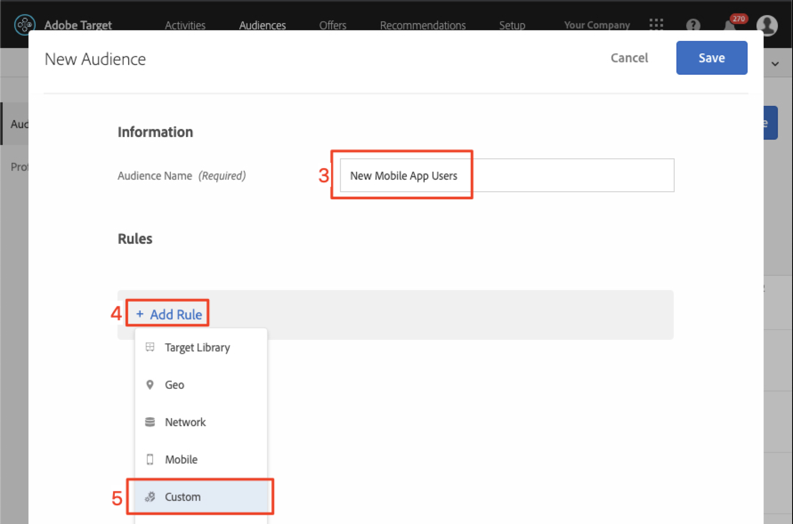

# Creare tipi di pubblico e offerte in Adobe Target

In questa lezione verrà illustrata l&#39;interfaccia di [!DNL Target] e verranno creati tipi di pubblico e offerte per le tre posizioni implementate nelle lezioni precedenti.

## Finalità di apprendimento

Alla fine di questa lezione, sarai in grado di:

* Utilizzo del pubblico in Adobe Target
* Creare le offerte in Adobe Target

Più specificamente, in questa lezione verranno creati i tipi di pubblico e le offerte necessari per eseguire i casi di utilizzo di personalizzazione definiti all’inizio dell’esercitazione. Vogliamo utilizzare le schermate Home e Ricerca per aiutare gli utenti dell’app a prenotare i loro viaggi, e vogliamo utilizzare la schermata di ringraziamento per visualizzare alcune promozioni rilevanti in base alla destinazione dell’utente. Ecco una tabella che rappresenta ciò che verrà creato in questa lezione per ogni posizione:

| Posizione | Destinatari | Offerta |
| --- | --- | --- |
| wetravel_engagement_home | Nuovi utenti di app mobili | &quot;Selezionare l&#39;origine e la destinazione per ricercare i percorsi bus disponibili&quot; |
| wetravel_engagement_search | Nuovi utenti di app mobili | &quot;Utilizzare i filtri per limitare i risultati della ricerca&quot; |
| wetravel_engagement_home | Restituzione degli utenti di app mobili | &quot;Bentornato! Utilizza il codice promozionale BACK30 durante il pagamento per ottenere uno sconto del 10%.&quot; |
| wetravel_engagement_search | Restituzione degli utenti di app mobili | contenuto predefinito |
| wetravel_context_dest | Destinazione: San Diego | &quot;DJ&quot; |
| wetravel_context_dest | Destinazione: Los Angeles | &quot;Universale&quot; |

## Seleziona il Workspace

Se la tua azienda utilizza Proprietà e Aree di lavoro per definire i limiti per la personalizzazione di app e siti web (e hai implementato il parametro at_property nell’ultima lezione), prima di procedere con questa lezione devi accertarti di essere nel Workspace corretto. Se non utilizzi Proprietà e Aree di lavoro, ignora questo passaggio. Seleziona il Workspace utilizzato nella lezione precedente per copiare il valore at_property:

## Creare tipi di pubblico

Ora creiamo i tipi di pubblico che utilizzeremo per personalizzare l’app.

### Creare un pubblico per i nuovi utenti

I tipi di pubblico di Adobe Target vengono utilizzati per identificare gruppi specifici di visitatori. Le offerte possono quindi essere indirizzate a tali gruppi specifici. Per le prime due posizioni, utilizzeremo un pubblico di tipo &quot;Nuovi utenti&quot;:

1. Fai clic su **[!UICONTROL Audiences]** nella navigazione superiore.
1. Fare clic sul pulsante **[!UICONTROL Create Audience]**.
   

1. Immetti **[!UICONTROL New Mobile App Users]** come nome del pubblico.
1. Selezionare **[!UICONTROL Add Rule]**.
1. Selezionare una regola **[!UICONTROL Custom]**.
   

1. Selezionare **[!UICONTROL a.Launches]**.
1. Selezionare **[!UICONTROL is less than]**.
1. Immettere **5**.
1. Salva il nuovo pubblico.
   

### Creare un pubblico per gli utenti di ritorno

Segui gli stessi passaggi elencati sopra per creare un pubblico per gli utenti di ritorno.

1. Denomina il pubblico _Utenti di ritorno dall&#39;app mobile_.
1. Utilizza **[!UICONTROL a.Launches is greater than or equal to 5]** come regola personalizzata.
1. Salva il nuovo pubblico.

   

>[!NOTE]
>
>Tutte le metriche e le dimensioni del ciclo di vita raccolte nel SDK mobile [!DNL Target] sono precedute da &quot;a&quot; (ad esempio, a.Launches) e sono disponibili nell&#39;opzione &quot;Personalizzato&quot; del menu a discesa e possono essere utilizzate per creare tipi di pubblico.

### Creare un pubblico per gli utenti Prenotazione di un viaggio a San Diego

Ora creeremo alcuni tipi di pubblico per alcune delle destinazioni offerte dall’app We.Travel. Nell’ultima lezione abbiamo passato la destinazione come parametro di posizione nella richiesta di posizione wetravel_context_dest. Tale parametro è disponibile nell’opzione &quot;Personalizzato&quot; del menu a discesa.

>[!NOTE]
>
>Se un parametro che si prevede di visualizzare nel menu a discesa Personalizzato non viene visualizzato nell&#39;interfaccia [!DNL Target], verificare che sia effettivamente trasmesso nella richiesta. Se hai verificato che è presente nella richiesta, ma non è stato caricato in modo lento nell&#39;interfaccia [!DNL Target], puoi semplicemente digitare il nome del parametro e premere Invio per continuare a definire il pubblico

1. Denomina il pubblico _Destinazione: San Diego_.
1. Utilizza una regola personalizzata con questa definizione: _locationDest contiene San Diego_.
1. Salva il nuovo pubblico.

   

### Creare un pubblico per gli utenti che prenotano un viaggio a Los Angeles

1. Assegna un nome al pubblico _Destinazione: Los Angeles_
1. Usa una regola personalizzata con questa definizione: _locationDest contiene Los Angeles_
1. Salva il nuovo pubblico.

## Creare le offerte

Ora creiamo le offerte per visualizzare questi messaggi. Come promemoria, le offerte sono snippet di codice/contenuto, consegnati nella risposta [!DNL Target]. Nella maggior parte dei casi sono create nell&#39;interfaccia utente [!DNL Target], ma è anche possibile crearle tramite API o utilizzando l&#39;integrazione Frammenti di esperienza con Adobe Experience Manager. Nelle app per dispositivi mobili, le offerte JSON sono comuni. In questo tutorial utilizzeremo le offerte HTML, che possono essere utilizzate per fornire nell’app qualsiasi contenuto in formato non crittografato (incluso JSON).

### Crea offerta per nuovi utenti

Innanzitutto, creiamo offerte per i messaggi destinati ai nuovi utenti:

1. Fai clic su **[!UICONTROL Offers]** nella navigazione superiore.
1. Fare clic su **[!UICONTROL Create]**.
1. Selezionare **[!UICONTROL HTML Offer]**.

   

1. Denomina l&#39;offerta _Home: coinvolgi nuovi utenti_.
1. Immetti _Seleziona Source e Destinazione per cercare i bus disponibili_ come codice.
1. Salva la nuova offerta.

   

### Crea l&#39;offerta per gli utenti di ritorno

Ora creiamo l’unica offerta per gli utenti di ritorno (la seconda offerta sarà il contenuto predefinito, che non verrà visualizzato come nulla):

1. Denomina l&#39;offerta _Home: Restituzione utenti_.
1. Immetti _Bentornato! Utilizza il codice promozionale BACK30 durante il pagamento per ottenere uno sconto del 10%._ come codice HTML.
1. Salva la nuova offerta.

   

### Crea offerta San Diego

Quando &quot;DJ&quot; viene restituito all’attività ThankYou, la logica nella funzione filterRecommendationBasedOnOffer() visualizzerà un banner per &quot;Rock Night with DJ SAM&quot;:

1. Denomina l&#39;offerta _Promozione per San Diego_.
1. Immetti _DJ_ come codice HTML.
1. Salva la nuova offerta.

### Crea offerta per gli utenti che vanno a Los Angeles

Quando viene restituito &quot;Universal&quot; all’attività ThankYou, la logica nella funzione filterRecommendationBasedOnOffer() visualizzerà un banner per &quot;Universal Studios&quot; visualizzerà:

1. Denomina l&#39;offerta _Promozione per Los Angeles_.
1. Immetti _Universal_ come codice HTML.
1. Salva la nuova offerta.

## Conclusione

Ora abbiamo i nostri tipi di pubblico e le nostre offerte. Nella prossima lezione, creeremo attività che legano le posizioni, i tipi di pubblico e le offerte per creare esperienze personalizzate.

**[AVANTI: &quot;Personalizza layout&quot; >](personalize-layouts.md)**
