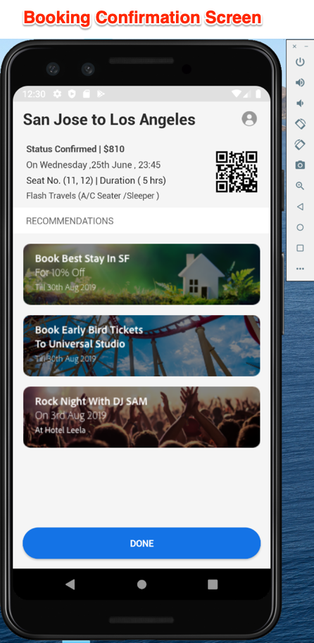
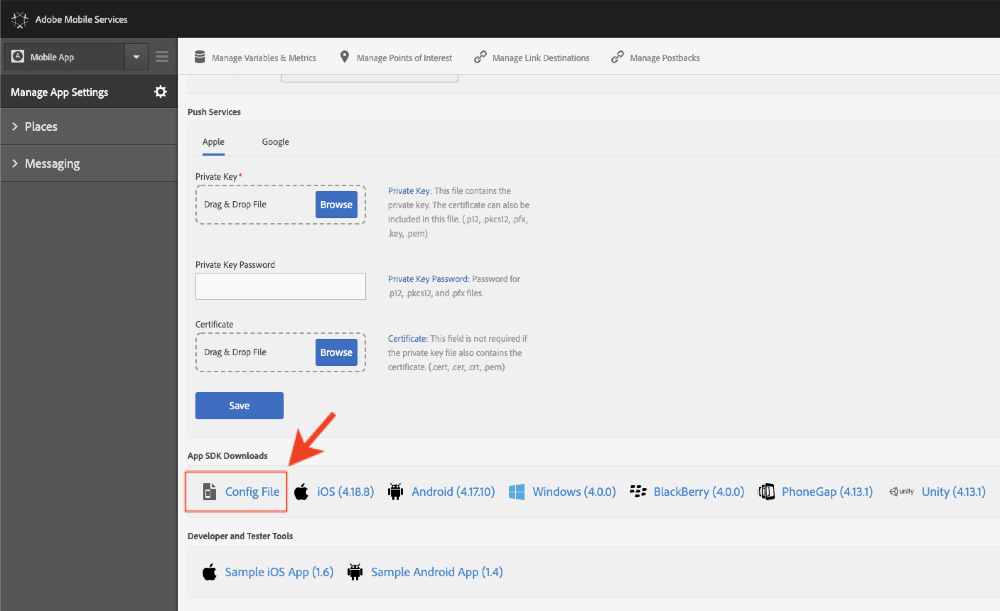
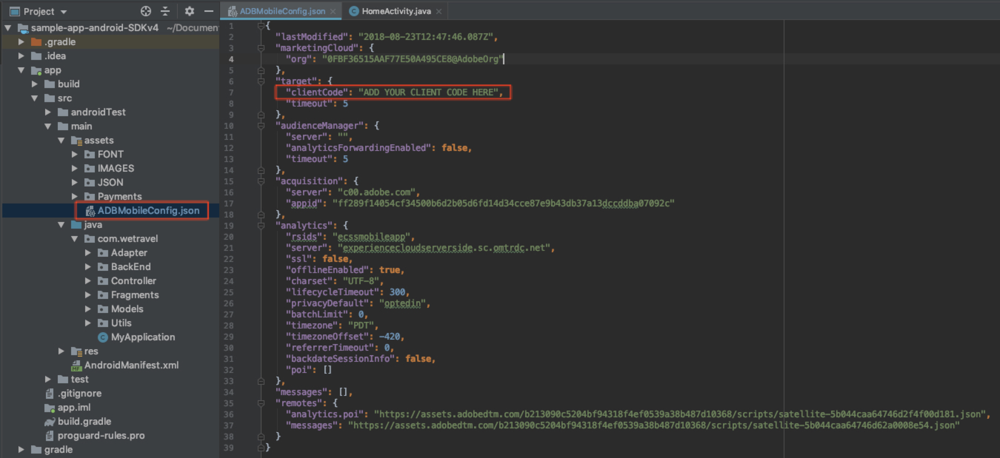

# Scarica e aggiorna l’app di esempio We.Travel.

L&#39;app di esempio We.Travel è preimplementata con Adobe Mobile Services SDK v4. È sufficiente aggiornarla per indirizzarla agli account della tua organizzazione Experience Cloud e della tua soluzione.

## Finalità di apprendimento

Alla fine di questa lezione, sarai in grado di:

* Scarica e apri l’app di esempio We.Travel in Android Studio
* Verifica e aggiorna le impostazioni SDK di Mobile Services per [!DNL Target]

## Scarica l’app We.Travel.

* Scarica [sample-app-android-SDKv4-Base-Version.zip](assets/sample-app-android-SDKv4-Base-Version.zip)
* Decomprimi il file zip
* Apri l’app in Android Studio come progetto esistente (ignora eventuali errori relativi alla &quot;Mappatura radice VCS non valida&quot;).
* Esegui l’app in un emulatore per verificare che l’app venga generata e che sia visibile la schermata iniziale
* Sfoglia l’app e verifica di poter completare il processo di prenotazione (seleziona un’opzione di pagamento e premi &quot;Procedi&quot; per saltare la schermata di fatturazione!).

  

## Verifica e aggiorna le impostazioni SDK di Mobile Services per [!DNL Target]

Il SDK di Adobe Mobile Services è stato preinstallato nell&#39;app We.Travel [secondo la documentazione](https://experienceleague.adobe.com/docs/mobile-services/android/getting-started-android/requirements.html?lang=it). Ora aggiornerai l&#39;installazione in modo che punti al tuo account [!DNL Target].

Innanzitutto, crea una nuova app nell’interfaccia utente di Mobile Services:

1. Accedi all&#39;[interfaccia di Adobe Mobile Services](https://mobilemarketing.adobe.com/).
1. Vai a [!UICONTROL Gestisci app], quindi fai clic su **[!UICONTROL Aggiungi]** per aggiungere una nuova app da utilizzare con questa esercitazione (**[!UICONTROL Gestisci app]** > **[!UICONTROL Aggiungi]**).
1. Scegli una suite di rapporti di Analytics con dati non di produzione, assegna un nome all&#39;app, seleziona il tipo **[!UICONTROL Standard]** e fai clic su **[!UICONTROL Salva]**.
1. Una volta aggiunta l&#39;app, aggiungi il codice client [!DNL Target] nella schermata successiva nella sezione [!UICONTROL Opzioni di SDK Target] (puoi trovare il codice client nell&#39;interfaccia [!DNL Target] in **[!UICONTROL Configurazione]** > **[!UICONTROL Implementazione]** > **[!UICONTROL Modifica impostazioni]**, accanto al pulsante Scarica `at.js`).
1. L&#39;impostazione [!UICONTROL Timeout richiesta] determina quanto tempo l&#39;app attende la risposta dal server [!DNL Target] prima di eseguire le istruzioni di timeout. È sufficiente lasciare l’impostazione predefinita.
1. Abilita il [!UICONTROL Servizio ID visitatori] e assicurati che la tua [!UICONTROL organizzazione] sia selezionata nel menu a discesa.
1. Salva le modifiche facendo clic su **[!UICONTROL Salva]** in alto a destra nella finestra (non su quella nelle opzioni [!UICONTROL Collegamenti universali], [!UICONTROL Collegamenti app] o [!UICONTROL Servizi push]).
1. Scorri fino alla sezione Download di App SDK nella parte inferiore della pagina e scarica il file di configurazione:

   

1. Sostituisci il file `ADBMobileConfig.json` nella cartella delle risorse del progetto di Android Studio (app > src > main > assets).

1. Ora apri il file `ADBMobileConfig.json` e accertati che contenga le modifiche previste, come il codice client [!DNL Target] e i dettagli di Analytics:
   

Se non trovi le impostazioni, conferma di aver fatto clic sul pulsante destro **[!UICONTROL Salva]** nell&#39;interfaccia [!UICONTROL Mobile Services] e di aver copiato il file nella posizione corretta.

Congratulazioni! SDK è stato aggiornato con i dettagli dell&#39;account [!DNL Target]. Effettueremo un&#39;ulteriore convalida della configurazione dopo aver aggiunto [!DNL Target] richieste nella prossima lezione.

**[AVANTI: &quot;Aggiungi richieste Target&quot; >](add-requests.md)**
