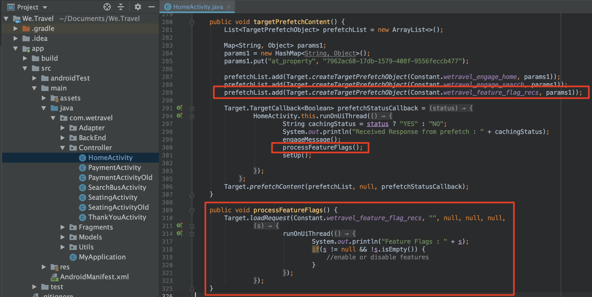

# Flagging delle funzioni

I proprietari di prodotti per app mobili necessitano della flessibilità necessaria per distribuire nuove funzionalità nella loro app senza dover investire in più versioni di app. Possono anche decidere di distribuire gradualmente le funzionalità a una percentuale della base di utenti, per verificare l&#39;efficacia.  Adobe Target può essere utilizzato per sperimentare le funzioni UX come colore, copia, pulsanti, testo e immagini e fornire tali funzionalità a audience specifiche.

In questa lezione, creeremo un&#39;offerta &quot;flag di funzionalità&quot; che può essere utilizzata come trigger per abilitare funzionalità app specifiche.

## Obiettivi di apprendimento

Al termine di questa lezione, potrete:

* Aggiungere una nuova posizione alla richiesta di recupero preventivo del batch
* Create un&#39;attività [!DNL Target] con un&#39;offerta che verrà utilizzata come flag di funzione
* Caricate e convalidate l&#39;offerta del flag di funzione nell&#39;app

## Aggiungere una nuova posizione alla richiesta di recupero preventivo all&#39;attività principale

Nell&#39;app demo delle lezioni precedenti, aggiungeremo una nuova posizione denominata &quot;wetravel_feature_flag_recs&quot; alla richiesta di preacquisizione nell&#39;attività principale e la cariceremo sullo schermo con un nuovo metodo Java.

>[!NOTE]
>
>Uno dei vantaggi dell&#39;utilizzo di una richiesta di preacquisizione è che l&#39;aggiunta di una nuova richiesta non comporta l&#39;aggiunta di sovraccarico di rete aggiuntivo o causa un ulteriore lavoro di caricamento, dal momento che la richiesta viene inclusa nel pacchetto all&#39;interno della richiesta di preacquisizione

Innanzitutto, verificate che la costante wetravel_feature_flag_recs sia aggiunta nel file Constant.java:


Di seguito è riportato il codice:

```java
public static final String wetravel_feature_flag_recs = "wetravel_feature_flag_recs";
```

Aggiungete ora la posizione alla richiesta di recupero preventivo e caricate una nuova funzione denominata `processFeatureFlags()`:



Di seguito è riportato il codice aggiornato completo:

```java
public void targetPrefetchContent() {
    List<TargetPrefetchObject> prefetchList = new ArrayList<>();

    Map<String, Object> params1;
    params1 = new HashMap<String, Object>();
    params1.put("at_property", "7962ac68-17db-1579-408f-9556feccb477");

    prefetchList.add(Target.createTargetPrefetchObject(Constant.wetravel_engage_home, params1));
    prefetchList.add(Target.createTargetPrefetchObject(Constant.wetravel_engage_search, params1));
    prefetchList.add(Target.createTargetPrefetchObject(Constant.wetravel_feature_flag_recs, params1));

    Target.TargetCallback<Boolean> prefetchStatusCallback = new Target.TargetCallback<Boolean>() {
        @Override
        public void call(final Boolean status) {
            HomeActivity.this.runOnUiThread(new Runnable() {
                @Override
                public void run() {
                    String cachingStatus = status ? "YES" : "NO";
                    System.out.println("Received Response from prefetch : " + cachingStatus);
                    engageMessage();
                    processFeatureFlags();
                    setUp();

                }
            });
        }};
    Target.prefetchContent(prefetchList, null, prefetchStatusCallback);
}

public void processFeatureFlags() {
    Target.loadRequest(Constant.wetravel_feature_flag_recs, "", null, null, null,
            new Target.TargetCallback<String>(){
                @Override
                public void call(final String s) {
                    runOnUiThread(new Runnable() {
                        @Override
                        public void run() {
                            System.out.println("Feature Flags : " + s);
                            if(s != null && !s.isEmpty()) {
                                //enable or disable features
                            }
                        }
                    });
                }
            });
}
```

### Convalida della richiesta di flag di funzione

Una volta aggiunto il codice, eseguite l&#39;emulatore sull&#39;attività principale e guardate Logcat per la risposta aggiornata:


## Creare un&#39;offerta JSON con flag di funzione

A questo punto, creeremo una semplice offerta JSON che fungerà da flag o trigger per un pubblico specifico, ovvero il pubblico che riceverà l&#39;implementazione della funzionalità nella propria app. Nell&#39;interfaccia [!DNL Target], crea una nuova offerta:


Denominiamolo &quot;Feature Flag v1&quot; con il valore {&quot;enable&quot;:1}


## Creazione di un&#39;attività

Ora creiamo un&#39;attività test A/B con quell&#39;offerta. Per i passaggi dettagliati sulla creazione di un&#39;attività, vedete la lezione precedente. L&#39;attività avrà bisogno di un solo pubblico per questo esempio. In uno scenario in diretta, potreste voler creare audience personalizzate specifiche per i roll-out di funzionalità specifiche, quindi impostare l&#39;attività per l&#39;utilizzo di tali audience. In questo esempio, assegneremo il traffico 50/50 (50% ai visitatori che visualizzerebbero gli aggiornamenti delle funzioni, e 50% ai visitatori che visualizzerebbero un&#39;esperienza standard). Configurazione per l&#39;attività:

1. Denominate l&#39;attività &quot;Flag funzione&quot;
1. Selezionare la posizione &quot;wetravel_feature_flag_recs&quot;
1. Modificate il contenuto nell&#39;offerta JSON &quot;Feature Flag v1&quot;

   

1. Fate clic su **[!UICONTROL Aggiungi esperienza]** per aggiungere esperienza B.
1. Lasciate la posizione &quot;wetravel_feature_flag_recs&quot;
1. Lasciare **[!UICONTROL Contenuto predefinito]** per il contenuto
1. Fare clic su **[!UICONTROL Next]** per passare alla schermata [!UICONTROL Targeting]

   

1. Nella schermata [!UICONTROL Targeting], verificare che il metodo [!UICONTROL Traffic Allocazione] sia impostato sull&#39;impostazione predefinita (Manuale) e che per ogni esperienza sia stata assegnata l&#39;allocazione predefinita del 50%. Selezionare **[!UICONTROL Next]** per passare a **[!UICONTROL Goals &amp; Settings]** (Obiettivi e impostazioni&lt;a3/>).

   

1. Impostare l&#39; **[!UICONTROL Obiettivo principale]** su **[!UICONTROL Conversione]**.
1. Impostate l&#39;azione su **[!UICONTROL Visualizzato un mbox]**. Useremo la posizione &quot;wetravel_context_dest&quot; (poiché questa posizione si trova nella schermata di conferma, possiamo usarla per verificare se la nuova funzione porta a più conversioni).
1. Fai clic su **[!UICONTROL Salva e chiudi]**.

   

Attivare l&#39;attività.

## Convalida dell’attività del contrassegno funzione

Ora utilizzate l&#39;emulatore per controllare la richiesta. Poiché il targeting è impostato su 50% di utenti, esiste un 50% in cui la risposta del flag di funzione contiene il valore `{enable:1}`.


Se il valore `{enable:1}` non è visualizzato, significa che non siete stati indirizzati per l&#39;esperienza. Come test temporaneo, per forzare la visualizzazione dell&#39;offerta, potete:

1. Disattivate l&#39;attività.
1. Modificate l&#39;allocazione del traffico al 100% sulla nuova esperienza di funzionalità.
1. Salvate e riattivate.
1. Eliminate i dati dall&#39;emulatore e riavviate l&#39;app.
1. L&#39;offerta deve ora restituire il valore `{enable:1}`.

In uno scenario live, la risposta `{enable:1}` può essere utilizzata per abilitare una logica più personalizzata nell&#39;app per visualizzare il set di funzioni specifico che desideri mostrare al pubblico di destinazione.

## Conclusione

Bel lavoro! Ora disponete delle competenze necessarie per distribuire le funzionalità a un pubblico di utenti specifico.
