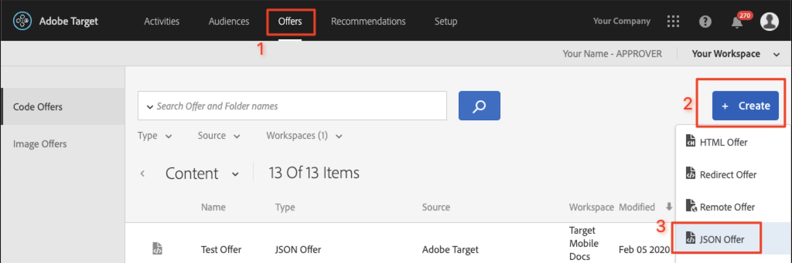
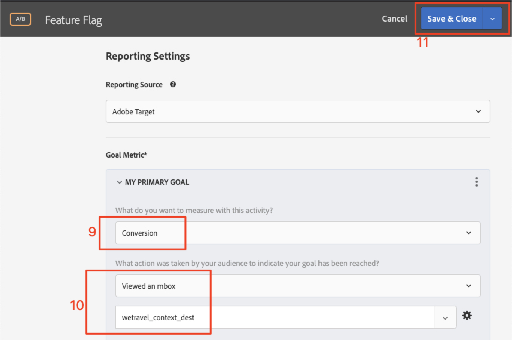

# Contrassegno di funzione

I proprietari dei prodotti delle app mobili devono poter implementare nuove funzioni nelle app senza dover investire in più versioni. Inoltre, potrebbe essere utile implementare gradualmente le funzioni fino a una percentuale della base di utenti, per verificarne l’efficacia. Adobe Target può essere utilizzato per sperimentare funzioni UX come colore, copia, pulsanti, testo e immagini e fornire tali funzioni a tipi di pubblico specifici.

In questa lezione, creeremo un’offerta di &quot;flag di funzione&quot; che può essere utilizzata come attivatore per abilitare funzioni specifiche dell’app.

## Finalità di apprendimento

Alla fine di questa lezione, sarai in grado di:

* Aggiungi una nuova posizione alla richiesta di preacquisizione batch
* Crea un&#39;attività [!DNL Target] con un&#39;offerta che verrà utilizzata come flag di funzione
* Carica e convalida l’offerta del flag di funzione nella tua app

## Aggiungere una nuova posizione alla richiesta di preacquisizione nell’attività principale

Nell’app demo delle lezioni precedenti, aggiungeremo una nuova posizione denominata &quot;wetravel_feature_flag_recs&quot; alla richiesta di preacquisizione nell’attività Home e la cariceremo sullo schermo con un nuovo metodo Java.

>[!NOTE]
>
>Uno dei vantaggi dell’utilizzo di una richiesta di preacquisizione è che l’aggiunta di una nuova richiesta non aggiunge alcun sovraccarico di rete aggiuntivo o causa un carico aggiuntivo, poiché la richiesta viene inserita nel pacchetto della richiesta di preacquisizione

Innanzitutto, verifica che la costante wetravel_feature_flag_recs sia aggiunta nel file Constant.java:


Di seguito è riportato il codice:

```java
public static final String wetravel_feature_flag_recs = "wetravel_feature_flag_recs";
```

Ora aggiungi il percorso alla richiesta di preacquisizione e carica una nuova funzione denominata `processFeatureFlags()`:


Di seguito è riportato il codice completo aggiornato:

```java
public void targetPrefetchContent() {
    List<TargetPrefetchObject> prefetchList = new ArrayList<>();

    Map<String, Object> params1;
    params1 = new HashMap<String, Object>();
    params1.put("at_property", "7962ac68-17db-1579-408f-9556feccb477");

    prefetchList.add(Target.createTargetPrefetchObject(Constant.wetravel_engage_home, params1));
    prefetchList.add(Target.createTargetPrefetchObject(Constant.wetravel_engage_search, params1));
    prefetchList.add(Target.createTargetPrefetchObject(Constant.wetravel_feature_flag_recs, params1));

    Target.TargetCallback<Boolean> prefetchStatusCallback = new Target.TargetCallback<Boolean>() {
        @Override
        public void call(final Boolean status) {
            HomeActivity.this.runOnUiThread(new Runnable() {
                @Override
                public void run() {
                    String cachingStatus = status ? "YES" : "NO";
                    System.out.println("Received Response from prefetch : " + cachingStatus);
                    engageMessage();
                    processFeatureFlags();
                    setUp();

                }
            });
        }};
    Target.prefetchContent(prefetchList, null, prefetchStatusCallback);
}

public void processFeatureFlags() {
    Target.loadRequest(Constant.wetravel_feature_flag_recs, "", null, null, null,
            new Target.TargetCallback<String>(){
                @Override
                public void call(final String s) {
                    runOnUiThread(new Runnable() {
                        @Override
                        public void run() {
                            System.out.println("Feature Flags : " + s);
                            if(s != null && !s.isEmpty()) {
                                //enable or disable features
                            }
                        }
                    });
                }
            });
}
```

### Convalidare la richiesta di flag di funzione

Una volta aggiunto il codice, esegui l’emulatore sull’attività Home e osserva Logcat per la risposta aggiornata:


## Creare un’offerta JSON con flag di funzione

Ora creeremo una semplice offerta JSON che fungerà da flag o attiverà per un pubblico specifico, il pubblico che riceverà il rollout della funzione nella sua app. Nell&#39;interfaccia [!DNL Target], crea una nuova offerta:



Chiamiamolo &quot;Flag di funzione v1&quot; con il valore {&quot;enable&quot;:1}


## Creazione di un&#39;attività

Ora creiamo un’attività di test A/B con quell’offerta. Per i passaggi dettagliati sulla creazione di un’attività, consulta la lezione precedente. Per questo esempio, l’attività avrà bisogno di un solo pubblico. In uno scenario live, puoi creare tipi di pubblico personalizzati specifici per rollout di funzionalità specifiche, quindi impostare l’attività in modo che utilizzi tali tipi di pubblico. In questo esempio, assegneremo traffico 50/50 (50% ai visitatori che vedrebbero gli aggiornamenti della funzione e 50% ai visitatori che vedrebbero un’esperienza standard). Di seguito è riportata la configurazione per l’attività:

1. Denomina l’attività &quot;Flag funzione&quot;
1. Selezionate la posizione &quot;wetravel_feature_flag_recs&quot;
1. Modifica il contenuto dell’offerta JSON &quot;Flag funzione v1&quot;

   

1. Fare clic su **[!UICONTROL Add Experience]** per aggiungere l&#39;esperienza B.
1. Lascia la posizione &quot;wetravel_feature_flag_recs&quot;
1. Lascia **[!UICONTROL Default Content]** per il contenuto
1. Fai clic su **[!UICONTROL Next]** per passare alla schermata [!UICONTROL Targeting]

   

1. Nella schermata [!UICONTROL Targeting], verificare che il metodo [!UICONTROL Traffic Allocation] sia impostato sull&#39;impostazione predefinita (Manuale) e che ogni esperienza abbia l&#39;allocazione predefinita del 50%. Selezionare **[!UICONTROL Next]** per passare a **[!UICONTROL Goals & Settings]**.

   

1. Imposta **[!UICONTROL Primary Goal]** su **[!UICONTROL Conversion]**.
1. Imposta l&#39;azione su **[!UICONTROL Viewed an Mbox]**. Utilizzeremo la posizione &quot;wetravel_context_dest&quot; (poiché questa posizione si trova nella schermata di conferma, possiamo utilizzarla per vedere se la nuova funzione porta a più conversioni).
1. Fare clic su **[!UICONTROL Save & Close]**.

   

Attivare l&#39;attività.

## Convalidare l&#39;attività di flag di funzione

Ora utilizza l’emulatore per controllare la richiesta. Poiché il targeting è stato impostato sul 50% degli utenti, con un 50% vedrai che la risposta del flag di funzione contiene il valore `{enable:1}`.


Se il valore `{enable:1}` non è visualizzato, significa che non si è stati destinati all&#39;esperienza. Come test temporaneo, per forzare la visualizzazione dell’offerta puoi:

1. Disattiva l’attività.
1. Modifica l’allocazione del traffico al 100% nella nuova esperienza con le funzioni.
1. Salva e riattiva.
1. Cancella i dati sull’emulatore, quindi riavvia l’app.
1. L&#39;offerta deve ora restituire il valore `{enable:1}`.

In uno scenario live, la risposta `{enable:1}` può essere utilizzata per abilitare una logica più personalizzata nell&#39;app per visualizzare il set di funzioni specifico che desideri mostrare al pubblico di destinazione.

## Conclusione

Ottimo lavoro. Ora disponi delle competenze necessarie per implementare le funzioni per tipi di pubblico specifici.
