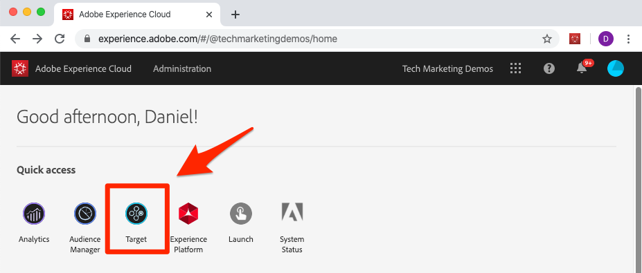
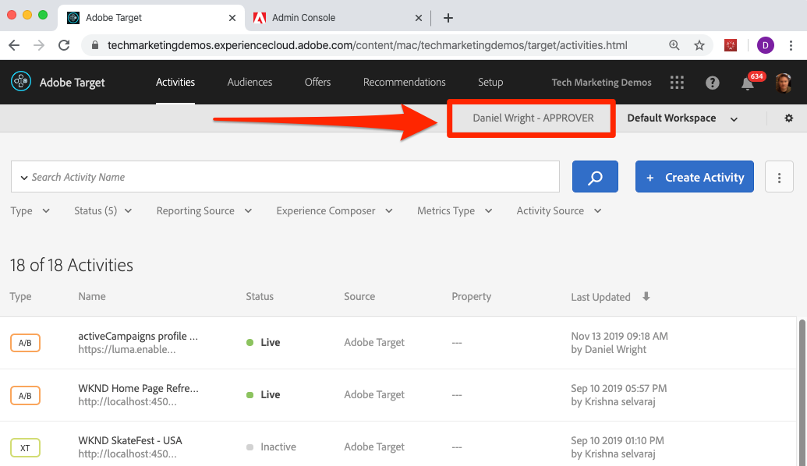
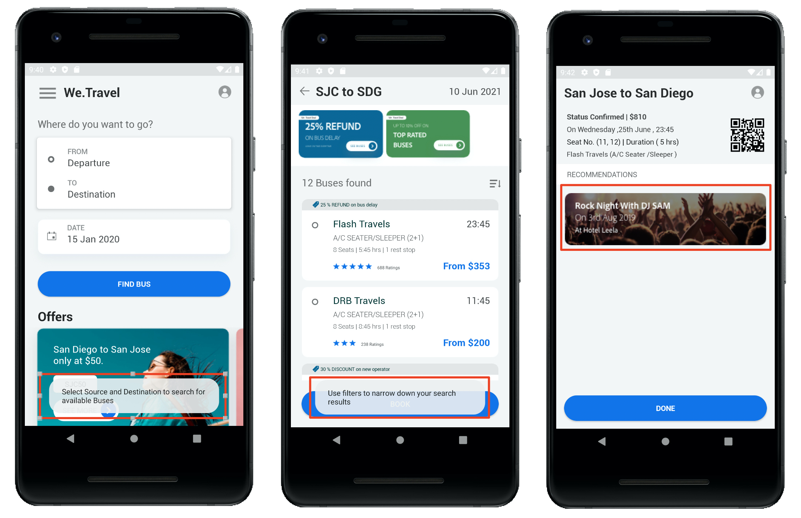

# Adobe Target con Adobe Mobile Services SDK v4 per Android - Panoramica

_Adobe Target con Adobe Mobile Services SDK v4 per Android_ è il punto di partenza ideale per gli sviluppatori di Android che utilizzano già Adobe Mobile Services SDK v4 e desiderano iniziare a personalizzare le esperienze dell&#39;app con Adobe Target.

È disponibile un’app demo per Android che ti permette di completare le lezioni. Dopo aver completato questa esercitazione, dovresti essere in grado di iniziare a implementare [!DNL Target] nella tua app Android.

Dopo aver completato questa esercitazione, sarai in grado di:

* Convalida l&#39;installazione di [Adobe Mobile Services SDK](https://experienceleague.adobe.com/docs/mobile-services/android/getting-started-android/requirements.html?lang=en)
* Implementare i seguenti tipi di richieste [!DNL Target]:
  * Preacquisizione del contenuto [!DNL Target]
  * Crea in batch più posizioni [!DNL Target] (mbox) in una singola richiesta
  * Richieste di blocco (eseguite prima della visualizzazione dell’app)
  * Richieste non di blocco (in esecuzione in background)
  * Real-time (non caching)
  * Recupero non riuscito della cache
* Aggiungere parametri alle richieste di personalizzazione avanzata
* Creare tipi di pubblico e offerte
* Personalizzazione dei layout
* Eseguire il rollout delle nuove funzioni con il flag di funzione

## Prerequisiti

In queste lezioni, si presume che:

* Disporre di un Adobe Id e di un accesso a livello di approvatore all’interfaccia di Adobe Target (vedi i passaggi di verifica riportati di seguito).
* Conoscere il codice cliente Adobe Target per effettuare richieste al proprio account. Il codice client viene visualizzato nell’interfaccia di Adobe Target nella schermata Configurazione > Implementazione > Modifica impostazioni at.js
* Ha accesso e ha familiarità con l&#39;interfaccia utente di [Mobile Services](https://mobilemarketing.adobe.com/)
* Possiedi un IDE per lo sviluppo di app mobili Android. Questo tutorial presenta [Android Studio](https://developer.android.com/studio/install) in vari passaggi e schermate

Se non disponi dell’accesso richiesto alle soluzioni Experience Cloud, rivolgiti al tuo amministratore Experience Cloud.

Inoltre, si presume che tu abbia familiarità con lo sviluppo Android in Java. Non devi essere un esperto Java per completare le lezioni, ma ti saranno più utili se sei in grado di leggere e comprendere il codice senza difficoltà.

### Verificare l’accesso ad Adobe Target

Questa lezione richiede l’accesso ad Adobe Target. Prima di procedere con i passaggi successivi, assicurati di avere accesso ad Adobe Target effettuando le seguenti operazioni:

1. Accedi a [Adobe Experience Cloud](https://experience.adobe.com/)
1. Dalla schermata iniziale di Experience Cloud, fai clic su [!DNL Target]:
   
1. Dovresti accedere all’elenco Attività in Adobe Target, come illustrato di seguito, e vedere che il tuo utente dispone dell’accesso a livello di Approvatore. Se non riesci ad accedere a [!DNL Target] o a verificare l&#39;accesso a livello di Approvatore, contatta uno degli amministratori Experience Cloud della tua azienda, richiedi questo accesso e riprendi questa esercitazione una volta che ti è stata concessa:

   

## Informazioni sulle lezioni

In queste lezioni, implementerai Adobe Target in un’app di viaggio demo denominata &quot;We.Travel&quot; utilizzando il tuo account Adobe Target. Entro la fine dell’esercitazione, distribuirai messaggi personalizzati all’utente in base all’utilizzo dell’app. Le esperienze di personalizzazione finali avranno un aspetto simile a questo:

Dopo aver valutato l&#39;implementazione nell&#39;app We.Travel, potrai iniziare a utilizzare [!DNL Target] nella tua app mobile.

Iniziamo!

**[AVANTI: &quot;Scarica e aggiorna l&#39;app di esempio&quot; >](download-and-update-the-sample-app.md)**
