# Personalizzazione dei layout

Ora è il momento di mettere insieme tutto e creare esperienze personalizzate. Un&#39;_attività_ è il meccanismo [!DNL Target] che collega le posizioni, i tipi di pubblico e le offerte, in modo che quando la richiesta viene effettuata dall&#39;app, [!DNL Target] risponda con il contenuto personalizzato. Creeremo due attività di personalizzazione in [!DNL Target] e confermeremo che il contenuto personalizzato venga visualizzato all&#39;utente giusto al momento giusto e nella posizione giusta.

## Finalità di apprendimento

Alla fine di questa lezione, sarai in grado di:

* Creare attività in Adobe Target
* Convalidare le attività nell’app di esempio

## Creare attività in Adobe Target

Scopri come creare attività Coinvolgi utenti e Offerte contestuali.

### Prima attività: &quot;Coinvolgere gli utenti&quot;

Ecco un riepilogo dell’attività che creeremo:

| Pubblico | Posizioni | Offerte |
|---|---|---|
| Nuovi utenti di app mobili | wetravel_engagement_home, wetravel_eng_search | Home: Coinvolgi nuovi utenti, Ricerca: Coinvolgi nuovi utenti |
| Restituzione degli utenti di app mobili | wetravel_engagement_home, wetravel_eng_search | Home: Utenti di ritorno, default_content |

Nell&#39;interfaccia [!DNL Target] eseguire le operazioni seguenti:

1. Seleziona **[!UICONTROL Attività]** > **[!UICONTROL Crea attività]** > **[!UICONTROL Targeting esperienza]**.

   

1. Fai clic su **[!UICONTROL App mobile]**.
1. Selezionare il **[!UICONTROL Compositore modulo]**.
1. Seleziona l’area di lavoro (la stessa utilizzata nelle lezioni precedenti).
1. Seleziona la Proprietà (la stessa proprietà utilizzata nelle lezioni precedenti).
1. Fai clic su **[!UICONTROL Avanti]**.

   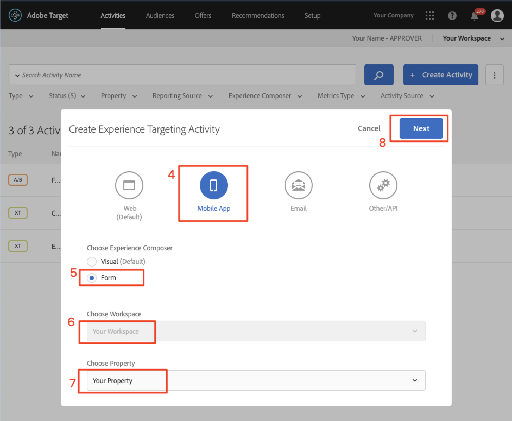

1. Cambia il titolo dell&#39;attività in **[!UICONTROL Coinvolgi gli utenti]**.
1. Seleziona i **[!UICONTROL puntini di sospensione]** > **[!UICONTROL Cambia pubblico]**.
   
1. Imposta il pubblico su **[!UICONTROL Utenti nuovi app mobili]**.
1. Fai clic su **[!UICONTROL Fine]**.
   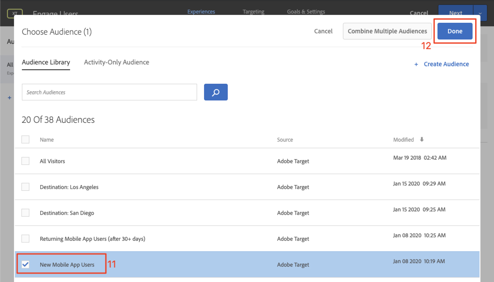

1. Cambia il percorso in _wetravel_ eng_home_.
1. Selezionare la freccia a discesa accanto a Contenuto predefinito e selezionare **[!UICONTROL Cambia offerta HTML]**.

   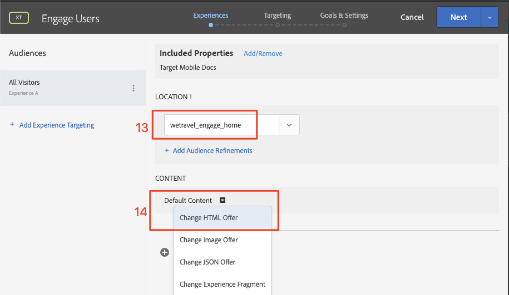

1. Seleziona l&#39;offerta **[!UICONTROL Home: Coinvolgi nuovi utenti]**.
1. Seleziona **[!UICONTROL Fine]**.

   

1. Seleziona **[!UICONTROL Aggiungi posizione]**.
   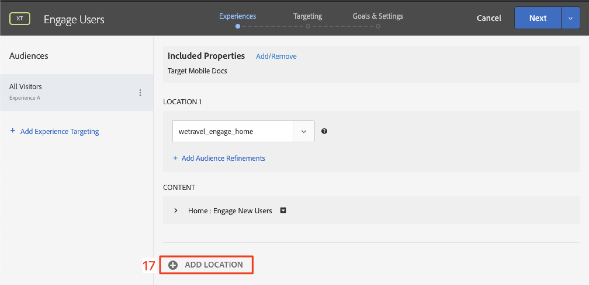

1. Seleziona il percorso _wetravel_ eng_search_.
1. Modifica l’offerta HTML.

   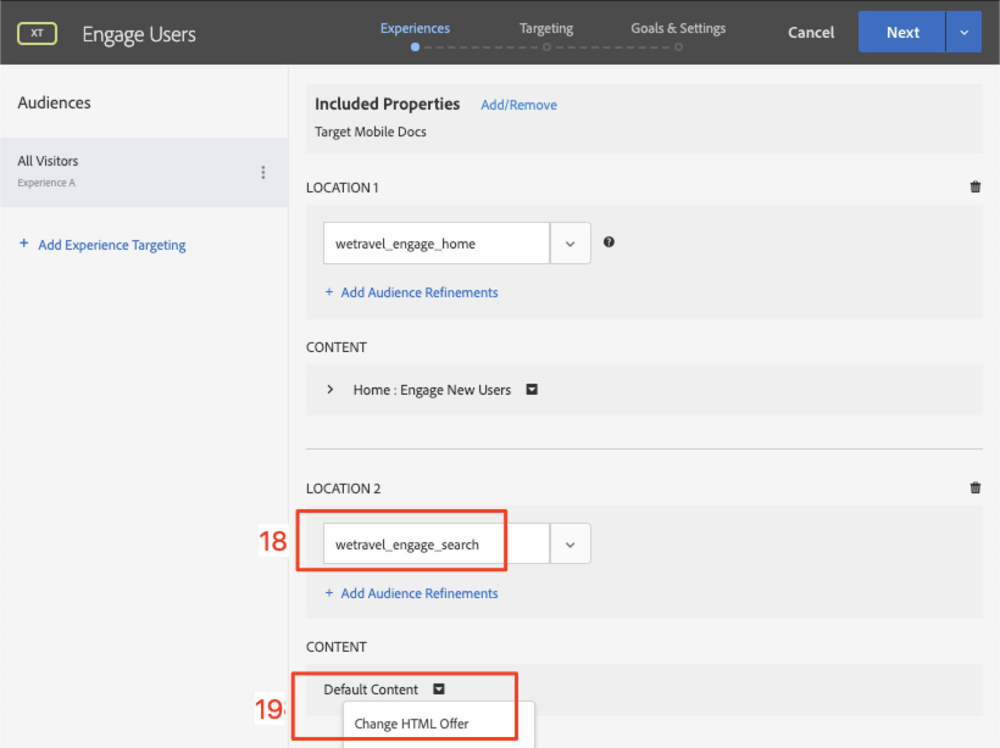

1. Selezionare l&#39;offerta **[!UICONTROL Cerca: coinvolgi nuovi utenti]**.
1. Fai clic su **[!UICONTROL Fine]**.

   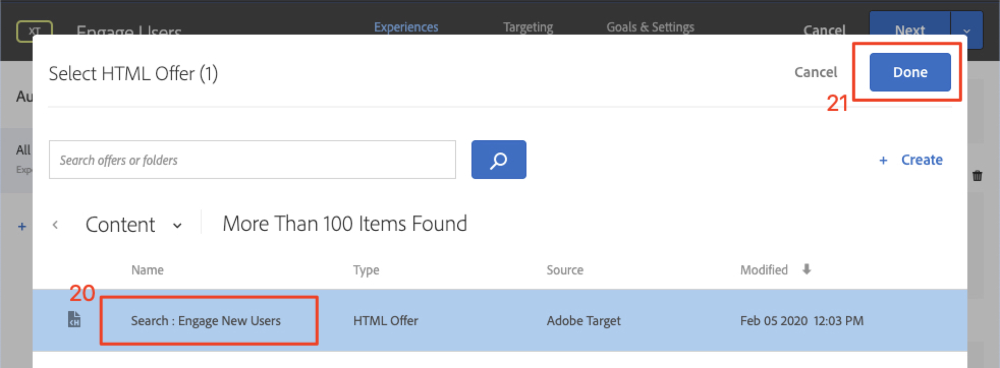

Hai appena collegato un pubblico a posizioni e offerte, creando un’esperienza personalizzata per i nuovi utenti dell’app mobile. Ora l’esperienza dovrebbe essere simile alla seguente:

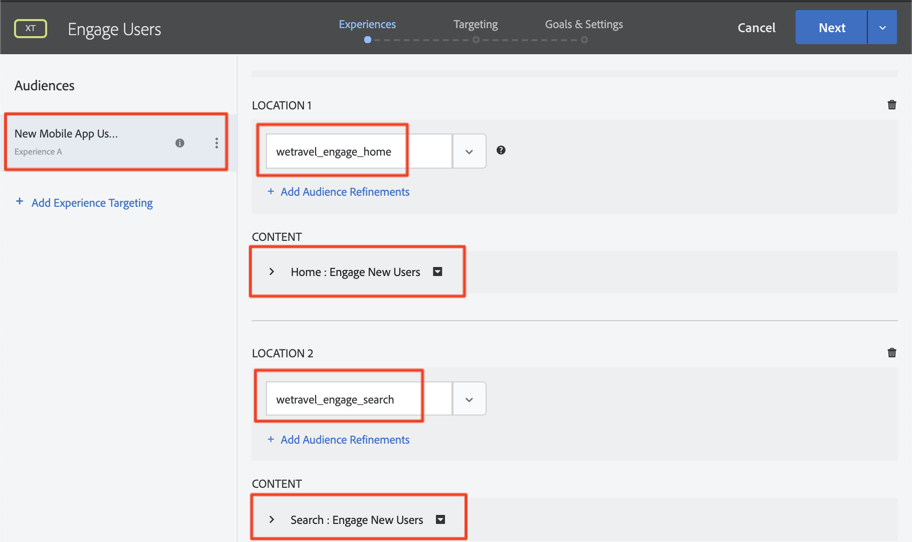

Ora crea un’esperienza per gli utenti di ritorno dell’app mobile:

1. Seleziona **[!UICONTROL Aggiungi targeting esperienza]** a sinistra.
1. Seleziona il pubblico **[!UICONTROL Utenti di ritorno dall&#39;app mobile]**.
1. Seleziona **[!UICONTROL Fine]**.
   

Ora utilizza lo stesso processo utilizzato in precedenza per configurare la nuova esperienza. La configurazione per l’esperienza Utenti app mobili di ritorno sarà simile alla seguente:

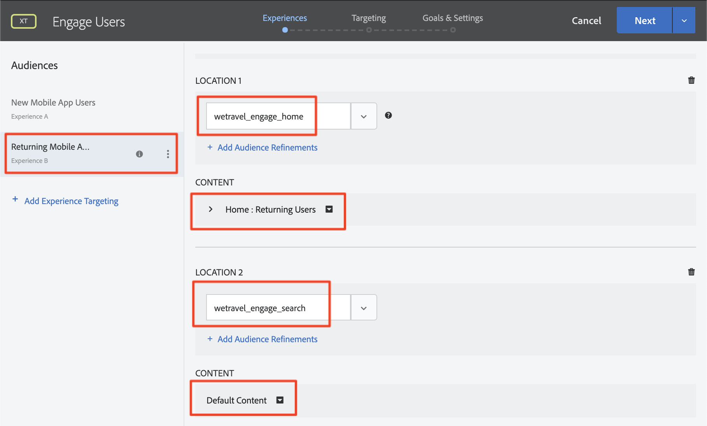

Passiamo alla schermata successiva nella configurazione:

1. Fai clic su **[!UICONTROL Avanti]** per passare alla schermata **[!UICONTROL Targeting]**.
1. Utilizza le impostazioni predefinite per il targeting. Se hai esperienze per tipi di pubblico sovrapposti (ad esempio _Utenti New York_ e _Utenti nuovi_) puoi ordinare l&#39;ordine di priorità in questa schermata.
1. Fai clic su **[!UICONTROL Avanti]** per passare a **[!UICONTROL Obiettivi e impostazioni]**.

   

Ora completiamo la configurazione dell’attività:

1. Imposta **[!UICONTROL Obiettivo primario]** su **[!UICONTROL Conversione]**.
1. Imposta l&#39;azione su **[!UICONTROL Visualizzazione di una mbox]** > _wetravel_ context_dest_ (poiché questa posizione si trova nella schermata di conferma, è possibile utilizzarla per misurare le conversioni).

   

1. Mantenere tutte le altre impostazioni sullo schermo sui valori predefiniti.
1. Fai clic su **[!UICONTROL Salva e chiudi]** per salvare l&#39;attività.
1. Attiva l&#39;**[!UICONTROL attività]** nella schermata successiva.

La nostra prima attività è ora live e pronta per essere testata.

### Seconda attività: &quot;Offerte contestuali&quot;

Ecco un riepilogo della seconda attività che creeremo:

| Pubblico | Posizione | Offerte |
| --- | --- | --- |
| Destinazione: San Diego | wetravel_context_dest | Promozione per San Diego |
| Destinazione: Los Angeles | wetravel_context_dest | Promozione per Los Angeles |

Ripeti lo stesso processo descritto in precedenza per l’attività successiva, &quot;Offerte contestuali&quot;. Di seguito è illustrata la configurazione finale per entrambe le esperienze:

#### San Diego

#### Los Angeles

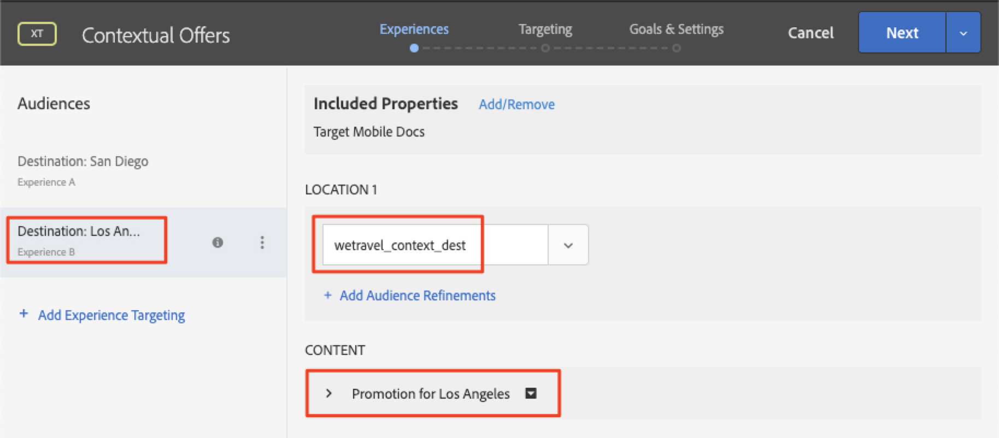

Nel passaggio Obiettivi e impostazioni, modificheremo l’obiettivo principale nella posizione indicata nella schermata di conferma della prenotazione:

1. Nelle **[!UICONTROL Impostazioni reporting]**, imposta l&#39;**[!UICONTROL Obiettivo principale]** su **[!UICONTROL Conversione]**.
1. Imposta l&#39;azione su **[!UICONTROL Visualizzazione di una mbox]** > _wetravel_ context_dest_ (in questa attività questa metrica è praticamente priva di significato, poiché è anche la stessa posizione che distribuisce l&#39;esperienza).
1. Fai clic su **[!UICONTROL Salva e chiudi]**.

Attiva l&#39;attività nella schermata successiva.

Ora la nostra seconda attività è live e pronta per essere testata.

## Convalidare l’offerta iniziale

Esegui l’emulatore e osserva la prima offerta da visualizzare nella parte inferiore della schermata iniziale. Se sei un utente di ritorno con 5 o più avvii di app, vedrai l&#39;offerta _bentornato_ visualizzata. Se sei un nuovo utente (meno di 5 avvii di app), dovresti visualizzare il messaggio _nuovo utente_:

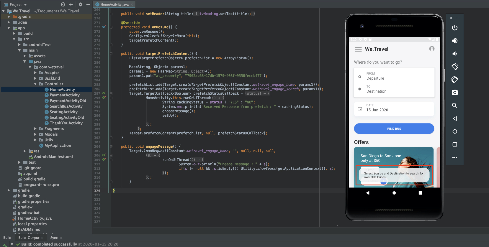

Se la nuova offerta utente non viene visualizzata, prova a cancellare i dati per l’emulatore. In questo modo al prossimo avvio l&#39;app verrà reimpostata su 1. Operazione eseguita in **[!UICONTROL Strumenti]** > **[!UICONTROL Gestione AVD]**. Se Logcat non funziona correttamente, potrebbe essere necessario riavviare anche Android Studio:

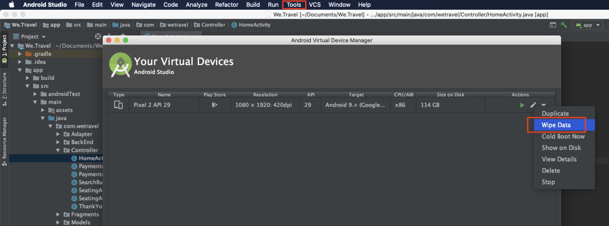

Puoi anche convalidare la risposta in Logcat filtrando per _wetravel_ eng_home_:

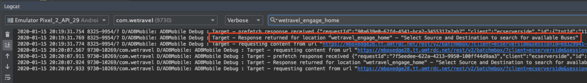

## Convalidare l’offerta di ricerca

Seleziona **[!UICONTROL San Jose]** come **[!UICONTROL Partenza]** e **[!UICONTROL San Diego]** come **[!UICONTROL Destinazione]**, quindi fai clic su **[!UICONTROL Trova bus]** per cercare i bus disponibili.

Nella schermata dei risultati dovrebbe essere visualizzato il messaggio _usa filtri_. Se sei un utente di ritorno con 5 o più avvii di app, non verrà visualizzato alcun messaggio qui, poiché per questa posizione è impostato il contenuto predefinito (che è vuoto):

## Convalidare le offerte contestuali nella schermata di ringraziamento

Continuare ora il processo di prenotazione:

* Selezionare un bus nella schermata dei risultati.
* Selezionare un posto nella schermata di pagamento.
* Seleziona **[!UICONTROL Carta di credito]** nella schermata di pagamento (lascia vuote le informazioni sul pagamento - non verrà effettuata alcuna prenotazione effettiva).

Poiché San Diego è stata selezionata come destinazione, nella schermata di conferma dovrebbe essere visualizzato il banner dell&#39;offerta _DJ SAM_:

Seleziona **[!UICONTROL Fine]** e prova un&#39;altra prenotazione con Los Angeles come destinazione. Nella schermata di conferma verrà visualizzato il banner _Universal Studios_:

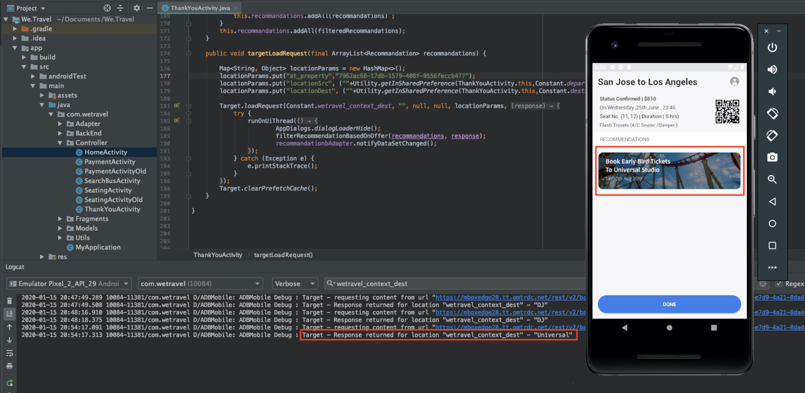

## Conclusione

Congratulazioni! In questo modo si conclude la parte principale dell’esercitazione Adobe Target SDK 4.x per Android. Ora disponi delle competenze necessarie per implementare la personalizzazione nelle app Android. Consulta questa documentazione e app demo come riferimento per i tuoi progetti futuri.

Successivo: l’assegnazione di un flag a una funzione è un’altra funzione che può essere implementata con Adobe Target in Android. Per informazioni sui contrassegni di funzionalità, consulta la lezione successiva.

**[AVANTI: segnalazione funzionalità >](feature-flagging.md)**
