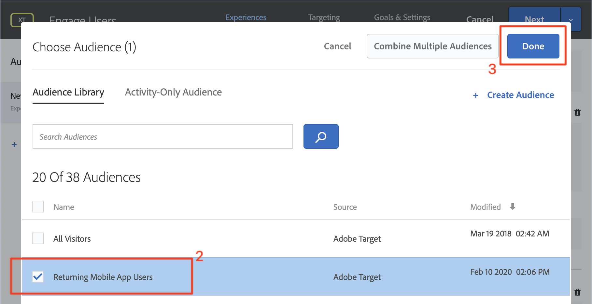

# Personalizza layout

Ora è il momento di mettere tutto insieme e creare le esperienze personalizzate. Un _Activity_ è il meccanismo [!DNL Target] che collega le posizioni, i tipi di pubblico e le offerte, in modo che, quando la richiesta viene effettuata dall&#39;app, [!DNL Target] risponda con il contenuto personalizzato. Creeremo due attività di personalizzazione in [!DNL Target] e verificheremo che il contenuto personalizzato venga visualizzato all&#39;utente giusto al momento giusto e nella posizione giusta.

## Obiettivi di apprendimento

Al termine di questa lezione, potrete:

* Creazione di attività in  Adobe Target
* Convalida delle attività nell&#39;app di esempio

## Creare attività in  Adobe Target

Scopri come creare attività di coinvolgimento di utenti e offerte contestuali.

### Prima attività - &quot;Coinvolgi utenti&quot;

Di seguito è riportato un riepilogo dell&#39;attività che verrà creata:

| Destinatari | Posizioni | Offerte |
|---|---|---|
| Nuovi utenti delle app mobili | wetravel_Eng_home, wetravel_Engel_search | Home: Coinvolgi nuovi utenti, cerca: Coinvolgi nuovi utenti |
| Restituzione di utenti di app mobili | wetravel_Eng_home, wetravel_Engel_search | Home: Return Users, default_content |

Nell&#39;interfaccia [!DNL Target] effettuare le seguenti operazioni:

1. Selezionare **[!UICONTROL Activities]** > **[!UICONTROL Create Activity]** > **[!UICONTROL Experience Targeting]** (Attività).

   

1. Fare clic su **[!UICONTROL App mobile]**.
1. Selezionare il **[!UICONTROL Compositore modulo]**.
1. Selezionate l’area di lavoro (la stessa area di lavoro utilizzata nelle lezioni precedenti).
1. Selezionate la proprietà (la stessa proprietà utilizzata nelle lezioni precedenti).
1. Fai clic su **[!UICONTROL Successivo]**.

   

1. Modificate il titolo dell&#39;attività in **[!UICONTROL Coinvolgi utenti]**.
1. Selezionare i **[!UICONTROL puntini di sospensione]** > **[!UICONTROL Change Audience]**.
   
1. Impostate l&#39;audience su **[!UICONTROL Nuovi utenti delle app mobili]**.
1. Fai clic su **[!UICONTROL Fine]**.
   

1. Modificate la posizione in _wetravel_Eng_home_.
1. Selezionate la freccia a discesa accanto a Contenuto predefinito e selezionate **[!UICONTROL Modifica offerta HTML]**.

   

1. Selezionare la **[!UICONTROL Home: Coinvolgi nuova offerta Utenti]**.
1. Selezionare **[!UICONTROL Fine]**.

   

1. Selezionare **[!UICONTROL Aggiungi posizione]**.
   

1. Selezionare la posizione _wetravel_Eng_search_.
1. Modificate l&#39;offerta HTML.

   

1. Selezionare la **[!UICONTROL Ricerca: Coinvolgi nuova offerta Utenti]**.
1. Fai clic su **[!UICONTROL Fine]**.

   

Hai appena collegato un&#39;audience a posizioni e offerte, creando l&#39;esperienza personalizzata per i Nuovi utenti delle app mobili! A questo punto l&#39;esperienza dovrebbe essere così:

Ora crea un&#39;esperienza per la restituzione di utenti di app mobili:

1. Seleziona **[!UICONTROL Aggiungi targeting esperienza]** a sinistra.
1. Seleziona l&#39;audience **[!UICONTROL Return Mobile App Users]**.
1. Selezionare **[!UICONTROL Fine]**.
   

Ora utilizzate lo stesso processo utilizzato in precedenza per configurare la nuova esperienza. La configurazione per l&#39;esperienza di restituzione degli utenti dell&#39;app mobile dovrebbe essere simile alla seguente:

Continuiamo con la schermata successiva nella configurazione:

1. Fare clic su **[!UICONTROL Next]** per passare alla schermata **[!UICONTROL Targeting]**.
1. Utilizzate le impostazioni predefinite per Targeting. Se le esperienze per il pubblico si sovrapponevano (ad es. _New York Users_ e _First Time Users_) è possibile ordinare l&#39;ordine di priorità in questa schermata.
1. Fare clic su **[!UICONTROL Next]** per passare a **[!UICONTROL Goals &amp; Settings]** (Obiettivi e impostazioni&lt;a3/>).

   

Ora completate la configurazione dell&#39;attività:

1. Impostare l&#39; **[!UICONTROL Obiettivo principale]** su **[!UICONTROL Conversione]**.
1. Impostate l&#39;azione su **[!UICONTROL Visualizzata una mbox]** > _wetravel_context_dest_ (Poiché questa posizione si trova nella schermata di conferma, possiamo usarla per misurare le conversioni).

   

1. Mantenete tutte le altre impostazioni sullo schermo al livello predefinito.
1. Fare clic su **[!UICONTROL Salva e chiudi]** per salvare l&#39;attività.
1. Attivare l&#39;attività **[!UICONTROL Activity]** nella schermata successiva.

La nostra prima attività è ora live e pronta per il test!

### Seconda attività - &quot;Offerte contestuali&quot;

Di seguito viene fornito un riepilogo della seconda attività che verrà creata:

| Destinatari | Posizione | Offerte |
| --- | --- | --- |
| Destinazione: San Diego | wetravel_context_dest | Promozione per San Diego |
| Destinazione: Los Angeles | wetravel_context_dest | Promozione per Los Angeles |

Ripetete lo stesso processo descritto sopra per l&#39;attività successiva, &quot;Offerte contestuali&quot;. La configurazione finale per entrambe le esperienze è riportata di seguito:

#### San Diego

#### Los Angeles

Nel passaggio Goals &amp; Settings (Obiettivi e impostazioni), cambieremo l&#39;obiettivo principale nella posizione nella schermata di conferma della prenotazione:

1. In **[!UICONTROL Impostazioni di reporting]**, impostare l&#39; **[!UICONTROL Obiettivo principale]** su **[!UICONTROL Conversione]**.
1. Impostate l&#39;azione su **[!UICONTROL Visualizzata una mbox]** > _wetravel_context_dest_ (in questa attività, questa metrica è sostanzialmente priva di significato, perché è anche la stessa posizione che fornisce l&#39;esperienza).
1. Fai clic su **[!UICONTROL Salva e chiudi]**.

Attivate l&#39;attività nella schermata successiva.

Ora la nostra seconda attività è live e pronta per il test!

## Convalida dell&#39;offerta principale

Emulatore ed esaminate la prima offerta da visualizzare nella parte inferiore della schermata iniziale. Se siete un utente di ritorno con 5 o più avvii di app, viene visualizzata l&#39;offerta _welcome back_. Se sei un nuovo utente (meno di 5 avvii dell&#39;app), dovresti visualizzare il messaggio _nuovo utente_:

Se la nuova offerta utente non viene visualizzata, provate a cancellare i dati per l&#39;emulatore. In questo modo, al successivo avvio dell&#39;app, gli avvii dell&#39;app verranno reimpostati su 1. Questa operazione viene eseguita in **[!UICONTROL Strumenti]** > **[!UICONTROL AVD Manager]**. Se Logcat non funziona correttamente, potrebbe essere necessario riavviare Android Studio:

Potete inoltre convalidare la risposta in Logcat filtrando _wetravel_Eng_home_:

## Convalida dell’offerta di ricerca

Selezionare **[!UICONTROL San Jose]** come **[!UICONTROL Partenza]** e **[!UICONTROL San Diego]** come **[!UICONTROL Destinazione]** e fare clic su **[!UICONTROL Trova bus]** per cercare gli autobus disponibili.

Nella schermata dei risultati è visualizzato il messaggio _use filter_. Se siete un utente di ritorno con 5 o più avvii di app, non verrà visualizzato alcun messaggio in quanto il contenuto predefinito è impostato per questa posizione (vuoto):

## Convalida delle offerte contestuali nella schermata di ringraziamento

Continuate il processo di prenotazione:

* Selezionate un bus nella schermata dei risultati.
* Selezionate una postazione nella schermata di estrazione.
* Selezionare **[!UICONTROL Carta di credito]** nella schermata di pagamento (lasciare vuota le informazioni di pagamento - non verrà effettuata alcuna prenotazione).

Poiché San Diego è stato selezionato come destinazione, è necessario visualizzare il banner dell&#39;offerta _DJ SAM_ nella schermata di conferma:

Selezionare **[!UICONTROL Done]** e provare a effettuare un&#39;altra prenotazione con Los Angeles come destinazione. Nella schermata di conferma deve essere visualizzato il banner _Universal Studios_:

## Conclusione

Congratulazioni! Con questo si conclude la parte principale dell’SDK 4.x per Adobe Target  per Android Tutorial. Ora hai le competenze per implementare la personalizzazione nelle app Android! Puoi fare riferimento a questa documentazione e a questa app demo come riferimento per i tuoi progetti futuri.

Avanti: La funzione di contrassegnazione delle funzioni è un’altra funzione che può essere implementata con  Adobe Target in Android. Per informazioni sul flag delle funzioni, consultare la lezione successiva.

**[NEXT: Funzionalità >](feature-flagging.md)**
