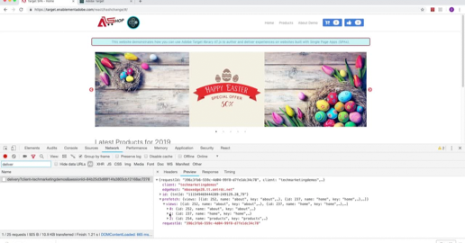

# Esercitazioni di Adobe Target

Adobe Target è la soluzione di Adobe Experience Cloud che offre tutto il necessario per adattare e personalizzare l&#39;esperienza dei clienti in modo da massimizzare i ricavi sui siti web e mobili, applicazioni, social media e altri canali digitali. Utilizzate questi video ed esercitazioni per apprendere i numerosi componenti di  Adobe Target.

## Novità

* **[Utilizzo dell’API Recommendations (esercitazione)](recommendations-api-tutorial/recs-api-overview.md)**

    
   *Per gli sviluppatori: Fate pratica pratica con le[!DNL Recommendations]API per configurare e gestire[!DNL Recommendations]cataloghi e criteri personalizzati e molto altro.*

* **[Implementazione  Adobe Target con  Adobe Mobile Services SDK v4 per Android (esercitazione)](mobile-v4/overview.md)**

    
   *Per gli sviluppatori che stanno già utilizzando  Adobe Mobile Services SDK v4: scopri come iniziare a personalizzare le esperienze app con  Adobe Target. Questi passaggi vengono forniti come supporto di utenti legacy.<!-- Concepts learned here are also applicable to Adobe Experience Platform Mobile SDK (v5).-->*

* **[Usa offerte Recommendations (video)](recommendations/use-recommendations-offers.md)**

    
   *Per tutti gli utenti di Target: Scopri come utilizzare le raccomandazioni sui prodotti nelle attività A/B e Targeting delle esperienze.*

<!--
* **[Create a Recommendations Activity (Video)](recommendations/create-a-recommendations-activity.md)**
     
    *Recommend products to your customers at scale with this Premium feature.* -->

## Prezzi del personale

<table>
<tr>
  <td>
    
    

      <a href="https://docs.adobe.com/content/help/en/experience-cloud/implementing-in-websites-with-launch/implement-solutions/target.html">
    <strong>Implementare Target con  Adobe Experience Platform Launch</strong>
    </a>
    

    

    <em>Implementazione web più rapida con Launch</em>
    

  </td>
  <td>
    
    

      <a href="implementation/implement-atjs-20-in-a-single-page-application.md">
    <strong>Implementazione di at.js 2.0 in un'applicazione SPA (Single Page Application)</strong>
    </a>
    

    

    <em>Scopri come at.js 2.x supporta SPA</em>
    

  </td>
  <td>
    
    

      <a href="troubleshooting/troubleshoot-with-the-experience-cloud-debugger.md">
    <strong>Risoluzione dei problemi di Target con il Experience Cloud Debugger</strong>
    </a>
    

    

    <em>Zoom avanti nell'implementazione</em>
    

  </td>
</tr>
</table>
