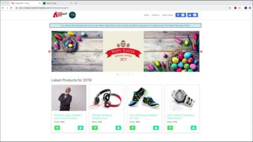

# Tutorial su Adobe Target

[!DNL Adobe Target] è la soluzione [!DNL Adobe Experience Cloud] che offre tutto il necessario per adattare e personalizzare l&#39;esperienza dei clienti. [!DNL Target] consente di massimizzare i ricavi sui siti Web e mobili, applicazioni, social media e altri canali digitali. Utilizzare questi video e tutorial per apprendere i numerosi componenti di [!DNL Adobe Target].

>[!NOTE]
>
>Oltre a questa guida, le seguenti guide [!DNL Adobe Target] sono inoltre disponibili:
>
>* *[Guida di Adobe Target per professionisti aziendali](https://experienceleague.adobe.com/docs/target/using/target-home.html?lang=it){target=_blank}*
>
>* *[Guida per gli sviluppatori di Adobe Target](https://experienceleague.adobe.com/docs/target-dev/developer/overview.html?lang=it){target=_blank}*

## Scelte del personale

<table style="margin-top: 0 !important">
<tr>
  <td>
    
    

      <a href="https://experienceleague.adobe.com/docs/platform-learn/migrate-target-to-websdk/introduction.html?lang=it">
    <strong>Migrazione di Target da at.js a Platform Web SDK</strong>
    </a>
    

    

    <em>Scopri come migrare l’implementazione at.js a Adobe Experience Platform Web SDK.</em>
    

  </td>
  <td>
    
    

      <a href="https://experienceleague.adobe.com/docs/platform-learn/implement-in-websites/implement-solutions/target.html">
    <strong>Implementare Target con i tag Adobe Experience Platform</strong>
    </a>
    

    

    <em>Scopri come implementare l'estensione Adobe Target con una richiesta di caricamento pagina e parametri personalizzati.</em>
    

  </td>
   <td>
    
    

    <a href="https://experienceleague.adobe.com/docs/target-learn/tutorials/implementation/implement-atjs-20-in-a-single-page-application.html">
    <strong>Implementare at.js 2.0 in un'applicazione a pagina singola</strong>
    </a>
    

    

    <em> Scopri come implementare at.js 2.0 (e versioni successive) di Adobe Target nelle applicazioni a pagina singola.</em>
    

  </td>
</tr>
</table>