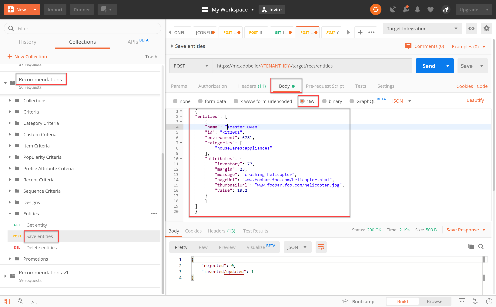

# Gestione del catalogo [!DNL Recommendations] tramite le API

A questo punto, hai imparato a generare un token di accesso, utilizzando il flusso di autenticazione JWT, per utilizzare le API di amministrazione Adobe Target  con  Adobe I/O.

Potete utilizzare le [API Recommendations](https://developers.adobetarget.com/api/recommendations/) per aggiungere, aggiornare o eliminare elementi nel catalogo delle raccomandazioni. Come per le altre API di amministrazione Adobe Target , le API [!DNL Recommendations] richiedono l&#39;autenticazione.

>[!TIP]
>
>Invia il file **[!UICONTROL IMS: JWT Generate + Auth tramite token utente]** ogni volta che è necessario aggiornare il token di accesso per l&#39;autenticazione, dal momento che scade dopo 24 ore. Per istruzioni, consultate [Configurare  autenticazione API Adobe](../apis/configure-io-target-integration.md).


>[!NOTE]
>
>Prima di procedere, ottenere la [raccolta Recommendations Postman](https://developers.adobetarget.com/api/recommendations/#section/Postman).

## Creazione e aggiornamento di elementi con l&#39;API Save Entities

Per compilare il database di prodotti [!DNL Recommendations] utilizzando l&#39;API anziché un feed di prodotto CSV o le richieste [!DNL Target] attivate sulle pagine di prodotto, utilizzate l&#39; [Save Entities API](https://developers.adobetarget.com/api/recommendations/#operation/saveEntities). Questa richiesta aggiunge o aggiorna un elemento in un singolo ambiente [!DNL Target]. La sintassi è la seguente:

```
POST https://mc.adobe.io/{{TENANT_ID}}/target/recs/entities
```

Ad esempio, Save Entities può essere utilizzato per aggiornare gli articoli ogni volta che vengono soddisfatte determinate soglie, come soglie per l&#39;inventario o il prezzo, al fine di contrassegnare tali articoli e impedirne l&#39;utilizzo.

1. Andate a **[!DNL Target]> [!UICONTROL Setup] > [!UICONTROL Host] > [!UICONTROL Ambienti]** per ottenere l&#39;ID ambiente [!DNL Target] in cui desiderate aggiungere o aggiornare un elemento.

   

2. Verificare `TENANT_ID` e `API_KEY` fare riferimento alle variabili di ambiente Postman stabilite in precedenza. Utilizzate l&#39;immagine seguente per il confronto. Se necessario, modificate le intestazioni e il percorso nella richiesta API in modo che corrispondano a quelli nell&#39;immagine seguente.

   

3. Immettere il codice JSON come **raw** nel **Body**. Non dimenticare di specificare l&#39;ID dell&#39;ambiente utilizzando la variabile `environment`. Nell’esempio seguente, l’ID ambiente è 6781.

   

   >!![NOTE]
   Di seguito è riportato un esempio di JSON che aggiunge nell&#39;ambiente 6781 entity.id kit2001 con valori di entità associati per un prodotto Toaster Oven.

   ```
      {
      "entities": [{
              "name": "Toaster Oven",
              "id": "kit2001",
              "environment": 6781,
              "categories": [
                  "housewares:appliances"
              ],
              "attributes": {
                  "inventory": 77,
                  "margin": 23,
                  "message": "crashing helicopter",
                  "pageUrl": "www.foobar.foo.com/helicopter.html",
                  "thumbnailUrl": "www.foobar.foo.com/helicopter.jpg",
                  "value": 19.2
              }
          }]
      }
   ```

4. Fai clic su **Send** (Invia). Dovreste ricevere la seguente risposta.

   

L&#39;oggetto JSON può essere ridimensionato per inviare più prodotti. Ad esempio, questo JSON specifica due entità.

```
    {
        "entities": [{
                "name": "Toaster Oven",
                "id": "kit2001",
                "environment": 6781,
                "categories": [
                    "housewares:appliances"
                ],
                "attributes": {
                    "inventory": 89,
                    "margin": 11,
                    "message": "Toaster Oven",
                    "pageUrl": "www.foobar.foo.com/helicopter.html",
                    "thumbnailUrl": "www.foobar.foo.com/helicopter.jpg",
                    "value": 102.5
                }
            },
            {
                "name": "Blender",
                "id": "kit2002",
                "environment": 6781,
                "categories": [
                    "housewares:appliances"
                ],
                "attributes": {
                    "inventory": 36,
                    "margin": 5,
                    "message": "Blender",
                    "pageUrl": "www.foobar.foo.com/helicopter.html",
                    "thumbnailUrl": "www.foobar.foo.com/helicopter.jpg",
                    "value": 54.5
                }
            }
        ]
    }
```

1. Adesso tocca a te! Utilizzate l&#39;API **Save Entities** per aggiungere i seguenti elementi al catalogo. Utilizzate il JSON di esempio sopra come punto di partenza. (sarà necessario estendere il JSON per includere altre entità.)

   

Wow, sembra che gli ultimi due elementi non appartengano. Esaminiamole utilizzando l&#39;API **Get Entity** e, se necessario, eliminatele utilizzando l&#39;API **Delete Entities**.

## Ottenimento dei dettagli degli elementi con l&#39;API Get Entity

Per recuperare i dettagli di un elemento esistente, utilizzate l&#39; [Get Entity API](https://developers.adobetarget.com/api/recommendations/#operation/getEntity). La sintassi è la seguente:

```
GET https://mc.adobe.io/{{TENANT_ID}}/target/recs/entities/[entity.id]
```

I dettagli dell&#39;entità possono essere recuperati solo per una singola entità alla volta. Potete utilizzare Get Entity per confermare che gli aggiornamenti sono stati eseguiti nel catalogo come previsto, o per controllare in altro modo il contenuto del catalogo.

1. Nella richiesta API, specificate l&#39;ID entità utilizzando la variabile `entityId`. L&#39;esempio seguente restituirà i dettagli per l&#39;entità di cui entityId=kit2004.

   

2. Verificare `TENANT_ID` e `API_KEY` fare riferimento alle variabili di ambiente Postman stabilite in precedenza. Utilizzate l&#39;immagine seguente per il confronto. Se necessario, modificate le intestazioni e il percorso nella richiesta API in modo che corrispondano a quelli nell&#39;immagine seguente.

   

3. Invia la richiesta.

   
Se si riceve un errore che indica che l&#39;entità non è stata trovata, come illustrato nell&#39;esempio precedente, verificare che la richiesta venga inviata all&#39; [!DNL Target] ambiente corretto.

   >[!NOTE]
   Se nessun ambiente è specificato in modo esplicito, Get Entity tenta di ottenere l&#39;entità solo dall&#39;ambiente [predefinito](https://docs.adobe.com/content/help/en/target/using/administer/hosts.html#section_4F8539B07C0C45E886E8525C344D5FB0). Se desiderate eseguire il pull da un ambiente diverso da quello predefinito, dovete specificare l&#39;ID ambiente.

4. Se necessario, aggiungete il parametro `environmentId` e inviate nuovamente la richiesta.

   

5. Inviate un&#39;altra richiesta **Get Entity**, stavolta per ispezionare l&#39;entità di cui entityId=kit2005.

   

Supponiamo che tu decida che queste entità devono essere rimosse dal catalogo. Usiamo l&#39;API **Elimina entità**.

## Eliminazione di elementi con l&#39;API Delete Entities

Per rimuovere elementi dal catalogo, utilizzate l&#39; [Elimina entità API](https://developers.adobetarget.com/api/recommendations/#operation/deleteEntities). La sintassi è la seguente:

```
DELETE https://mc.adobe.io/{{TENANT_ID}}/target/recs/entities?ids=[comma-delimited-entity-ids]&environment=[environmentId]
```

>[!WARNING]
Questa API elimina le entità a cui fanno riferimento gli ID specificati.
Se non vengono forniti ID entità, tutte le entità nell&#39;ambiente specificato vengono eliminate. Se non viene fornito alcun ID ambiente, le entità verranno eliminate da tutti gli ambienti. Utilizzate questo con cautela!

1. Andate a **[!DNL Target]> [!UICONTROL Setup] > [!UICONTROL Host] > [!UICONTROL Ambienti]** per ottenere l&#39;ID ambiente [!DNL Target] da cui desiderate eliminare gli elementi.

   

2. Nella richiesta API, specificate gli ID entità delle entità da eliminare, utilizzando la sintassi `&ids=[comma-delimited-entity-ids]` (un parametro di query). Quando eliminate più entità, separate gli ID con una virgola.

   

3. Specificate l&#39;ID dell&#39;ambiente, utilizzando la sintassi `&environment=[environmentId]`, in caso contrario le entità in tutti gli ambienti verranno eliminate.

   

4. Verificare `TENANT_ID` e `API_KEY` fare riferimento alle variabili di ambiente Postman stabilite in precedenza. Utilizzate l&#39;immagine seguente per il confronto. Se necessario, modificate le intestazioni e il percorso nella richiesta API in modo che corrispondano a quelli nell&#39;immagine seguente.

   

5. Invia la richiesta.

   

6. Verificare i risultati utilizzando **Get Entity**, che ora dovrebbe indicare che le entità eliminate non possono essere trovate.

   

   

Congratulazioni! Ora potete utilizzare le [!DNL Recommendations] API per creare, aggiornare, eliminare e ottenere dettagli sulle entità nel catalogo. Nella sezione successiva verrà illustrato come gestire i criteri personalizzati.

[Next &quot;Manage Custom Criteria&quot; (Gestisci criteri personalizzati) >](manage-custom-criteria.md)
