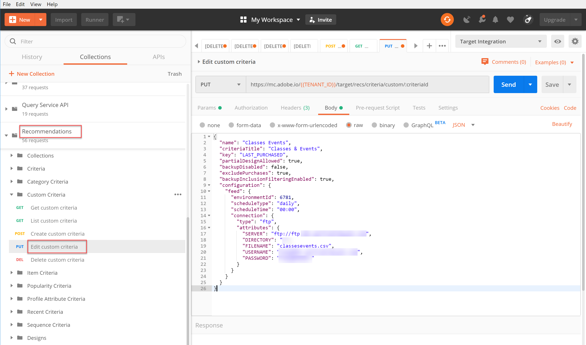

# Gestire criteri personalizzati

A volte gli algoritmi forniti da [!DNL Recommendations] non sono in grado di far emergere particolari elementi che si desidera promuovere. In questa situazione, i criteri personalizzati ti consentono di fornire un set specifico di elementi consigliati per un determinato elemento chiave o categoria. Puoi definire la mappatura tra l’elemento o la categoria chiave e gli elementi consigliati e importarla come criterio personalizzato. Questo processo è descritto nella [documentazione sui criteri personalizzati](https://docs.adobe.com/content/help/en/target/using/recommendations/criteria/recommendations-csv.html). Come indicato in tale documentazione, puoi creare, modificare ed eliminare criteri personalizzati tramite l’ [!DNL Target] interfaccia utente (UI). Tuttavia, [!DNL Target] fornisce anche un set di API per criteri personalizzati che consentono una gestione più dettagliata dei criteri personalizzati.

>[!IMPORTANT]
>
>Segui questa linea guida di utilizzo per i criteri personalizzati:
>
> Puoi eseguire tutte le operazioni (creare, modificare, eliminare) per un dato criterio personalizzato utilizzando le API oppure fare tutto (creare, modificare, eliminare) utilizzando l’interfaccia utente. La gestione dei criteri personalizzati tramite una combinazione dell’interfaccia utente e dell’API può causare conflitti tra informazioni o risultati imprevisti. Ad esempio, la creazione di un criterio personalizzato nell’interfaccia utente ma la modifica tramite API non rifletterà gli aggiornamenti nell’interfaccia utente, anche se verrà aggiornato nel backend, come visibile tramite l’API.

## Creare criteri personalizzati

Per creare criteri personalizzati utilizzando [Crea API di criteri personalizzati](https://developers.adobetarget.com/api/recommendations/#operation/createCriteriaCustom), la sintassi è la seguente:

`POST https://mc.adobe.io/{{TENANT_ID}}/target/recs/criteria/custom`

>[!WARNING]
>
>I criteri personalizzati creati utilizzando l’API Crea criterio personalizzato, come descritto in questo esercizio, verranno visualizzati nell’interfaccia utente, dove persisteranno. Non potrai modificarli o eliminarli dall’interfaccia utente. È possibile modificarli o eliminarli **tramite API**, ma in entrambi i casi continueranno a essere visualizzati nell&#39; [!DNL Target] interfaccia utente. Per mantenere l&#39;opzione di modifica o eliminazione dall&#39;interfaccia utente, crea i criteri personalizzati utilizzando l&#39;interfaccia utente per [la documentazione](https://docs.adobe.com/content/help/en/target/using/recommendations/criteria/recommendations-csv.html), invece di utilizzare l&#39;API Crea criteri personalizzati.

Procedi con questa esercitazione solo dopo aver letto l’avviso riportato sopra e aver acquisito familiarità con la creazione di nuovi criteri personalizzati che non possono essere successivamente eliminati dall’interfaccia utente.

1. Verifica che `TENANT_ID` e `API_KEY` per **Crea criteri personalizzati** faccia riferimento alle variabili di ambiente Postman stabilite in precedenza. Usa l&#39;immagine seguente per un confronto.

   

2. Aggiungi il tuo **Corpo** come **raw** JSON che definisce la posizione del file CSV dei criteri personalizzati. Utilizza l&#39;esempio fornito nella documentazione [Crea API di criteri personalizzati](https://developers.adobetarget.com/api/recommendations/#operation/getAllCriteriaCustom) come modello, fornendo il tuo `environmentId` e altri valori come necessario. Per questo esempio, utilizziamo LAST_PURCHASED come chiave.

   

3. Invia la richiesta e osserva la risposta, che contiene i dettagli dei criteri personalizzati appena creati.

   

4. Per verificare che i criteri personalizzati siano stati creati, accedi all’interno di Adobe Target a **[!UICONTROL Recommendations] > [!UICONTROL Criteria]** e cerca i criteri per nome, oppure utilizza l’ **API Criteri personalizzati elenco** nel passaggio successivo.

   

In questo caso, abbiamo un errore. Esaminiamo l&#39;errore esaminando più da vicino i criteri personalizzati, utilizzando l&#39; **API Criteri personalizzati elenco**.

## Elenca criteri personalizzati

Per recuperare un elenco di tutti i criteri personalizzati e i relativi dettagli, utilizza l’ [API Criteri personalizzati elenco](https://developers.adobetarget.com/api/recommendations/#operation/getAllCriteriaCustom). La sintassi è la seguente:

`GET https://mc.adobe.io/{{TENANT_ID}}/target/recs/criteria/custom`

1. Verifica `TENANT_ID` e `API_KEY` come prima e invia la richiesta. Nella risposta, prendi nota dell’ID criterio personalizzato e dei dettagli relativi al messaggio di errore indicato in precedenza.
   

In questo caso, l&#39;errore si è verificato perché le informazioni sul server non sono corrette, il che significa che [!DNL Target] non è in grado di accedere al file CSV contenente la definizione dei criteri personalizzati. Modifichiamo i criteri personalizzati per correggerlo.

## Modifica criteri personalizzati

Per modificare i dettagli di una definizione di criteri personalizzata, utilizza l&#39; [Modifica API criteri personalizzati](https://developers.adobetarget.com/api/recommendations/#operation/updateCriteriaCustom). La sintassi è la seguente:

`POST https://mc.adobe.io/{{TENANT_ID}}/target/recs/criteria/custom/:criteriaId`

1. Verifica `TENANT_ID` e `API_KEY` come prima.
   

1. Specifica l’ID dei criteri dei criteri personalizzati (singoli) che desideri modificare.
   

1. Nel corpo, fornisci a JSON aggiornato le informazioni corrette sul server. (Per questo passaggio, specifica l&#39;accesso FTP a un server a cui puoi accedere.)
   

1. Invia la richiesta e prendi nota della risposta.
   

Verifica il successo dei criteri personalizzati aggiornati utilizzando l&#39; **Ottieni API criteri personalizzati**.

## Ottieni criteri personalizzati

Per visualizzare i dettagli dei criteri personalizzati per uno specifico criterio personalizzato, utilizza l’ [Ottieni API criteri personalizzati](https://developers.adobetarget.com/api/recommendations/#operation/getCriteriaCustom). La sintassi è la seguente:

`GET https://mc.adobe.io/{{TENANT_ID}}/target/recs/criteria/custom/:criteriaId`

1. Specifica l&#39;ID dei criteri personalizzati di cui desideri ottenere i dettagli. Invia la richiesta e controlla la risposta.
   
1. Verifica il successo. (Nel nostro caso, verifica che non ci siano ulteriori errori FTP.)
   
1. (Facoltativo) Verifica che l’aggiornamento si rifletta con precisione nell’interfaccia utente.
   

## Elimina criteri personalizzati

Utilizzando l&#39;ID criteri indicato in precedenza, elimina i criteri personalizzati utilizzando l&#39; [Elimina API criteri personalizzati](https://developers.adobetarget.com/api/recommendations/#operation/deleteCriteriaCustom). La sintassi è la seguente:

`DELETE https://mc.adobe.io/{{TENANT_ID}}/target/recs/criteria/custom/:criteriaId`

1. Specifica l’ID dei criteri dei criteri personalizzati (singoli) che desideri eliminare. Fai clic su **Send** (Invia).
   

1. Verifica che i criteri siano stati eliminati utilizzando Ottieni criteri personalizzati.
   
In questo caso, l&#39;errore 404 previsto indica che i criteri eliminati non possono essere trovati.

>[!NOTE]
>Come promemoria, i criteri non verranno rimossi dall’interfaccia utente [!DNL Target] anche se sono stati eliminati, perché sono stati creati utilizzando l’API Crea criteri personalizzati.

Congratulazioni! Ora puoi creare, elencare, modificare, eliminare e ottenere dettagli sui criteri personalizzati utilizzando l’ [!DNL Recommendations] API . Nella sezione successiva, utilizzerai l’ [!DNL Target] API di consegna per recuperare i consigli.

[Successivo &quot;Recupera Recommendations con API di distribuzione lato server&quot; >](fetch-recs-server-side-delivery-api.md)
