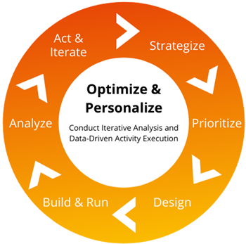

# Best practice per l’ottimizzazione con Adobe Target

Scopri sei fondamentali di ottimizzazione per l’Adobe e come applicarli.

Quando si tratta di costruire una forte presenza digitale, il team dovrà affrontare una serie di sfide. Non solo hai il compito di coinvolgere centinaia, anche migliaia di clienti, oltre a questo, i tuoi clienti mostrano una varietà di comportamenti e preferenze unici che cambieranno nel tempo e spetta a te non solo tenere il passo con questi cambiamenti, ma anticiparli ed eseguire le tue strategie in modo efficiente e preciso. È una corsa contro i concorrenti in una maratona di contenuti perpetui, che richiede iterazione costante e tecnologia all-in-class.

Una soluzione a questa sfida sfaccettata è l&#39;ottimizzazione con Adobe Target, che assicura una presenza digitale in evoluzione rilevante, valida e priva di attriti. Architettura tecnica e canali di distribuzione [!DNL Target] può variare notevolmente tra i clienti, tuttavia abbiamo curato un elenco di best practice e strategie di ottimizzazione che ogni team può utilizzare per sfruttare tutte le funzionalità di questo potente strumento.

## Informazioni sull’ottimizzazione

L&#39;ottimizzazione è definita come &quot;l&#39;azione di fare l&#39;uso migliore o più efficace di una situazione o di una risorsa&quot;. È il modo più efficiente per garantire la disponibilità di dati qualitativi che dimostrino che le modifiche che apporti sono preziose. Per ottimizzare veramente, devi essere in grado di misurare l&#39;impatto e il valore dei tuoi sforzi. In caso contrario, le modifiche apportate si tradurranno in costi più elevati, con un guadagno minimo. Per ottenere questo risultato in modo efficace ed efficiente, è necessario iniziare con la pianificazione strategica. Senza includere un piano strategico nella tua ottimizzazione, ti basterebbe solo indovinare.

### Sei elementi essenziali per l&#39;ottimizzazione

1. **Strategizzare**: Identifica le opportunità per le attività che sono allineate con gli obiettivi aziendali e che sono basate su dati.
1. **Priorità**: Classificazione e programmazione delle attività in base all&#39;allineamento dell&#39;azienda, al livello di impegno e al potenziale impatto.
1. **Progettazione**: Crea visualizzazioni definitive delle esperienze di attività e sviluppa piani di attività con criteri dettagliati.
1. **Creare ed eseguire**: Sviluppa attività che includono [!DNL Target] configurazione, sviluppo del codice e test di controllo qualità.
1. **Analizza**: Launch [!DNL Target] attività di produzione e monitoraggio delle prestazioni per la durata dell&#39;attività.
1. **Agisci e ripeti**: Sviluppa consigli basati sulle prestazioni delle attività di test o personalizzazione.

Sapendo che il cambiamento è costante, la nostra strategia di ottimizzazione dovrebbe essere un ciclo di esecuzione iterativo per soddisfare le esigenze in continua evoluzione dei clienti (vedi la figura 1 qui sotto).

_Figura 1 - Ciclo iterativo di ottimizzazione_

## Creazione di una strategia di ottimizzazione

Il processo di sviluppo di una strategia di ottimizzazione può essere suddiviso in: (1) Crea un piano di attività di test e (2) Comprendi le nozioni di base sull’ottimizzazione.

1: Il piano di attività di test deve essere documentato. In questo modo, potrai disporre di uno standard di qualità minimo per le applicazioni di test. Il piano di attività di test deve includere:

* **Nome e descrizione:** Nome dell’attività intuitiva e descrizione dell’attività su cui si concentra l’esperimento. &quot;Come? Cosa? Quando? Dove? Perché?&quot;

* **Obiettivo:** Scopo dell&#39;attività e obiettivo aziendale allineato è stato progettato per influenzare.

* **Ipotesi:** Un&#39;ipotesi è una previsione che si crea prima di eseguire un esperimento. Indica chiaramente cosa viene testato, cosa credete che sarà il risultato e perché pensate che sia così. Eseguire l&#39;esperimento dimostrerà o confuterà la tua ipotesi.

Un&#39;ipotesi completa si articola in tre parti:

* Se _variable_
* Then _risultato_
* Perché _logica_

* **Posizione:** URL, sezione pagina e tipo di dispositivo.
* **Metrica per obiettivo:** Come verrà misurato il successo?
* **Metriche secondarie:** Altri importanti indicatori di prestazioni chiave (KPI, Key Performance Indicators) da valutare allo scopo di comprendere ulteriormente le iterazioni relative all’impatto e alla pianificazione.
* **Pubblico attività:** Descrizione del filtro di esposizione richiesto per la prova.
* **Tipi di pubblico per reportistica:** Elenco di descrizioni dei sottoinsiemi di visitatori da utilizzare per l’analisi.
* **Concetti di esperienza:** Mockups, wireframe di esempi e descrizioni.

**Nota generale:** È possibile testare qualsiasi elemento di una pagina web che possa fornire un valore aziendale o fornire informazioni utili sul comportamento dei visitatori. Alcuni tipi comuni di attività di test includono:

* Titolo
* Testo contenuto
* Testo pulsante
* Layout della pagina
* Fotografia
* Colore pulsante
* Layout degli elementi
* Rimozione e aggiunta di elementi
* Ordinamento della navigazione
* Tassonomia di navigazione
* Enfasi di ricerca

2: La seconda fase della strategia consiste nel comprendere le nozioni di base sull&#39;ottimizzazione, che includono la comprensione degli elementi di test stessi. Gli elementi di test dell&#39;ottimizzazione includono:

    A. Valore elemento
    
    Questo si ottiene facendo un passo indietro per chiedere, perché esiste un determinato elemento sul sito e il contenuto svolge uno scopo specifico? Queste domande sono un buon punto di partenza se il tuo sito ha appena concluso una riprogettazione o se è stata recentemente implementata una nuova funzione. La tattica utilizzata per determinare il valore dell’elemento è definita test di inclusione/esclusione. Il test di inclusione/esclusione fornisce una buona lettura del valore nella pagina in cui viene visualizzato l’elemento.
    
    B. Presentazione degli elementi
    
    Questo è il punto in cui si pensa all’aspetto generale dell’elemento e al modo in cui questo influisce sulla presentazione complessiva della pagina. La tattica utilizzata per la presentazione è quella di concentrarsi su come apportare modifiche rilevanti ai contenuti e alle pagine degli elementi.
    
    C. Funzione elemento
    
    Qui ci chiediamo, l&#39;elemento della pagina fa quello che dovrebbe fare? L’interazione ha successo e funziona come previsto? L&#39;interazione è naturale o un punto di attrito? La tattica utilizzata per la funzione è quella di creare esperienze incentrate sulle funzionalità di facile utilizzo senza un impatto aggiuntivo sui costi.

## Ottimizzazione e personalizzazione

Ora che abbiamo analizzato ed elencato i componenti della strategia, è importante distinguere tra gli sforzi di ottimizzazione e quelli di personalizzazione. L&#39;ottimizzazione è l&#39;azione di fare l&#39;uso migliore o più efficace di una situazione o di una risorsa, mentre la personalizzazione è l&#39;azione di progettare o produrre qualcosa per soddisfare le esigenze individuali di qualcuno.

Ad alto livello:

* L&#39;ottimizzazione si concentra sul test per individuare ciò che è più efficiente e le prestazioni migliori per TUTTI coloro che interagiscono con la tua presenza digitale.
* La personalizzazione sta testando per individuare ciò che è più efficiente e le prestazioni migliori per ALCUNI di coloro che interagiscono con la tua presenza digitale.

Quando ti concentri sull’ottimizzazione, le attività di test più comuni sono:

* **Test A/B:** Test in tempo reale di due o più pagine o elementi di pagina uno contro l’altro per ottenere informazioni quantitative sulle preferenze del cliente.
* **Test multivariato:** Confronto delle combinazioni di offerte tra gli elementi di una pagina per vedere quale combinazione funziona meglio. Inoltre, il test multivariato identificherà quale elemento della pagina migliora maggiormente le conversioni.

Quando ti concentri sulla personalizzazione, è probabile che visualizzi le stesse attività di test di in Ottimizzazione, ma sono indirizzate a tipi di pubblico più specifici. Ad esempio, nel test A/B, è probabile che aggiungerai pagine e tipi di pubblico all’interno delle esperienze per migliorare la tua personalizzazione.

La personalizzazione include anche il tipo di attività di test di Targeting esperienza, che distribuisce contenuti a tipi di pubblico specifici in base a un set di regole e criteri definiti. Man mano che inizi a crescere e ad approfondire la personalizzazione, potrai sfruttare anche alcune delle funzionalità premium di Target come:

* Tipo di attività di Automated Personalization
* Tipo di attività raccomandazione

## Ottimizzazione prima della personalizzazione

Considerata la comprensione di cui sopra, l’Adobe consiglia di ottimizzare prima di personalizzare e di avanzare la personalizzazione da ampia a granulare. Per maturare le attività di personalizzazione da ampie a granulari, inizierai a utilizzare uno stile di personalizzazione uno-a-molti (ampio) (utilizzando il test A/B), quindi passerai allo stile di personalizzazione uno-a-uno (granulare) (utilizzando le attività di personalizzazione automatizzata).

Per ulteriori informazioni, ascoltare [webinar sulla comprensione e l’ottimizzazione dell’implementazione di Adobe Target](https://adobecustomersuccess.adobeconnect.com/pkfafpzd9yarmp4/), con consulente aziendale, Katie Cozby.
